# Spot Mission → Orbit → Ignition Perspective Integration

**Project:** Automated Mission Notification & Robot Monitoring System  
**Version:** 2.0  
**Last Updated:** 2026-01-29

---

## 1. Executive Summary

This project integrates Boston Dynamics Spot robot missions (via Orbit) with Ignition Perspective for:
- **Real-time robot monitoring** (battery, connectivity, health, pose)
- **Mission status tracking** and historical analysis
- **Conditional email notifications** based on mission/tag/status
- **Long-term data storage** with Store & Forward historian
- **Dashboard access** for operators, managers, and maintenance teams
- Scalable architecture supporting multiple sites and projects

---

## 2. SIPOC Diagram

### 2.1 SIPOC Flow (Mermaid)

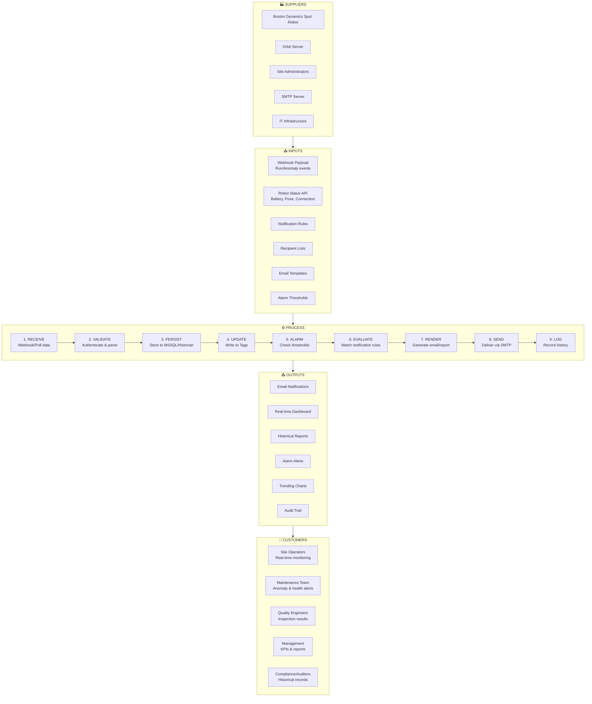
```mermaid
flowchart TB
    subgraph SUPPLIERS["🏭 SUPPLIERS"]
        S1[Boston Dynamics Spot Robot]
        S2[Orbit Server]
        S3[Site Administrators]
        S4[SMTP Server]
        S5[IT Infrastructure]
    end

    subgraph INPUTS["📥 INPUTS"]
        I1[Webhook Payload<br/>Run/Anomaly events]
        I2[Robot Status API<br/>Battery, Pose, Connection]
        I3[Notification Rules]
        I4[Recipient Lists]
        I5[Email Templates]
        I6[Alarm Thresholds]
    end

    subgraph PROCESS["⚙️ PROCESS"]
        P1[1. RECEIVE<br/>Webhook/Poll data]
        P2[2. VALIDATE<br/>Authenticate & parse]
        P3[3. PERSIST<br/>Store to MSSQL/Historian]
        P4[4. UPDATE<br/>Write to Tags]
        P5[5. ALARM<br/>Check thresholds]
        P6[6. EVALUATE<br/>Match notification rules]
        P7[7. RENDER<br/>Generate email/report]
        P8[8. SEND<br/>Deliver via SMTP]
        P9[9. LOG<br/>Record history]
        
        P1 --> P2 --> P3 --> P4 --> P5 --> P6 --> P7 --> P8 --> P9
    end

    subgraph OUTPUTS["📤 OUTPUTS"]
        O1[Email Notifications]
        O2[Real-time Dashboard]
        O3[Historical Reports]
        O4[Alarm Alerts]
        O5[Trending Charts]
        O6[Audit Trail]
    end

    subgraph CUSTOMERS["👥 CUSTOMERS"]
        C1[Site Operators<br/>Real-time monitoring]
        C2[Maintenance Team<br/>Anomaly & health alerts]
        C3[Quality Engineers<br/>Inspection results]
        C4[Management<br/>KPIs & reports]
        C5[Compliance/Auditors<br/>Historical records]
    end

    SUPPLIERS --> INPUTS
    INPUTS --> PROCESS
    PROCESS --> OUTPUTS
    OUTPUTS --> CUSTOMERS
```

### 2.2 SIPOC Summary Table

| Element | Description |
|---------|-------------|
| **S**uppliers | Spot Robot, Orbit Server, Site Admins, SMTP, IT Infra |
| **I**nputs | Webhook payloads, Robot API data, Rules, Recipients, Templates, Alarm thresholds |
| **P**rocess | Receive → Validate → Persist → Update Tags → Alarm → Evaluate → Render → Send → Log |
| **O**utputs | Emails, Dashboard, Reports, Alarms, Trending, Audit Trail |
| **C**ustomers | Operators, Maintenance, Quality, Management, Auditors |

---

## 3. Data Flow Architecture

### 3.1 Complete System Architecture (Mermaid)

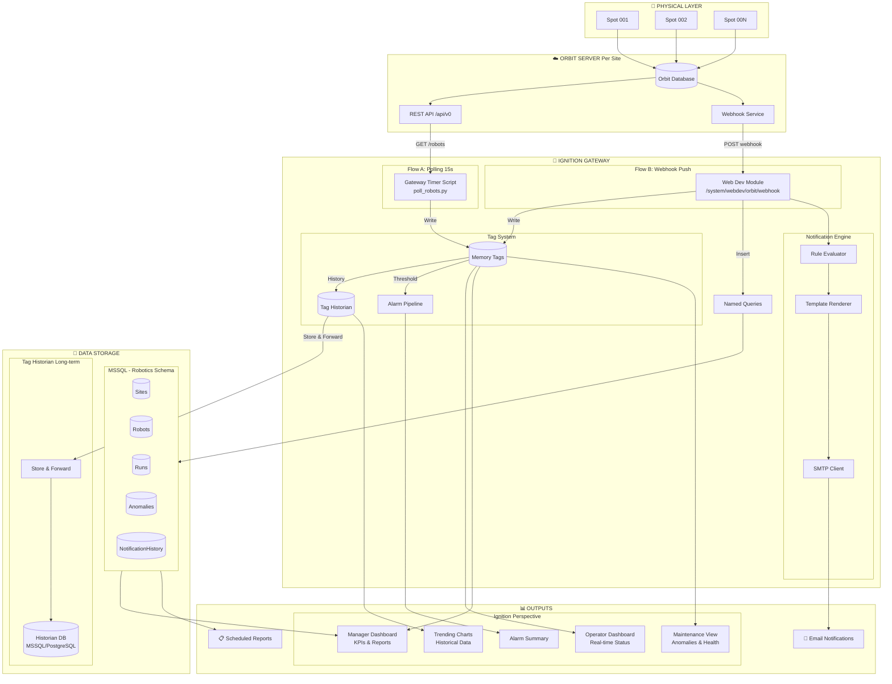
```mermaid
flowchart TB
    subgraph ROBOTS["🤖 PHYSICAL LAYER"]
        SPOT1[Spot 001]
        SPOT2[Spot 002]
        SPOTN[Spot 00N]
    end

    subgraph ORBIT["☁️ ORBIT SERVER Per Site"]
        ORBIT_API[REST API /api/v0]
        ORBIT_WH[Webhook Service]
        ORBIT_DB[(Orbit Database)]
        
        ORBIT_DB --> ORBIT_API
        ORBIT_DB --> ORBIT_WH
    end

    subgraph IGNITION["🔧 IGNITION GATEWAY"]
        subgraph POLLING["Flow A: Polling 15s"]
            TIMER[Gateway Timer Script<br/>poll_robots.py]
        end
        
        subgraph WEBHOOK["Flow B: Webhook Push"]
            WEBDEV[Web Dev Module<br/>/system/webdev/orbit/webhook]
        end
        
        subgraph TAG_SYSTEM["Tag System"]
            TAGS[(Memory Tags)]
            HISTORIAN[(Tag Historian)]
            ALARMS[Alarm Pipeline]
        end
        
        subgraph NOTIFICATION["Notification Engine"]
            RULE_ENGINE[Rule Evaluator]
            TEMPLATE[Template Renderer]
            SMTP_CLIENT[SMTP Client]
        end
        
        NQ[Named Queries]
    end

    subgraph STORAGE["💾 DATA STORAGE"]
        subgraph HISTORIAN_STORE["Tag Historian Long-term"]
            SF[Store & Forward]
            HIST_DB[(Historian DB<br/>MSSQL/PostgreSQL)]
        end
        
        subgraph MSSQL["MSSQL - Robotics Schema"]
            SITES[(Sites)]
            ROBOTS_TBL[(Robots)]
            RUNS[(Runs)]
            ANOMALIES[(Anomalies)]
            NOTIFICATIONS[(NotificationHistory)]
        end
    end

    subgraph OUTPUTS["📊 OUTPUTS"]
        subgraph PERSPECTIVE["Ignition Perspective"]
            DASH_OP[Operator Dashboard<br/>Real-time Status]
            DASH_MGR[Manager Dashboard<br/>KPIs & Reports]
            DASH_MAINT[Maintenance View<br/>Anomalies & Health]
            TRENDING[Trending Charts<br/>Historical Data]
            ALARM_VIEW[Alarm Summary]
        end
        
        EMAIL[📧 Email Notifications]
        REPORTS[📋 Scheduled Reports]
    end

    %% Connections
    SPOT1 & SPOT2 & SPOTN --> ORBIT_DB
    
    ORBIT_API -->|GET /robots| TIMER
    ORBIT_WH -->|POST webhook| WEBDEV
    
    TIMER -->|Write| TAGS
    WEBDEV -->|Write| TAGS
    WEBDEV -->|Insert| NQ
    
    TAGS -->|History| HISTORIAN
    TAGS -->|Threshold| ALARMS
    HISTORIAN -->|Store & Forward| SF
    SF --> HIST_DB
    
    NQ --> MSSQL
    
    WEBDEV --> RULE_ENGINE
    RULE_ENGINE --> TEMPLATE
    TEMPLATE --> SMTP_CLIENT
    SMTP_CLIENT --> EMAIL
    
    TAGS --> DASH_OP & DASH_MGR & DASH_MAINT
    HISTORIAN --> TRENDING
    ALARMS --> ALARM_VIEW
    MSSQL --> DASH_MGR & REPORTS
```

### 3.2 Two Distinct Data Flows

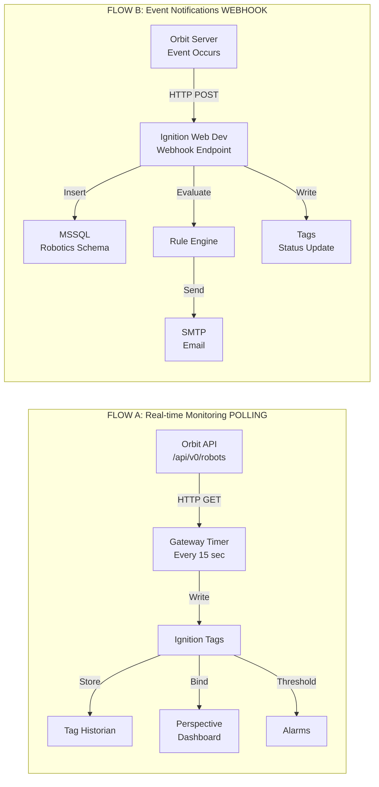
```mermaid
flowchart LR
    subgraph FLOW_A["FLOW A: Real-time Monitoring POLLING"]
        direction TB
        A1[Orbit API<br/>/api/v0/robots]
        A2[Gateway Timer<br/>Every 15 sec]
        A3[Ignition Tags]
        A4[Tag Historian]
        A5[Perspective<br/>Dashboard]
        A6[Alarms]
        
        A1 -->|HTTP GET| A2
        A2 -->|Write| A3
        A3 -->|Store| A4
        A3 -->|Bind| A5
        A3 -->|Threshold| A6
    end
    
    subgraph FLOW_B["FLOW B: Event Notifications WEBHOOK"]
        direction TB
        B1[Orbit Server<br/>Event Occurs]
        B2[Ignition Web Dev<br/>Webhook Endpoint]
        B3[MSSQL<br/>Robotics Schema]
        B4[Rule Engine]
        B5[SMTP<br/>Email]
        B6[Tags<br/>Status Update]
        
        B1 -->|HTTP POST| B2
        B2 -->|Insert| B3
        B2 -->|Evaluate| B4
        B4 -->|Send| B5
        B2 -->|Write| B6
    end
```

### 3.3 Data Storage Decision Matrix

| Data Type | Storage | Update Freq | Retention | Use Case |
|-----------|---------|-------------|-----------|----------|
| Battery Level | Tag Historian | 15 sec | 1 year | Trending, capacity analysis |
| Pose X/Y/Theta | Tag Historian | 15 sec | 90 days | Path tracking, heatmaps |
| IsConnected | Tag Historian | 15 sec | 1 year | Uptime analysis |
| Mission Events | MSSQL | Event-driven | 5 years | Reporting, notifications |
| Anomalies | MSSQL | Event-driven | 5 years | Compliance, analysis |
| Notification Log | MSSQL | Event-driven | 3 years | Audit trail |
| Real-time Status | Memory Tags | 15 sec | None | Dashboard display |

---

## 4. Robot Monitoring System

### 4.1 Monitoring Overview


```mermaid
flowchart TB
    subgraph ROBOT_HEALTH["🤖 Robot Health Monitoring"]
        direction LR
        
        subgraph METRICS["Monitored Metrics"]
            M1[🔋 Battery Level]
            M2[📡 Connectivity]
            M3[🌡️ Temperature]
            M4[📍 Position/Pose]
            M5[⚠️ Error States]
            M6[🎯 Mission Status]
        end
        
        subgraph THRESHOLDS["Alarm Thresholds"]
            T1[Battery < 20%<br/>Low Warning]
            T2[Battery < 10%<br/>Critical]
            T3[Disconnected > 5min<br/>Comm Lost]
            T4[Mission Failed<br/>Immediate]
            T5[Pose Deviation > 2m<br/>Navigation Issue]
        end
        
        subgraph ALERTS["Alert Actions"]
            A1[Dashboard Alarm Banner]
            A2[Email to Operator]
            A3[Email to Maintenance]
            A4[Log to History]
        end
        
        METRICS --> THRESHOLDS --> ALERTS
    end
```

### 4.2 User Access Matrix

| User Role | Dashboard Access | Email Alerts | Historical Data | Configuration |
|-----------|------------------|--------------|-----------------|---------------|
| **Operator** | Real-time status, Active alarms | Mission complete/fail, Battery low | Last 24 hours | None |
| **Shift Supervisor** | All robot status, Mission queue | All mission alerts | Last 7 days | View rules |
| **Maintenance Tech** | Robot health, Anomalies | Equipment alerts, Anomaly detected | Last 30 days | None |
| **Site Manager** | KPI dashboard, Utilization | Daily summary, Critical alerts | Full history | Edit rules |
| **System Admin** | All dashboards | System alerts | Full history | Full config |

### 4.3 Operator Dashboard Features

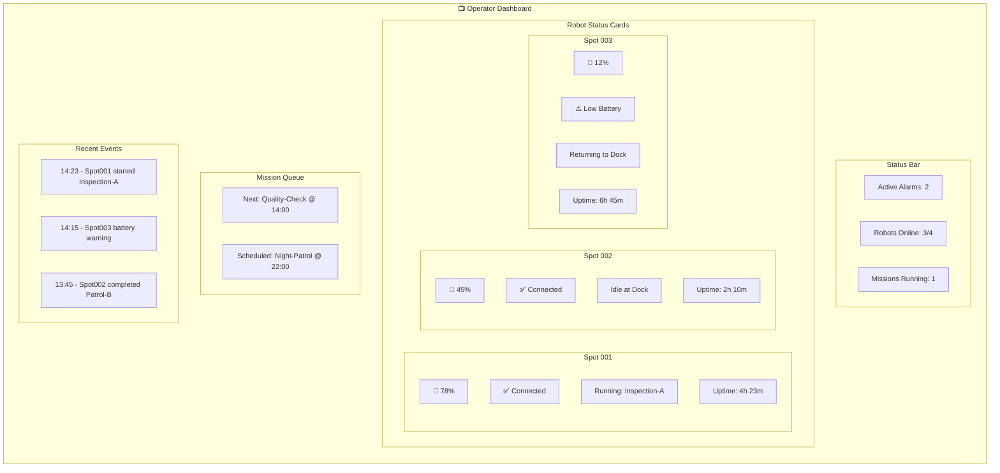
```mermaid
flowchart TB
    subgraph OPERATOR_DASH["📺 Operator Dashboard"]
        direction TB
        
        subgraph TOP_BAR["Status Bar"]
            ALARM_COUNT[Active Alarms: 2]
            ROBOT_COUNT[Robots Online: 3/4]
            MISSION_STATUS[Missions Running: 1]
        end
        
        subgraph ROBOT_CARDS["Robot Status Cards"]
            subgraph CARD1["Spot 001"]
                C1_BAT[🔋 78%]
                C1_STATUS[✅ Connected]
                C1_MISSION[Running: Inspection-A]
                C1_UPTIME[Uptime: 4h 23m]
            end
            subgraph CARD2["Spot 002"]
                C2_BAT[🔋 45%]
                C2_STATUS[✅ Connected]
                C2_MISSION[Idle at Dock]
                C2_UPTIME[Uptime: 2h 10m]
            end
            subgraph CARD3["Spot 003"]
                C3_BAT[🔋 12%]
                C3_STATUS[⚠️ Low Battery]
                C3_MISSION[Returning to Dock]
                C3_UPTIME[Uptime: 6h 45m]
            end
        end
        
        subgraph MISSION_QUEUE["Mission Queue"]
            MQ1[Next: Quality-Check @ 14:00]
            MQ2[Scheduled: Night-Patrol @ 22:00]
        end
        
        subgraph RECENT_EVENTS["Recent Events"]
            RE1[14:23 - Spot001 started Inspection-A]
            RE2[14:15 - Spot003 battery warning]
            RE3[13:45 - Spot002 completed Patrol-B]
        end
    end
```

### 4.4 Manager Dashboard Features

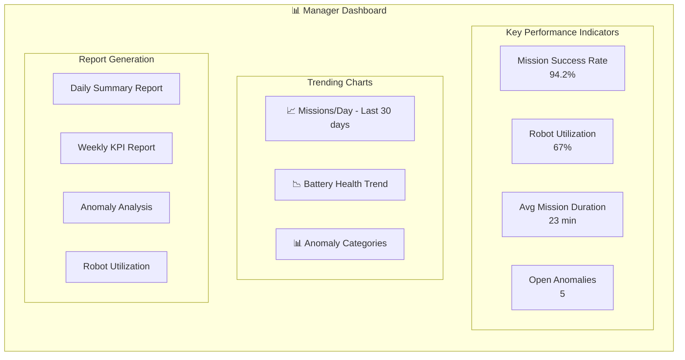
```mermaid
flowchart TB
    subgraph MANAGER_DASH["📊 Manager Dashboard"]
        direction TB
        
        subgraph KPIs["Key Performance Indicators"]
            KPI1[Mission Success Rate<br/>94.2%]
            KPI2[Robot Utilization<br/>67%]
            KPI3[Avg Mission Duration<br/>23 min]
            KPI4[Open Anomalies<br/>5]
        end
        
        subgraph CHARTS["Trending Charts"]
            CHART1[📈 Missions/Day - Last 30 days]
            CHART2[📉 Battery Health Trend]
            CHART3[📊 Anomaly Categories]
        end
        
        subgraph REPORTS["Report Generation"]
            RPT1[Daily Summary Report]
            RPT2[Weekly KPI Report]
            RPT3[Anomaly Analysis]
            RPT4[Robot Utilization]
        end
    end
```

---

## 5. Tag Historian & Store and Forward

### 5.1 Store and Forward Architecture

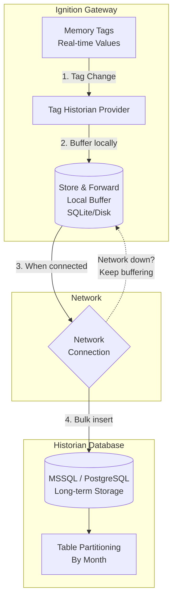
```mermaid
flowchart TB
    subgraph IGNITION_GW["Ignition Gateway"]
        TAGS[Memory Tags<br/>Real-time Values]
        HIST_PROVIDER[Tag Historian Provider]
        SF_BUFFER[(Store & Forward<br/>Local Buffer<br/>SQLite/Disk)]
    end
    
    subgraph NETWORK["Network"]
        CONN{Network<br/>Connection}
    end
    
    subgraph HISTORIAN_DB["Historian Database"]
        HIST_DB[(MSSQL / PostgreSQL<br/>Long-term Storage)]
        PARTITIONS[Table Partitioning<br/>By Month]
    end
    
    TAGS -->|1. Tag Change| HIST_PROVIDER
    HIST_PROVIDER -->|2. Buffer locally| SF_BUFFER
    SF_BUFFER -->|3. When connected| CONN
    CONN -->|4. Bulk insert| HIST_DB
    HIST_DB --> PARTITIONS
    
    %% Failure scenario
    CONN -.->|Network down?<br/>Keep buffering| SF_BUFFER
```

### 5.2 Store and Forward Configuration

```yaml
# Ignition Gateway - Tag Historian Settings

historian_provider:
  name: "SpotRobotHistorian"
  database: "MSSQL_Historian"
  
  # Store and Forward Settings
  store_and_forward:
    enabled: true
    buffer_location: "/var/lib/ignition/historian-buffer"
    max_buffer_size_mb: 5000          # 5 GB local buffer
    forward_interval_ms: 5000         # Attempt forward every 5 sec
    batch_size: 10000                 # Records per batch
    
  # Data Retention
  retention:
    raw_data_days: 90                 # Keep raw data 90 days
    1min_aggregates_days: 365         # Keep 1-min averages 1 year
    1hour_aggregates_days: 1825       # Keep 1-hour averages 5 years
    
  # Partitioning (MSSQL)
  partitioning:
    scheme: "monthly"
    auto_create: true
    retention_months: 60              # Auto-drop partitions older than 5 years
```

### 5.3 Data Retention Strategy

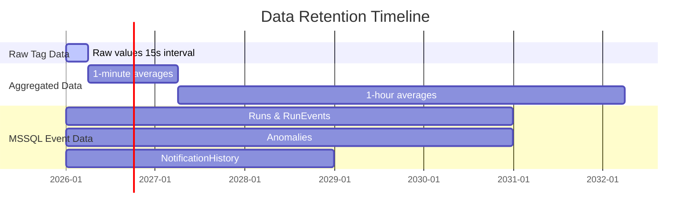
```mermaid
gantt
    title Data Retention Timeline
    dateFormat  YYYY-MM
    axisFormat  %Y-%m
    
    section Raw Tag Data
    Raw values 15s interval    :active, raw, 2026-01, 90d
    
    section Aggregated Data
    1-minute averages          :agg1, after raw, 365d
    1-hour averages            :agg2, after agg1, 1825d
    
    section MSSQL Event Data
    Runs & RunEvents           :db1, 2026-01, 1825d
    Anomalies                  :db2, 2026-01, 1825d
    NotificationHistory        :db3, 2026-01, 1095d
```

### 5.4 Historian Table Partitioning (MSSQL)

```sql
-- Create partition function by month
CREATE PARTITION FUNCTION pf_HistorianMonthly (DATETIME2)
AS RANGE RIGHT FOR VALUES (
    '2026-01-01', '2026-02-01', '2026-03-01', '2026-04-01',
    '2026-05-01', '2026-06-01', '2026-07-01', '2026-08-01',
    '2026-09-01', '2026-10-01', '2026-11-01', '2026-12-01'
);

-- Create partition scheme
CREATE PARTITION SCHEME ps_HistorianMonthly
AS PARTITION pf_HistorianMonthly
ALL TO ([PRIMARY]);

-- Historian data table (simplified example)
CREATE TABLE Historian.TagValues (
    TagId INT NOT NULL,
    Timestamp DATETIME2(3) NOT NULL,
    Value FLOAT NULL,
    Quality INT NOT NULL DEFAULT 192,
    CONSTRAINT PK_TagValues PRIMARY KEY (TagId, Timestamp)
) ON ps_HistorianMonthly(Timestamp);

-- Maintenance job to drop old partitions
-- Run monthly via SQL Agent job
```

---

## 6. System Architecture (Mermaid)

### 6.1 Complete Architecture Diagram

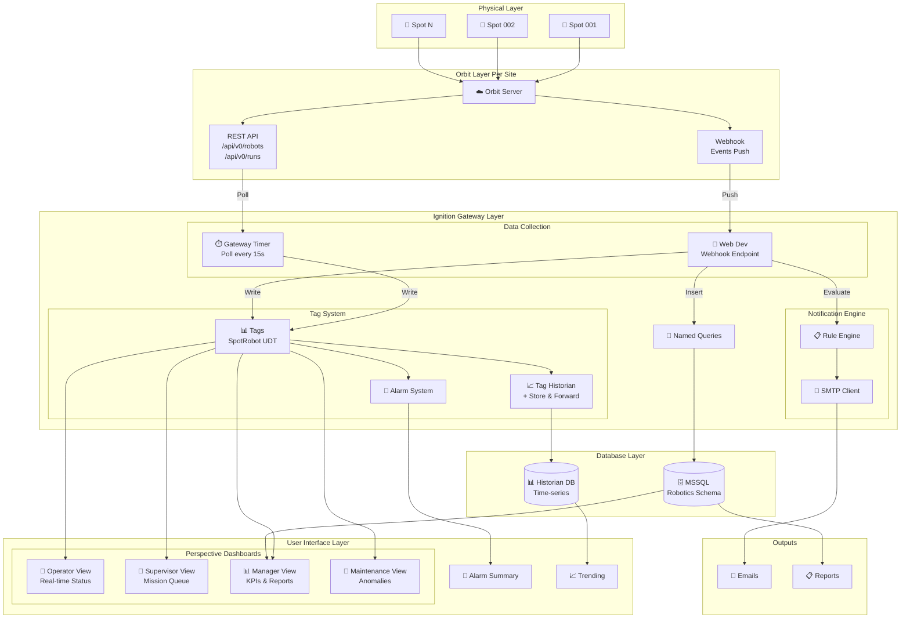
```mermaid
flowchart TB
    subgraph PHYSICAL["Physical Layer"]
        SPOT1["🤖 Spot 001"]
        SPOT2["🤖 Spot 002"]
        SPOTN["🤖 Spot N"]
    end
    
    subgraph ORBIT_LAYER["Orbit Layer Per Site"]
        ORBIT["☁️ Orbit Server"]
        ORBIT_API["REST API<br/>/api/v0/robots<br/>/api/v0/runs"]
        ORBIT_WEBHOOK["Webhook<br/>Events Push"]
    end
    
    subgraph IGNITION_LAYER["Ignition Gateway Layer"]
        subgraph DATA_COLLECTION["Data Collection"]
            POLL["⏱️ Gateway Timer<br/>Poll every 15s"]
            WEBDEV["🔌 Web Dev<br/>Webhook Endpoint"]
        end
        
        subgraph TAG_SYSTEM["Tag System"]
            TAGS["📊 Tags<br/>SpotRobot UDT"]
            HISTORIAN["📈 Tag Historian<br/>+ Store & Forward"]
            ALARMS["🚨 Alarm System"]
        end
        
        subgraph NOTIFICATION["Notification Engine"]
            RULES["📋 Rule Engine"]
            SMTP["📧 SMTP Client"]
        end
        
        NQ["📝 Named Queries"]
    end
    
    subgraph DATABASE_LAYER["Database Layer"]
        MSSQL[("🗄️ MSSQL<br/>Robotics Schema")]
        HIST_DB[("📊 Historian DB<br/>Time-series")]
    end
    
    subgraph UI_LAYER["User Interface Layer"]
        subgraph DASHBOARDS["Perspective Dashboards"]
            DASH_OP["👷 Operator View<br/>Real-time Status"]
            DASH_SUP["👔 Supervisor View<br/>Mission Queue"]
            DASH_MGR["📊 Manager View<br/>KPIs & Reports"]
            DASH_MAINT["🔧 Maintenance View<br/>Anomalies"]
        end
        ALARM_VIEW["🚨 Alarm Summary"]
        TREND_VIEW["📈 Trending"]
    end
    
    subgraph OUTPUTS["Outputs"]
        EMAIL["📧 Emails"]
        REPORTS["📋 Reports"]
    end
    
    %% Connections
    SPOT1 & SPOT2 & SPOTN --> ORBIT
    ORBIT --> ORBIT_API & ORBIT_WEBHOOK
    
    ORBIT_API -->|Poll| POLL
    ORBIT_WEBHOOK -->|Push| WEBDEV
    
    POLL -->|Write| TAGS
    WEBDEV -->|Write| TAGS
    WEBDEV -->|Insert| NQ
    WEBDEV -->|Evaluate| RULES
    
    TAGS --> HISTORIAN
    TAGS --> ALARMS
    HISTORIAN --> HIST_DB
    NQ --> MSSQL
    
    RULES --> SMTP --> EMAIL
    
    TAGS --> DASH_OP & DASH_SUP & DASH_MGR & DASH_MAINT
    MSSQL --> DASH_MGR & REPORTS
    HIST_DB --> TREND_VIEW
    ALARMS --> ALARM_VIEW
```

---

## 7. Database Schema

### 7.1 Entity Relationship Diagram (Mermaid)

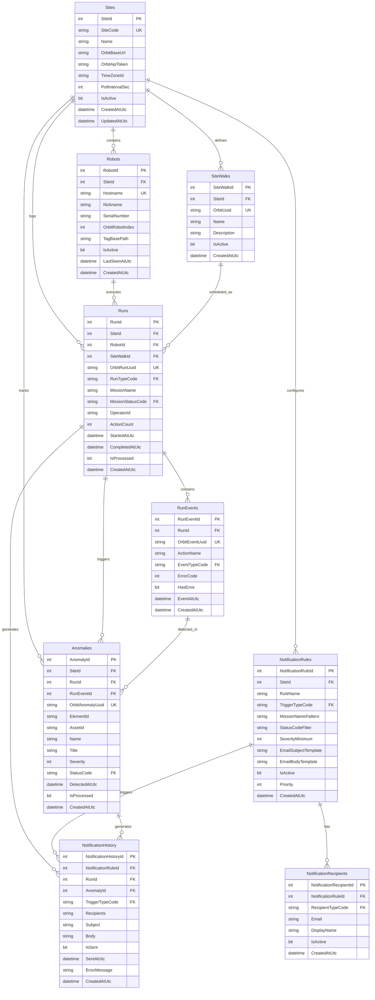
```mermaid
erDiagram
    Sites ||--o{ Robots : contains
    Sites ||--o{ SiteWalks : defines
    Sites ||--o{ Runs : logs
    Sites ||--o{ Anomalies : tracks
    Sites ||--o{ NotificationRules : configures
    
    Robots ||--o{ Runs : executes
    SiteWalks ||--o{ Runs : scheduled_as
    
    Runs ||--o{ RunEvents : contains
    Runs ||--o{ Anomalies : triggers
    Runs ||--o{ NotificationHistory : generates
    
    RunEvents ||--o{ Anomalies : detected_in
    
    NotificationRules ||--o{ NotificationRecipients : has
    NotificationRules ||--o{ NotificationHistory : triggers
    
    Anomalies ||--o{ NotificationHistory : generates
    
    Sites {
        int SiteId PK
        string SiteCode UK
        string Name
        string OrbitBaseUrl
        string OrbitApiToken
        string TimeZoneId
        int PollIntervalSec
        bit IsActive
        datetime CreatedAtUtc
        datetime UpdatedAtUtc
    }
    
    Robots {
        int RobotId PK
        int SiteId FK
        string Hostname UK
        string Nickname
        string SerialNumber
        int OrbitRobotIndex
        string TagBasePath
        bit IsActive
        datetime LastSeenAtUtc
        datetime CreatedAtUtc
    }
    
    SiteWalks {
        int SiteWalkId PK
        int SiteId FK
        string OrbitUuid UK
        string Name
        string Description
        bit IsActive
        datetime CreatedAtUtc
    }
    
    Runs {
        int RunId PK
        int SiteId FK
        int RobotId FK
        int SiteWalkId FK
        string OrbitRunUuid UK
        string RunTypeCode FK
        string MissionName
        string MissionStatusCode FK
        string OperatorId
        int ActionCount
        datetime StartedAtUtc
        datetime CompletedAtUtc
        bit IsProcessed
        datetime CreatedAtUtc
    }
    
    RunEvents {
        int RunEventId PK
        int RunId FK
        string OrbitEventUuid UK
        string ActionName
        string EventTypeCode FK
        int ErrorCode
        bit HasError
        datetime EventAtUtc
        datetime CreatedAtUtc
    }
    
    Anomalies {
        int AnomalyId PK
        int SiteId FK
        int RunId FK
        int RunEventId FK
        string OrbitAnomalyUuid UK
        string ElementId
        string AssetId
        string Name
        string Title
        int Severity
        string StatusCode FK
        datetime DetectedAtUtc
        bit IsProcessed
        datetime CreatedAtUtc
    }
    
    NotificationRules {
        int NotificationRuleId PK
        int SiteId FK
        string RuleName
        string TriggerTypeCode FK
        string MissionNamePattern
        string StatusCodeFilter
        int SeverityMinimum
        string EmailSubjectTemplate
        string EmailBodyTemplate
        bit IsActive
        int Priority
        datetime CreatedAtUtc
    }
    
    NotificationRecipients {
        int NotificationRecipientId PK
        int NotificationRuleId FK
        string RecipientTypeCode FK
        string Email
        string DisplayName
        bit IsActive
        datetime CreatedAtUtc
    }
    
    NotificationHistory {
        int NotificationHistoryId PK
        int NotificationRuleId FK
        int RunId FK
        int AnomalyId FK
        string TriggerTypeCode FK
        string Recipients
        string Subject
        string Body
        bit IsSent
        datetime SentAtUtc
        string ErrorMessage
        datetime CreatedAtUtc
    }
```

### 7.2 Database Schema (DBML Syntax for dbdiagram.io)

```dbml
// Robotics Schema - DBML Format
// Use at: https://dbdiagram.io

Project SpotRobotMonitoring {
  database_type: 'MSSQL'
  Note: 'Spot Robot Mission & Notification System'
}

// ===========================================
// LOOKUP TABLES
// ===========================================

Table Robotics.MissionStatusCodes {
  MissionStatusCode nvarchar(10) [pk, not null]
  Description nvarchar(100) [not null]
  DisplayOrder int [not null, default: 0]
  IsActive bit [not null, default: 1]
  
  Note: 'PEND, RUN, COMP, FAIL, ABRT, PAUS'
}

Table Robotics.TriggerTypeCodes {
  TriggerTypeCode nvarchar(20) [pk, not null]
  Description nvarchar(100) [not null]
  DisplayOrder int [not null, default: 0]
  IsActive bit [not null, default: 1]
  
  Note: 'RUN_START, RUN_COMP, RUN_FAIL, ANOM_OPEN, ANOM_CLOSE, ROBOT_CONN, ROBOT_DISC'
}

Table Robotics.RunTypeCodes {
  RunTypeCode nvarchar(20) [pk, not null]
  Description nvarchar(100) [not null]
  IsActive bit [not null, default: 1]
  
  Note: 'mission, teleop'
}

Table Robotics.AnomalyStatusCodes {
  AnomalyStatusCode nvarchar(20) [pk, not null]
  Description nvarchar(100) [not null]
  IsActive bit [not null, default: 1]
  
  Note: 'open, closed'
}

Table Robotics.EventTypeCodes {
  EventTypeCode nvarchar(20) [pk, not null]
  Description nvarchar(100) [not null]
  IsActive bit [not null, default: 1]
  
  Note: 'daq, screenshot'
}

Table Robotics.RecipientTypeCodes {
  RecipientTypeCode nvarchar(10) [pk, not null]
  Description nvarchar(100) [not null]
  IsActive bit [not null, default: 1]
  
  Note: 'to, cc, bcc'
}

// ===========================================
// CORE TABLES
// ===========================================

Table Robotics.Sites {
  SiteId int [pk, increment]
  SiteCode nvarchar(20) [unique, not null, note: 'e.g., SITE001, CLEVELAND']
  Name nvarchar(200) [not null]
  OrbitBaseUrl nvarchar(500) [not null, note: 'e.g., https://orbit.site.com']
  OrbitApiToken nvarchar(500) [note: 'Encrypted in production']
  TimeZoneId nvarchar(100) [not null, default: 'UTC']
  PollIntervalSec int [not null, default: 15]
  IsActive bit [not null, default: 1]
  CreatedAtUtc datetime2 [not null, default: `SYSUTCDATETIME()`]
  UpdatedAtUtc datetime2
  CreatedBy nvarchar(100) [not null, default: `SYSTEM_USER`]
  UpdatedBy nvarchar(100)
  
  indexes {
    SiteCode [unique]
  }
}

Table Robotics.Robots {
  RobotId int [pk, increment]
  SiteId int [not null, ref: > Robotics.Sites.SiteId]
  Hostname nvarchar(100) [not null, note: 'Orbit robotHostname']
  Nickname nvarchar(100)
  SerialNumber nvarchar(50)
  OrbitRobotIndex int [note: '0-32 per Orbit server']
  TagBasePath nvarchar(500) [note: 'e.g., [default]Enterprise/Site/Area/Line/Spot001']
  IsActive bit [not null, default: 1]
  LastSeenAtUtc datetime2
  CreatedAtUtc datetime2 [not null, default: `SYSUTCDATETIME()`]
  UpdatedAtUtc datetime2
  
  indexes {
    (SiteId, Hostname) [unique]
    SiteId
  }
}

Table Robotics.SiteWalks {
  SiteWalkId int [pk, increment]
  SiteId int [not null, ref: > Robotics.Sites.SiteId]
  OrbitUuid nvarchar(100) [unique, not null, note: 'Orbit unique identifier']
  Name nvarchar(200) [not null]
  Description nvarchar(1000)
  IsActive bit [not null, default: 1]
  CreatedAtUtc datetime2 [not null, default: `SYSUTCDATETIME()`]
  UpdatedAtUtc datetime2
  
  indexes {
    OrbitUuid [unique]
    SiteId
  }
}

Table Robotics.Runs {
  RunId int [pk, increment]
  SiteId int [not null, ref: > Robotics.Sites.SiteId]
  RobotId int [ref: > Robotics.Robots.RobotId]
  SiteWalkId int [ref: > Robotics.SiteWalks.SiteWalkId]
  OrbitRunUuid nvarchar(100) [unique, not null]
  RunTypeCode nvarchar(20) [not null, ref: > Robotics.RunTypeCodes.RunTypeCode]
  MissionName nvarchar(200)
  MissionStatusCode nvarchar(10) [ref: > Robotics.MissionStatusCodes.MissionStatusCode]
  OperatorId nvarchar(100)
  ActionCount int [default: 0]
  PendingActionCount int [default: 0]
  StartedAtUtc datetime2
  CompletedAtUtc datetime2
  DurationMinutes as "DATEDIFF(MINUTE, StartedAtUtc, CompletedAtUtc)" [note: 'Computed']
  IsProcessed bit [not null, default: 0, note: 'Notification processing flag']
  ProcessedAtUtc datetime2
  CreatedAtUtc datetime2 [not null, default: `SYSUTCDATETIME()`]
  UpdatedAtUtc datetime2
  
  indexes {
    OrbitRunUuid [unique]
    SiteId
    RobotId
    (StartedAtUtc) [note: 'DESC']
    (IsProcessed) [note: 'Filtered: WHERE IsProcessed = 0']
  }
}

Table Robotics.RunEvents {
  RunEventId int [pk, increment]
  RunId int [not null, ref: > Robotics.Runs.RunId]
  OrbitEventUuid nvarchar(100) [unique, not null]
  ActionName nvarchar(200)
  ActionUuid nvarchar(100)
  MissionName nvarchar(200)
  EventTypeCode nvarchar(20) [ref: > Robotics.EventTypeCodes.EventTypeCode]
  ErrorCode int
  HasError as "CASE WHEN ErrorCode IS NOT NULL AND ErrorCode <> 0 THEN 1 ELSE 0 END" [note: 'Computed persisted']
  EventAtUtc datetime2 [not null]
  CreatedAtUtc datetime2 [not null, default: `SYSUTCDATETIME()`]
  
  indexes {
    OrbitEventUuid [unique]
    RunId
    (EventAtUtc) [note: 'DESC']
  }
}

Table Robotics.Anomalies {
  AnomalyId int [pk, increment]
  SiteId int [not null, ref: > Robotics.Sites.SiteId]
  RunId int [ref: > Robotics.Runs.RunId]
  RunEventId int [ref: > Robotics.RunEvents.RunEventId]
  OrbitAnomalyUuid nvarchar(100) [unique, not null]
  ElementId nvarchar(100)
  AssetId nvarchar(100)
  Name nvarchar(200)
  Title nvarchar(500)
  Source nvarchar(200)
  Severity int [note: '1=Low, 5=Critical']
  StatusCode nvarchar(20) [not null, default: 'open', ref: > Robotics.AnomalyStatusCodes.AnomalyStatusCode]
  DetectedAtUtc datetime2 [not null]
  StatusModifiedAtUtc datetime2
  StatusModifiedBy nvarchar(100)
  IsProcessed bit [not null, default: 0]
  ProcessedAtUtc datetime2
  CreatedAtUtc datetime2 [not null, default: `SYSUTCDATETIME()`]
  UpdatedAtUtc datetime2
  
  indexes {
    OrbitAnomalyUuid [unique]
    SiteId
    StatusCode
    (IsProcessed) [note: 'Filtered: WHERE IsProcessed = 0']
  }
}

// ===========================================
// NOTIFICATION TABLES
// ===========================================

Table Robotics.NotificationRules {
  NotificationRuleId int [pk, increment]
  SiteId int [ref: > Robotics.Sites.SiteId, note: 'NULL = all sites']
  RuleName nvarchar(200) [not null]
  Description nvarchar(1000)
  TriggerTypeCode nvarchar(20) [not null, ref: > Robotics.TriggerTypeCodes.TriggerTypeCode]
  MissionNamePattern nvarchar(200) [note: 'Regex or exact match']
  StatusCodeFilter nvarchar(200) [note: 'Comma-separated codes']
  SeverityMinimum int [note: 'For anomaly rules 1-5']
  EmailSubjectTemplate nvarchar(500)
  EmailBodyTemplate nvarchar(max)
  IsActive bit [not null, default: 1]
  Priority int [not null, default: 100, note: 'Lower = higher priority']
  CreatedAtUtc datetime2 [not null, default: `SYSUTCDATETIME()`]
  UpdatedAtUtc datetime2
  CreatedBy nvarchar(100) [not null, default: `SYSTEM_USER`]
  UpdatedBy nvarchar(100)
  
  indexes {
    TriggerTypeCode
    (IsActive, Priority)
  }
}

Table Robotics.NotificationRecipients {
  NotificationRecipientId int [pk, increment]
  NotificationRuleId int [not null, ref: > Robotics.NotificationRules.NotificationRuleId]
  RecipientTypeCode nvarchar(10) [not null, default: 'to', ref: > Robotics.RecipientTypeCodes.RecipientTypeCode]
  Email nvarchar(200) [not null]
  DisplayName nvarchar(200)
  IsActive bit [not null, default: 1]
  CreatedAtUtc datetime2 [not null, default: `SYSUTCDATETIME()`]
}

Table Robotics.NotificationHistory {
  NotificationHistoryId int [pk, increment]
  NotificationRuleId int [ref: > Robotics.NotificationRules.NotificationRuleId]
  RunId int [ref: > Robotics.Runs.RunId]
  AnomalyId int [ref: > Robotics.Anomalies.AnomalyId]
  TriggerTypeCode nvarchar(20) [not null, ref: > Robotics.TriggerTypeCodes.TriggerTypeCode]
  Recipients nvarchar(max) [note: 'JSON array']
  Subject nvarchar(500) [not null]
  Body nvarchar(max)
  IsSent bit [not null, default: 0]
  SentAtUtc datetime2
  ErrorMessage nvarchar(max)
  RetryCount int [not null, default: 0]
  CreatedAtUtc datetime2 [not null, default: `SYSUTCDATETIME()`]
  
  indexes {
    (CreatedAtUtc) [note: 'DESC']
    (IsSent) [note: 'Filtered: WHERE IsSent = 0']
  }
}

// ===========================================
// ROBOT MONITORING TABLES (NEW)
// ===========================================

Table Robotics.RobotHealthSnapshots {
  SnapshotId bigint [pk, increment]
  RobotId int [not null, ref: > Robotics.Robots.RobotId]
  BatteryLevel float
  IsConnected bit
  IsCharging bit
  RobotStateCode nvarchar(50)
  PoseX float
  PoseY float
  PoseTheta float
  Temperature float
  ErrorCode int
  SnapshotAtUtc datetime2 [not null]
  CreatedAtUtc datetime2 [not null, default: `SYSUTCDATETIME()`]
  
  indexes {
    (RobotId, SnapshotAtUtc) [note: 'DESC']
  }
  
  Note: 'Optional: For MSSQL-based backup of tag historian data. Consider using Tag Historian instead.'
}

Table Robotics.AlarmHistory {
  AlarmHistoryId bigint [pk, increment]
  RobotId int [ref: > Robotics.Robots.RobotId]
  AlarmName nvarchar(200) [not null]
  AlarmPriority int [not null, note: '1=Diagnostic, 4=Critical']
  AlarmState nvarchar(50) [not null, note: 'Active, Cleared, Acked']
  TagPath nvarchar(500)
  TriggerValue nvarchar(200)
  ThresholdValue nvarchar(200)
  TriggeredAtUtc datetime2 [not null]
  ClearedAtUtc datetime2
  AckedAtUtc datetime2
  AckedBy nvarchar(100)
  Notes nvarchar(1000)
  CreatedAtUtc datetime2 [not null, default: `SYSUTCDATETIME()`]
  
  indexes {
    RobotId
    (TriggeredAtUtc) [note: 'DESC']
    AlarmState
  }
}
```

### 7.3 SQL Schema Definition

```sql
-- ============================================================
-- ROBOTICS SCHEMA - MSSQL Database Schema v2.0
-- Following Enterprise Naming Convention v1.1
-- ============================================================

CREATE SCHEMA Robotics;
GO

-- ============================================================
-- LOOKUP TABLES
-- ============================================================

CREATE TABLE Robotics.MissionStatusCodes (
    MissionStatusCode NVARCHAR(10) NOT NULL PRIMARY KEY,
    Description NVARCHAR(100) NOT NULL,
    DisplayOrder INT NOT NULL DEFAULT 0,
    IsActive BIT NOT NULL DEFAULT 1
);

CREATE TABLE Robotics.TriggerTypeCodes (
    TriggerTypeCode NVARCHAR(20) NOT NULL PRIMARY KEY,
    Description NVARCHAR(100) NOT NULL,
    DisplayOrder INT NOT NULL DEFAULT 0,
    IsActive BIT NOT NULL DEFAULT 1
);

CREATE TABLE Robotics.RunTypeCodes (
    RunTypeCode NVARCHAR(20) NOT NULL PRIMARY KEY,
    Description NVARCHAR(100) NOT NULL,
    IsActive BIT NOT NULL DEFAULT 1
);

CREATE TABLE Robotics.AnomalyStatusCodes (
    AnomalyStatusCode NVARCHAR(20) NOT NULL PRIMARY KEY,
    Description NVARCHAR(100) NOT NULL,
    IsActive BIT NOT NULL DEFAULT 1
);

CREATE TABLE Robotics.EventTypeCodes (
    EventTypeCode NVARCHAR(20) NOT NULL PRIMARY KEY,
    Description NVARCHAR(100) NOT NULL,
    IsActive BIT NOT NULL DEFAULT 1
);

CREATE TABLE Robotics.RecipientTypeCodes (
    RecipientTypeCode NVARCHAR(10) NOT NULL PRIMARY KEY,
    Description NVARCHAR(100) NOT NULL,
    IsActive BIT NOT NULL DEFAULT 1
);

CREATE TABLE Robotics.AlarmPriorityCodes (
    AlarmPriorityCode INT NOT NULL PRIMARY KEY,
    Description NVARCHAR(100) NOT NULL,
    ColorHex NVARCHAR(7) NOT NULL,
    IsActive BIT NOT NULL DEFAULT 1
);

-- ============================================================
-- CORE TABLES
-- ============================================================

CREATE TABLE Robotics.Sites (
    SiteId INT IDENTITY(1,1) NOT NULL,
    SiteCode NVARCHAR(20) NOT NULL,
    Name NVARCHAR(200) NOT NULL,
    OrbitBaseUrl NVARCHAR(500) NOT NULL,
    OrbitApiToken NVARCHAR(500) NULL,
    TimeZoneId NVARCHAR(100) NOT NULL DEFAULT 'UTC',
    PollIntervalSec INT NOT NULL DEFAULT 15,
    IsActive BIT NOT NULL DEFAULT 1,
    CreatedAtUtc DATETIME2(3) NOT NULL DEFAULT SYSUTCDATETIME(),
    UpdatedAtUtc DATETIME2(3) NULL,
    CreatedBy NVARCHAR(100) NOT NULL DEFAULT SYSTEM_USER,
    UpdatedBy NVARCHAR(100) NULL,
    CONSTRAINT PK_Sites PRIMARY KEY (SiteId),
    CONSTRAINT UQ_Sites_SiteCode UNIQUE (SiteCode)
);

CREATE TABLE Robotics.Robots (
    RobotId INT IDENTITY(1,1) NOT NULL,
    SiteId INT NOT NULL,
    Hostname NVARCHAR(100) NOT NULL,
    Nickname NVARCHAR(100) NULL,
    SerialNumber NVARCHAR(50) NULL,
    OrbitRobotIndex INT NULL,
    TagBasePath NVARCHAR(500) NULL,
    IsActive BIT NOT NULL DEFAULT 1,
    LastSeenAtUtc DATETIME2(3) NULL,
    CreatedAtUtc DATETIME2(3) NOT NULL DEFAULT SYSUTCDATETIME(),
    UpdatedAtUtc DATETIME2(3) NULL,
    CONSTRAINT PK_Robots PRIMARY KEY (RobotId),
    CONSTRAINT FK_Robots_Sites FOREIGN KEY (SiteId) REFERENCES Robotics.Sites(SiteId),
    CONSTRAINT UQ_Robots_SiteId_Hostname UNIQUE (SiteId, Hostname)
);

CREATE TABLE Robotics.SiteWalks (
    SiteWalkId INT IDENTITY(1,1) NOT NULL,
    SiteId INT NOT NULL,
    OrbitUuid NVARCHAR(100) NOT NULL,
    Name NVARCHAR(200) NOT NULL,
    Description NVARCHAR(1000) NULL,
    IsActive BIT NOT NULL DEFAULT 1,
    CreatedAtUtc DATETIME2(3) NOT NULL DEFAULT SYSUTCDATETIME(),
    UpdatedAtUtc DATETIME2(3) NULL,
    CONSTRAINT PK_SiteWalks PRIMARY KEY (SiteWalkId),
    CONSTRAINT FK_SiteWalks_Sites FOREIGN KEY (SiteId) REFERENCES Robotics.Sites(SiteId),
    CONSTRAINT UQ_SiteWalks_OrbitUuid UNIQUE (OrbitUuid)
);

CREATE TABLE Robotics.Runs (
    RunId INT IDENTITY(1,1) NOT NULL,
    SiteId INT NOT NULL,
    RobotId INT NULL,
    SiteWalkId INT NULL,
    OrbitRunUuid NVARCHAR(100) NOT NULL,
    RunTypeCode NVARCHAR(20) NOT NULL,
    MissionName NVARCHAR(200) NULL,
    MissionStatusCode NVARCHAR(10) NULL,
    OperatorId NVARCHAR(100) NULL,
    ActionCount INT NULL DEFAULT 0,
    PendingActionCount INT NULL DEFAULT 0,
    StartedAtUtc DATETIME2(3) NULL,
    CompletedAtUtc DATETIME2(3) NULL,
    DurationMinutes AS DATEDIFF(MINUTE, StartedAtUtc, CompletedAtUtc) PERSISTED,
    IsProcessed BIT NOT NULL DEFAULT 0,
    ProcessedAtUtc DATETIME2(3) NULL,
    CreatedAtUtc DATETIME2(3) NOT NULL DEFAULT SYSUTCDATETIME(),
    UpdatedAtUtc DATETIME2(3) NULL,
    CONSTRAINT PK_Runs PRIMARY KEY (RunId),
    CONSTRAINT FK_Runs_Sites FOREIGN KEY (SiteId) REFERENCES Robotics.Sites(SiteId),
    CONSTRAINT FK_Runs_Robots FOREIGN KEY (RobotId) REFERENCES Robotics.Robots(RobotId),
    CONSTRAINT FK_Runs_SiteWalks FOREIGN KEY (SiteWalkId) REFERENCES Robotics.SiteWalks(SiteWalkId),
    CONSTRAINT FK_Runs_RunTypeCodes FOREIGN KEY (RunTypeCode) REFERENCES Robotics.RunTypeCodes(RunTypeCode),
    CONSTRAINT FK_Runs_MissionStatusCodes FOREIGN KEY (MissionStatusCode) REFERENCES Robotics.MissionStatusCodes(MissionStatusCode),
    CONSTRAINT UQ_Runs_OrbitRunUuid UNIQUE (OrbitRunUuid)
);

CREATE TABLE Robotics.RunEvents (
    RunEventId INT IDENTITY(1,1) NOT NULL,
    RunId INT NOT NULL,
    OrbitEventUuid NVARCHAR(100) NOT NULL,
    ActionName NVARCHAR(200) NULL,
    ActionUuid NVARCHAR(100) NULL,
    MissionName NVARCHAR(200) NULL,
    EventTypeCode NVARCHAR(20) NULL,
    ErrorCode INT NULL,
    HasError AS CASE WHEN ErrorCode IS NOT NULL AND ErrorCode <> 0 THEN 1 ELSE 0 END PERSISTED,
    EventAtUtc DATETIME2(3) NOT NULL,
    CreatedAtUtc DATETIME2(3) NOT NULL DEFAULT SYSUTCDATETIME(),
    CONSTRAINT PK_RunEvents PRIMARY KEY (RunEventId),
    CONSTRAINT FK_RunEvents_Runs FOREIGN KEY (RunId) REFERENCES Robotics.Runs(RunId),
    CONSTRAINT FK_RunEvents_EventTypeCodes FOREIGN KEY (EventTypeCode) REFERENCES Robotics.EventTypeCodes(EventTypeCode),
    CONSTRAINT UQ_RunEvents_OrbitEventUuid UNIQUE (OrbitEventUuid)
);

CREATE TABLE Robotics.Anomalies (
    AnomalyId INT IDENTITY(1,1) NOT NULL,
    SiteId INT NOT NULL,
    RunId INT NULL,
    RunEventId INT NULL,
    OrbitAnomalyUuid NVARCHAR(100) NOT NULL,
    ElementId NVARCHAR(100) NULL,
    AssetId NVARCHAR(100) NULL,
    Name NVARCHAR(200) NULL,
    Title NVARCHAR(500) NULL,
    Source NVARCHAR(200) NULL,
    Severity INT NULL,
    StatusCode NVARCHAR(20) NOT NULL DEFAULT 'open',
    DetectedAtUtc DATETIME2(3) NOT NULL,
    StatusModifiedAtUtc DATETIME2(3) NULL,
    StatusModifiedBy NVARCHAR(100) NULL,
    IsProcessed BIT NOT NULL DEFAULT 0,
    ProcessedAtUtc DATETIME2(3) NULL,
    CreatedAtUtc DATETIME2(3) NOT NULL DEFAULT SYSUTCDATETIME(),
    UpdatedAtUtc DATETIME2(3) NULL,
    CONSTRAINT PK_Anomalies PRIMARY KEY (AnomalyId),
    CONSTRAINT FK_Anomalies_Sites FOREIGN KEY (SiteId) REFERENCES Robotics.Sites(SiteId),
    CONSTRAINT FK_Anomalies_Runs FOREIGN KEY (RunId) REFERENCES Robotics.Runs(RunId),
    CONSTRAINT FK_Anomalies_RunEvents FOREIGN KEY (RunEventId) REFERENCES Robotics.RunEvents(RunEventId),
    CONSTRAINT FK_Anomalies_AnomalyStatusCodes FOREIGN KEY (StatusCode) REFERENCES Robotics.AnomalyStatusCodes(AnomalyStatusCode),
    CONSTRAINT UQ_Anomalies_OrbitAnomalyUuid UNIQUE (OrbitAnomalyUuid)
);

-- ============================================================
-- NOTIFICATION TABLES
-- ============================================================

CREATE TABLE Robotics.NotificationRules (
    NotificationRuleId INT IDENTITY(1,1) NOT NULL,
    SiteId INT NULL,
    RuleName NVARCHAR(200) NOT NULL,
    Description NVARCHAR(1000) NULL,
    TriggerTypeCode NVARCHAR(20) NOT NULL,
    MissionNamePattern NVARCHAR(200) NULL,
    StatusCodeFilter NVARCHAR(200) NULL,
    SeverityMinimum INT NULL,
    EmailSubjectTemplate NVARCHAR(500) NULL,
    EmailBodyTemplate NVARCHAR(MAX) NULL,
    IsActive BIT NOT NULL DEFAULT 1,
    Priority INT NOT NULL DEFAULT 100,
    CreatedAtUtc DATETIME2(3) NOT NULL DEFAULT SYSUTCDATETIME(),
    UpdatedAtUtc DATETIME2(3) NULL,
    CreatedBy NVARCHAR(100) NOT NULL DEFAULT SYSTEM_USER,
    UpdatedBy NVARCHAR(100) NULL,
    CONSTRAINT PK_NotificationRules PRIMARY KEY (NotificationRuleId),
    CONSTRAINT FK_NotificationRules_Sites FOREIGN KEY (SiteId) REFERENCES Robotics.Sites(SiteId),
    CONSTRAINT FK_NotificationRules_TriggerTypeCodes FOREIGN KEY (TriggerTypeCode) REFERENCES Robotics.TriggerTypeCodes(TriggerTypeCode)
);

CREATE TABLE Robotics.NotificationRecipients (
    NotificationRecipientId INT IDENTITY(1,1) NOT NULL,
    NotificationRuleId INT NOT NULL,
    RecipientTypeCode NVARCHAR(10) NOT NULL DEFAULT 'to',
    Email NVARCHAR(200) NOT NULL,
    DisplayName NVARCHAR(200) NULL,
    IsActive BIT NOT NULL DEFAULT 1,
    CreatedAtUtc DATETIME2(3) NOT NULL DEFAULT SYSUTCDATETIME(),
    CONSTRAINT PK_NotificationRecipients PRIMARY KEY (NotificationRecipientId),
    CONSTRAINT FK_NotificationRecipients_NotificationRules FOREIGN KEY (NotificationRuleId) REFERENCES Robotics.NotificationRules(NotificationRuleId),
    CONSTRAINT FK_NotificationRecipients_RecipientTypeCodes FOREIGN KEY (RecipientTypeCode) REFERENCES Robotics.RecipientTypeCodes(RecipientTypeCode)
);

CREATE TABLE Robotics.NotificationHistory (
    NotificationHistoryId INT IDENTITY(1,1) NOT NULL,
    NotificationRuleId INT NULL,
    RunId INT NULL,
    AnomalyId INT NULL,
    TriggerTypeCode NVARCHAR(20) NOT NULL,
    Recipients NVARCHAR(MAX) NULL,
    Subject NVARCHAR(500) NOT NULL,
    Body NVARCHAR(MAX) NULL,
    IsSent BIT NOT NULL DEFAULT 0,
    SentAtUtc DATETIME2(3) NULL,
    ErrorMessage NVARCHAR(MAX) NULL,
    RetryCount INT NOT NULL DEFAULT 0,
    CreatedAtUtc DATETIME2(3) NOT NULL DEFAULT SYSUTCDATETIME(),
    CONSTRAINT PK_NotificationHistory PRIMARY KEY (NotificationHistoryId),
    CONSTRAINT FK_NotificationHistory_NotificationRules FOREIGN KEY (NotificationRuleId) REFERENCES Robotics.NotificationRules(NotificationRuleId),
    CONSTRAINT FK_NotificationHistory_Runs FOREIGN KEY (RunId) REFERENCES Robotics.Runs(RunId),
    CONSTRAINT FK_NotificationHistory_Anomalies FOREIGN KEY (AnomalyId) REFERENCES Robotics.Anomalies(AnomalyId),
    CONSTRAINT FK_NotificationHistory_TriggerTypeCodes FOREIGN KEY (TriggerTypeCode) REFERENCES Robotics.TriggerTypeCodes(TriggerTypeCode)
);

-- ============================================================
-- ALARM HISTORY TABLE (for audit beyond Ignition Alarm Journal)
-- ============================================================

CREATE TABLE Robotics.AlarmHistory (
    AlarmHistoryId BIGINT IDENTITY(1,1) NOT NULL,
    RobotId INT NULL,
    AlarmName NVARCHAR(200) NOT NULL,
    AlarmPriorityCode INT NOT NULL,
    AlarmState NVARCHAR(50) NOT NULL,
    TagPath NVARCHAR(500) NULL,
    TriggerValue NVARCHAR(200) NULL,
    ThresholdValue NVARCHAR(200) NULL,
    TriggeredAtUtc DATETIME2(3) NOT NULL,
    ClearedAtUtc DATETIME2(3) NULL,
    AckedAtUtc DATETIME2(3) NULL,
    AckedBy NVARCHAR(100) NULL,
    Notes NVARCHAR(1000) NULL,
    CreatedAtUtc DATETIME2(3) NOT NULL DEFAULT SYSUTCDATETIME(),
    CONSTRAINT PK_AlarmHistory PRIMARY KEY (AlarmHistoryId),
    CONSTRAINT FK_AlarmHistory_Robots FOREIGN KEY (RobotId) REFERENCES Robotics.Robots(RobotId),
    CONSTRAINT FK_AlarmHistory_AlarmPriorityCodes FOREIGN KEY (AlarmPriorityCode) REFERENCES Robotics.AlarmPriorityCodes(AlarmPriorityCode)
);

-- ============================================================
-- INDEXES
-- ============================================================

CREATE INDEX IX_Robots_SiteId ON Robotics.Robots(SiteId);
CREATE INDEX IX_SiteWalks_SiteId ON Robotics.SiteWalks(SiteId);
CREATE INDEX IX_Runs_SiteId ON Robotics.Runs(SiteId);
CREATE INDEX IX_Runs_RobotId ON Robotics.Runs(RobotId);
CREATE INDEX IX_Runs_StartedAtUtc ON Robotics.Runs(StartedAtUtc DESC);
CREATE INDEX IX_Runs_IsProcessed ON Robotics.Runs(IsProcessed) WHERE IsProcessed = 0;
CREATE INDEX IX_RunEvents_RunId ON Robotics.RunEvents(RunId);
CREATE INDEX IX_RunEvents_EventAtUtc ON Robotics.RunEvents(EventAtUtc DESC);
CREATE INDEX IX_Anomalies_SiteId ON Robotics.Anomalies(SiteId);
CREATE INDEX IX_Anomalies_StatusCode ON Robotics.Anomalies(StatusCode);
CREATE INDEX IX_Anomalies_IsProcessed ON Robotics.Anomalies(IsProcessed) WHERE IsProcessed = 0;
CREATE INDEX IX_NotificationRules_TriggerTypeCode ON Robotics.NotificationRules(TriggerTypeCode);
CREATE INDEX IX_NotificationRules_IsActive ON Robotics.NotificationRules(IsActive, Priority);
CREATE INDEX IX_NotificationHistory_CreatedAtUtc ON Robotics.NotificationHistory(CreatedAtUtc DESC);
CREATE INDEX IX_NotificationHistory_IsSent ON Robotics.NotificationHistory(IsSent) WHERE IsSent = 0;
CREATE INDEX IX_AlarmHistory_RobotId ON Robotics.AlarmHistory(RobotId);
CREATE INDEX IX_AlarmHistory_TriggeredAtUtc ON Robotics.AlarmHistory(TriggeredAtUtc DESC);
CREATE INDEX IX_AlarmHistory_AlarmState ON Robotics.AlarmHistory(AlarmState);

-- ============================================================
-- SEED DATA
-- ============================================================

INSERT INTO Robotics.MissionStatusCodes (MissionStatusCode, Description, DisplayOrder) VALUES
('PEND', 'Pending', 1),
('RUN', 'Running', 2),
('COMP', 'Completed', 3),
('FAIL', 'Failed', 4),
('ABRT', 'Aborted', 5),
('PAUS', 'Paused', 6);

INSERT INTO Robotics.TriggerTypeCodes (TriggerTypeCode, Description, DisplayOrder) VALUES
('RUN_START', 'Run Started', 1),
('RUN_COMP', 'Run Completed', 2),
('RUN_FAIL', 'Run Failed', 3),
('ANOM_OPEN', 'Anomaly Detected', 4),
('ANOM_CLOSE', 'Anomaly Closed', 5),
('ROBOT_CONN', 'Robot Connected', 6),
('ROBOT_DISC', 'Robot Disconnected', 7),
('BATT_LOW', 'Battery Low', 8),
('BATT_CRIT', 'Battery Critical', 9);

INSERT INTO Robotics.RunTypeCodes (RunTypeCode, Description) VALUES
('mission', 'Autonomous Mission'),
('teleop', 'Teleoperation');

INSERT INTO Robotics.AnomalyStatusCodes (AnomalyStatusCode, Description) VALUES
('open', 'Active Alert'),
('closed', 'Resolved');

INSERT INTO Robotics.EventTypeCodes (EventTypeCode, Description) VALUES
('daq', 'Data Acquisition'),
('screenshot', 'User Screenshot');

INSERT INTO Robotics.RecipientTypeCodes (RecipientTypeCode, Description) VALUES
('to', 'Primary Recipient'),
('cc', 'Carbon Copy'),
('bcc', 'Blind Carbon Copy');

INSERT INTO Robotics.AlarmPriorityCodes (AlarmPriorityCode, Description, ColorHex) VALUES
(1, 'Diagnostic', '#808080'),
(2, 'Low', '#00FF00'),
(3, 'Medium', '#FFFF00'),
(4, 'High', '#FFA500'),
(5, 'Critical', '#FF0000');
GO
```

---

## 8. Ignition Best Practices Implementation

This section ensures the implementation follows Ignition documentation best practices for Tags, Tag Historian, and SQL Server integration.

### 8.1 Tag Provider Configuration

Per Ignition documentation: *"Tags are not part of an Ignition project. Rather, projects simply reference tags. Tags are stored inside of Tag Providers."*

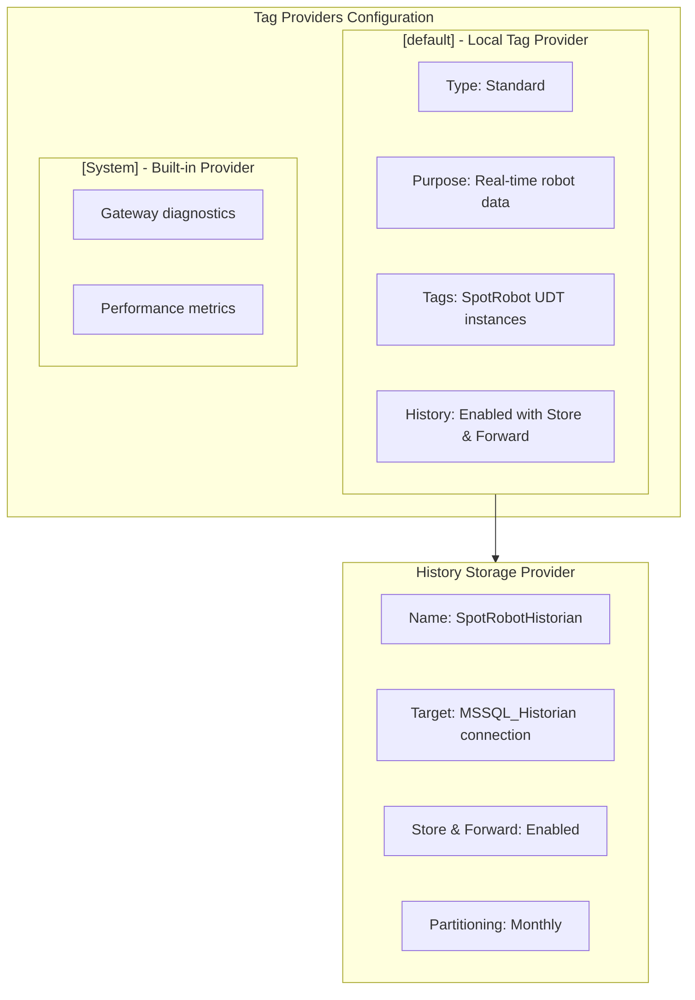
```mermaid
flowchart TB
    subgraph TAG_PROVIDERS["Tag Providers Configuration"]
        direction TB
        
        subgraph DEFAULT["[default] - Local Tag Provider"]
            DESC1[Type: Standard]
            DESC2[Purpose: Real-time robot data]
            DESC3[Tags: SpotRobot UDT instances]
            DESC4[History: Enabled with Store & Forward]
        end
        
        subgraph SYSTEM["[System] - Built-in Provider"]
            SYS1[Gateway diagnostics]
            SYS2[Performance metrics]
        end
    end
    
    subgraph HISTORY_STORAGE["History Storage Provider"]
        HIST_PROV[Name: SpotRobotHistorian]
        HIST_DB[Target: MSSQL_Historian connection]
        HIST_SF[Store & Forward: Enabled]
        HIST_PART[Partitioning: Monthly]
    end
    
    DEFAULT --> HISTORY_STORAGE
```

**Tag Provider Settings:**

| Setting | Value | Rationale |
|---------|-------|-----------|
| Provider Name | `default` | Standard convention |
| Provider Type | Standard | Local provider on this Gateway |
| Allow External Edits | No | Prevent unauthorized changes |
| Store Tag Values | Yes | Persist values across restarts |

### 8.2 Tag Version Control Strategy

Per Ignition documentation: *"Ignition can export and import tag configurations to and from JSON format... steps must be taken to track changes of tags."*

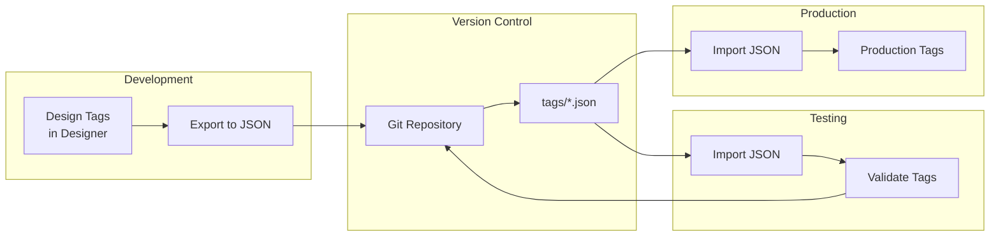
```mermaid
flowchart LR
    subgraph DEV["Development"]
        DEV_TAGS[Design Tags<br/>in Designer]
        DEV_EXPORT[Export to JSON]
    end
    
    subgraph VCS["Version Control"]
        GIT[Git Repository]
        JSON_FILES[tags/*.json]
    end
    
    subgraph TEST["Testing"]
        TEST_IMPORT[Import JSON]
        TEST_VALIDATE[Validate Tags]
    end
    
    subgraph PROD["Production"]
        PROD_IMPORT[Import JSON]
        PROD_TAGS[Production Tags]
    end
    
    DEV_TAGS --> DEV_EXPORT --> GIT
    GIT --> JSON_FILES
    JSON_FILES --> TEST_IMPORT --> TEST_VALIDATE
    TEST_VALIDATE --> GIT
    JSON_FILES --> PROD_IMPORT --> PROD_TAGS
```

**Tag Export Structure:**

```
/tags/
├── _types/
│   └── SpotRobot.json           # UDT Definition
├── Enterprise/
│   └── Site001/
│       └── Assembly/
│           └── Line001/
│               ├── Spot001.json  # UDT Instance
│               ├── Spot002.json
│               └── _folder.json  # Folder metadata
└── export_manifest.json          # Export timestamp & version
```

**Automated Export Script (Gateway Timer):**

```python
# Script: tags/auto_export.py
# Schedule: Daily at 2:00 AM

import system
import json
from java.util import Date

def export_tags_for_version_control():
    """
    Export all tags to JSON for version control.
    Per Ignition best practice for tracking tag changes.
    """
    export_path = "/var/lib/ignition/tag-exports/"
    timestamp = system.date.format(Date(), "yyyy-MM-dd_HHmmss")
    
    # Export UDT definitions
    udt_json = system.tag.exportTags(
        basePath="[default]_types_",
        filePath="{}/udts_{}.json".format(export_path, timestamp)
    )
    
    # Export tag instances
    tags_json = system.tag.exportTags(
        basePath="[default]Enterprise",
        filePath="{}/tags_{}.json".format(export_path, timestamp)
    )
    
    system.util.getLogger("TagExport").info(
        "Tags exported for version control: {}".format(timestamp)
    )
```

### 8.3 Tag History Configuration Best Practices

Per Ignition documentation: *"Tag history bindings allow you to pull Tag history data that is stored in the database into a component through a binding."*

**History Storage Provider Configuration:**

| Setting | Value | Best Practice Rationale |
|---------|-------|-------------------------|
| **Provider Name** | `SpotRobotHistorian` | Descriptive name |
| **Database Connection** | `MSSQL_Historian` | Dedicated historian DB |
| **Store & Forward** | Enabled | Prevent data loss |
| **Partition Time** | Monthly | Balance performance & maintenance |
| **Pre-create Partitions** | 3 months ahead | Avoid runtime errors |
| **Query Timeout** | 60 seconds | Reasonable for large queries |

**Tag History Settings per Tag Type:**

| Tag | History Mode | Deadband | Sample Rate | Rationale |
|-----|--------------|----------|-------------|-----------|
| BatteryLevel | Analog | 1% | On Change | Reduce storage, capture trends |
| IsConnected | Digital | N/A | On Change | Only store state changes |
| Pose/X, Y, Theta | Analog | 0.1m / 0.05rad | On Change | Path tracking |
| MissionStatusCode | Discrete | N/A | On Change | State machine |
| RobotStateCode | Discrete | N/A | On Change | State machine |

### 8.4 History Access Mode for Perspective

Per Ignition documentation: *"History Access Mode is set to Gateway Network or Database."*

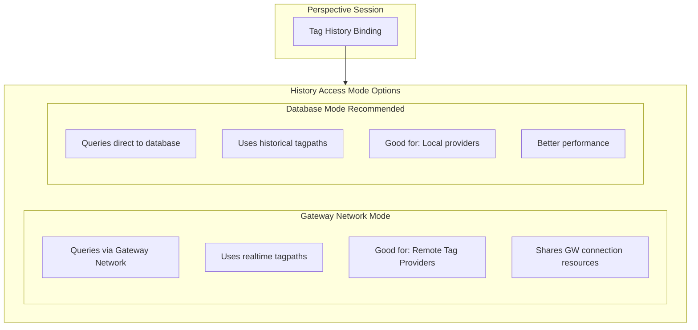
```mermaid
flowchart TB
    subgraph PERSPECTIVE["Perspective Session"]
        BINDING[Tag History Binding]
    end
    
    subgraph ACCESS_MODES["History Access Mode Options"]
        subgraph GW_NETWORK["Gateway Network Mode"]
            GW1[Queries via Gateway Network]
            GW2[Uses realtime tagpaths]
            GW3[Good for: Remote Tag Providers]
            GW4[Shares GW connection resources]
        end
        
        subgraph DB_DIRECT["Database Mode Recommended"]
            DB1[Queries direct to database]
            DB2[Uses historical tagpaths]
            DB3[Good for: Local providers]
            DB4[Better performance]
        end
    end
    
    BINDING --> ACCESS_MODES
```

**Recommended Configuration:**

```yaml
# For local Tag Provider with historian on same server
history_access_mode: "Database"  # Direct DB queries

# Tag path format for Database mode (historical tagpath)
historical_tagpath: "[MSSQL_Historian/ignition:default]Enterprise/Site001/Assembly/Line001/Spot001/BatteryLevel"

# Tag path format for Gateway Network mode (realtime tagpath)
realtime_tagpath: "[default]Enterprise/Site001/Assembly/Line001/Spot001/BatteryLevel"
```

**Perspective Tag History Binding Example:**

```python
# For trending charts - use historical tagpath when History Access Mode = Database
historical_tags = [
    "[MSSQL_Historian/ignition:default]Enterprise/Site001/Assembly/Line001/Spot001/BatteryLevel",
    "[MSSQL_Historian/ignition:default]Enterprise/Site001/Assembly/Line001/Spot001/Pose/X",
    "[MSSQL_Historian/ignition:default]Enterprise/Site001/Assembly/Line001/Spot001/Pose/Y"
]

# For real-time display - use realtime tagpath
realtime_tags = [
    "[default]Enterprise/Site001/Assembly/Line001/Spot001/BatteryLevel"
]
```

### 8.5 SQL Server Database Integration

Per Ignition documentation: *"Named Queries allow for retrieval including support for conditions, date and quality limitations."*

**Database Connection Configuration:**

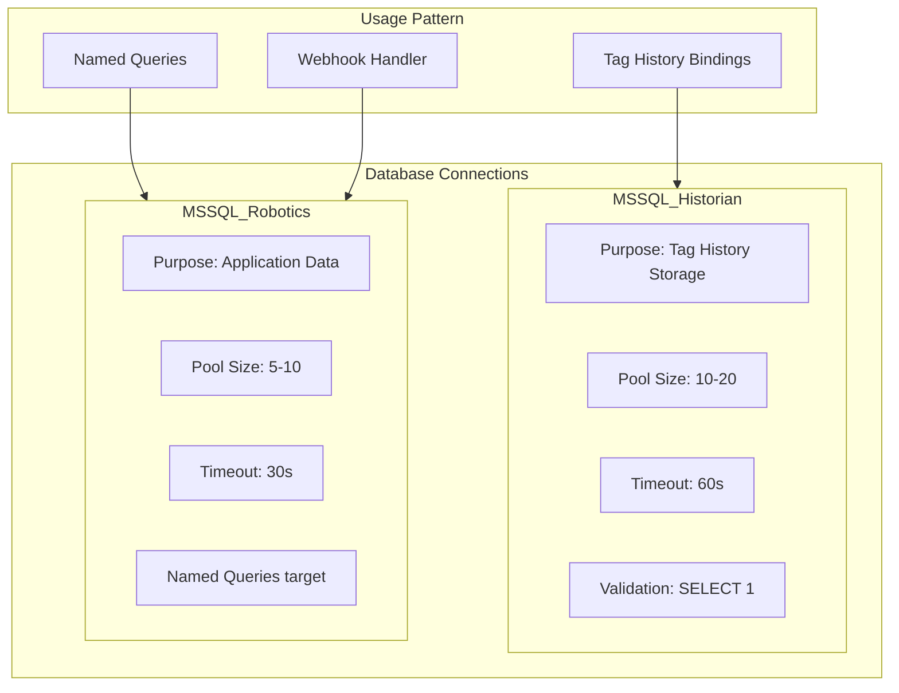
```mermaid
flowchart TB
    subgraph CONNECTIONS["Database Connections"]
        subgraph HISTORIAN_CONN["MSSQL_Historian"]
            H1[Purpose: Tag History Storage]
            H2[Pool Size: 10-20]
            H3[Timeout: 60s]
            H4[Validation: SELECT 1]
        end
        
        subgraph APP_CONN["MSSQL_Robotics"]
            A1[Purpose: Application Data]
            A2[Pool Size: 5-10]
            A3[Timeout: 30s]
            A4[Named Queries target]
        end
    end
    
    subgraph USAGE["Usage Pattern"]
        HIST_BIND[Tag History Bindings] --> HISTORIAN_CONN
        NQ[Named Queries] --> APP_CONN
        WEBHOOK[Webhook Handler] --> APP_CONN
    end
```

**Connection Pool Settings:**

| Connection | Pool Min | Pool Max | Timeout | Validation Query |
|------------|----------|----------|---------|------------------|
| MSSQL_Historian | 5 | 20 | 60s | `SELECT 1` |
| MSSQL_Robotics | 2 | 10 | 30s | `SELECT 1` |

**Named Query Best Practices:**

| Query Type | Caching | Polling Rate | Fallback | Use Case |
|------------|---------|--------------|----------|----------|
| Lookup tables | Yes, 5 min | Manual | Cached value | Dropdowns |
| Real-time list | No | 5-10 sec | Empty dataset | Active items |
| Historical report | No | Manual | Error message | Reports |
| Dashboard KPIs | Yes, 30 sec | 60 sec | Cached value | Metrics |

**Named Query Examples:**

```sql
-- GetRobotsBysite (Cached, 5 min TTL)
-- Purpose: Populate robot dropdown
SELECT RobotId, Nickname, Hostname
FROM Robotics.Robots
WHERE SiteId = :siteId AND IsActive = 1
ORDER BY Nickname

-- GetMissionHistory (Uncached, User-triggered)
-- Purpose: Historical table with filters
SELECT 
    r.RunId,
    r.MissionName,
    r.MissionStatusCode,
    r.StartedAtUtc,
    r.CompletedAtUtc,
    r.DurationMinutes,
    r.ActionCount,
    rob.Nickname AS RobotName
FROM Robotics.Runs r
LEFT JOIN Robotics.Robots rob ON r.RobotId = rob.RobotId
WHERE r.SiteId = :siteId
    AND r.StartedAtUtc >= :startDate
    AND r.StartedAtUtc < :endDate
    AND (:missionStatus IS NULL OR r.MissionStatusCode = :missionStatus)
ORDER BY r.StartedAtUtc DESC
OFFSET :offset ROWS FETCH NEXT :limit ROWS ONLY

-- GetKPIMetrics (Cached, 30 sec TTL)
-- Purpose: Dashboard KPIs
SELECT 
    COUNT(*) AS TotalRuns,
    SUM(CASE WHEN MissionStatusCode = 'COMP' THEN 1 ELSE 0 END) AS CompletedRuns,
    SUM(CASE WHEN MissionStatusCode = 'FAIL' THEN 1 ELSE 0 END) AS FailedRuns,
    AVG(DurationMinutes) AS AvgDuration,
    CAST(SUM(CASE WHEN MissionStatusCode = 'COMP' THEN 1.0 ELSE 0 END) / 
         NULLIF(COUNT(*), 0) * 100 AS DECIMAL(5,2)) AS SuccessRate
FROM Robotics.Runs
WHERE SiteId = :siteId
    AND StartedAtUtc >= :startDate
```

### 8.6 Architecture Pattern: Standard with Historian

Per Ignition documentation: *"Standard architecture is as straightforward as Ignition running on one server and the SQL database running on the second server."*

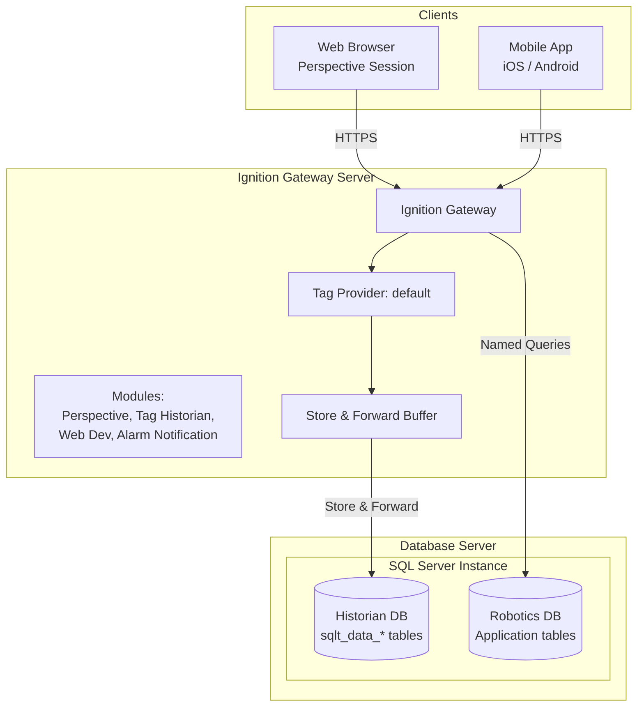
```mermaid
flowchart TB
    subgraph IGNITION_SERVER["Ignition Gateway Server"]
        GW[Ignition Gateway]
        MODULES[Modules:<br/>Perspective, Tag Historian,<br/>Web Dev, Alarm Notification]
        TAG_PROV[Tag Provider: default]
        SF[Store & Forward Buffer]
    end
    
    subgraph DB_SERVER["Database Server"]
        subgraph MSSQL["SQL Server Instance"]
            HIST_DB[(Historian DB<br/>sqlt_data_* tables)]
            APP_DB[(Robotics DB<br/>Application tables)]
        end
    end
    
    subgraph CLIENTS["Clients"]
        BROWSER[Web Browser<br/>Perspective Session]
        MOBILE[Mobile App<br/>iOS / Android]
    end
    
    GW --> TAG_PROV
    TAG_PROV --> SF
    SF -->|Store & Forward| HIST_DB
    GW -->|Named Queries| APP_DB
    
    BROWSER & MOBILE -->|HTTPS| GW
```

**For High Resilience (Future Consideration):**

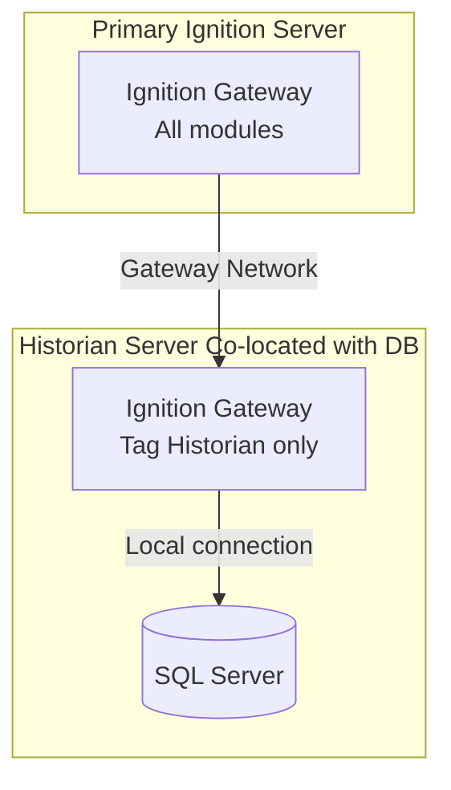
```mermaid
flowchart TB
    subgraph PRIMARY["Primary Ignition Server"]
        GW1[Ignition Gateway<br/>All modules]
    end
    
    subgraph HISTORIAN_SERVER["Historian Server Co-located with DB"]
        GW2[Ignition Gateway<br/>Tag Historian only]
        MSSQL[(SQL Server)]
    end
    
    GW1 -->|Gateway Network| GW2
    GW2 -->|Local connection| MSSQL
```

### 8.7 Tag Structure with Alarm Configuration

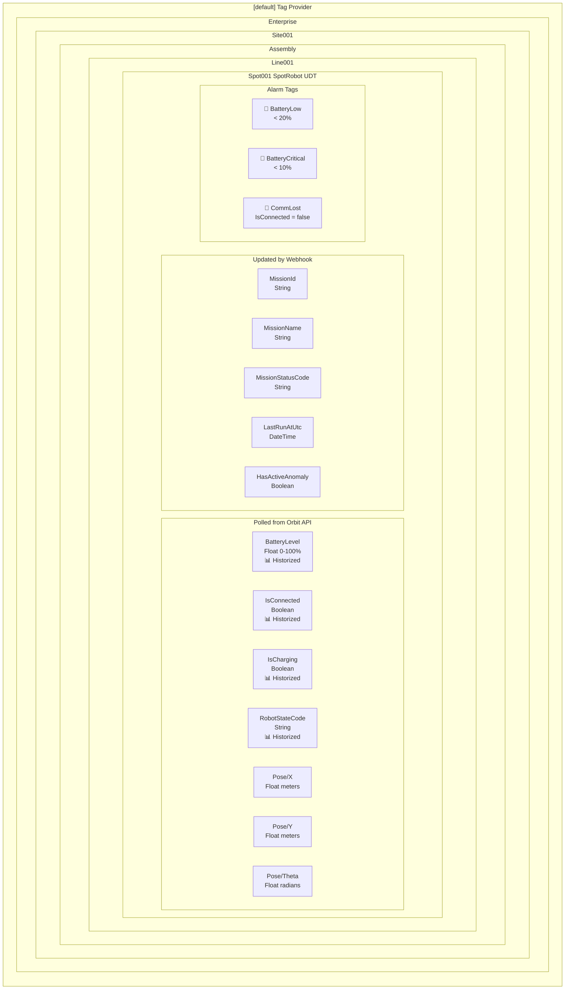
```mermaid
flowchart TB
    subgraph TAG_HIERARCHY["[default] Tag Provider"]
        direction TB
        
        subgraph ENTERPRISE["Enterprise"]
            subgraph SITE["Site001"]
                subgraph AREA["Assembly"]
                    subgraph LINE["Line001"]
                        subgraph ROBOT["Spot001 SpotRobot UDT"]
                            direction LR
                            
                            subgraph POLLED["Polled from Orbit API"]
                                BAT[BatteryLevel<br/>Float 0-100%<br/>📊 Historized]
                                CONN[IsConnected<br/>Boolean<br/>📊 Historized]
                                CHARGE[IsCharging<br/>Boolean<br/>📊 Historized]
                                STATE[RobotStateCode<br/>String<br/>📊 Historized]
                                POSE_X[Pose/X<br/>Float meters]
                                POSE_Y[Pose/Y<br/>Float meters]
                                POSE_T[Pose/Theta<br/>Float radians]
                            end
                            
                            subgraph WEBHOOK["Updated by Webhook"]
                                MIS_ID[MissionId<br/>String]
                                MIS_NAME[MissionName<br/>String]
                                MIS_STATUS[MissionStatusCode<br/>String]
                                LAST_RUN[LastRunAtUtc<br/>DateTime]
                                HAS_ANOM[HasActiveAnomaly<br/>Boolean]
                            end
                            
                            subgraph ALARMS["Alarm Tags"]
                                ALM_BAT_LO[🚨 BatteryLow<br/>< 20%]
                                ALM_BAT_CR[🚨 BatteryCritical<br/>< 10%]
                                ALM_COMM[🚨 CommLost<br/>IsConnected = false]
                            end
                        end
                    end
                end
            end
        end
    end
```

### 8.2 UDT Definition with Alarms

```
SpotRobot (UDT)
│
├── [Parameters]
│   ├── RobotHostname       : String
│   ├── SiteId              : Int
│   └── TagBasePath         : String
│
├── [Polled Tags - Historian Enabled]
│   ├── BatteryLevel        : Float     (history: 1% deadband)
│   │   └── ALARMS:
│   │       ├── BatteryLow     : Level < 20, Priority: Medium
│   │       └── BatteryCritical: Level < 10, Priority: Critical
│   │
│   ├── IsConnected         : Boolean   (history: on change)
│   │   └── ALARMS:
│   │       └── CommLost       : Value = false for > 60s, Priority: High
│   │
│   ├── IsCharging          : Boolean   (history: on change)
│   ├── RobotStateCode      : String    (history: on change)
│   └── Pose/
│       ├── X               : Float     (history: 0.1m deadband)
│       ├── Y               : Float     (history: 0.1m deadband)
│       └── Theta           : Float     (history: 0.05 rad deadband)
│
├── [Webhook Tags - No History]
│   ├── MissionId           : String
│   ├── MissionName         : String
│   ├── MissionStatusCode   : String
│   │   └── ALARMS:
│   │       └── MissionFailed  : Value = "FAIL", Priority: High
│   │
│   ├── LastRunAtUtc        : DateTime
│   ├── HasActiveAnomaly    : Boolean
│   │   └── ALARMS:
│   │       └── AnomalyActive  : Value = true, Priority: Medium
│   │
│   ├── ActiveAnomalyCount  : Int
│   └── LastErrorCode       : Int
│
└── [System Tags]
    ├── CommStatus          : Int (OPC quality)
    ├── LastPollAtUtc       : DateTime
    └── PollErrorCount      : Int
```

---

## 9. Ignition Perspective Design

Following Ignition Perspective best practices, this section defines the UI architecture before implementation.

### 9.1 Design Considerations Checklist

Per Ignition documentation, plan these elements before building:

| Consideration | Decision |
|---------------|----------|
| **Navigation Structure** | Left docked menu + top header bar |
| **Page Hierarchy** | Role-based pages with shared components |
| **Mobile Responsive** | Yes - Breakpoint container for phone/tablet/desktop |
| **Touch Optimized** | Yes - Large buttons, swipe gestures |
| **Theme Support** | Light/Dark themes with CSS variables |
| **Offline Capability** | Limited - Tags cached, DB queries require connection |

### 9.2 Project Navigation Flowchart

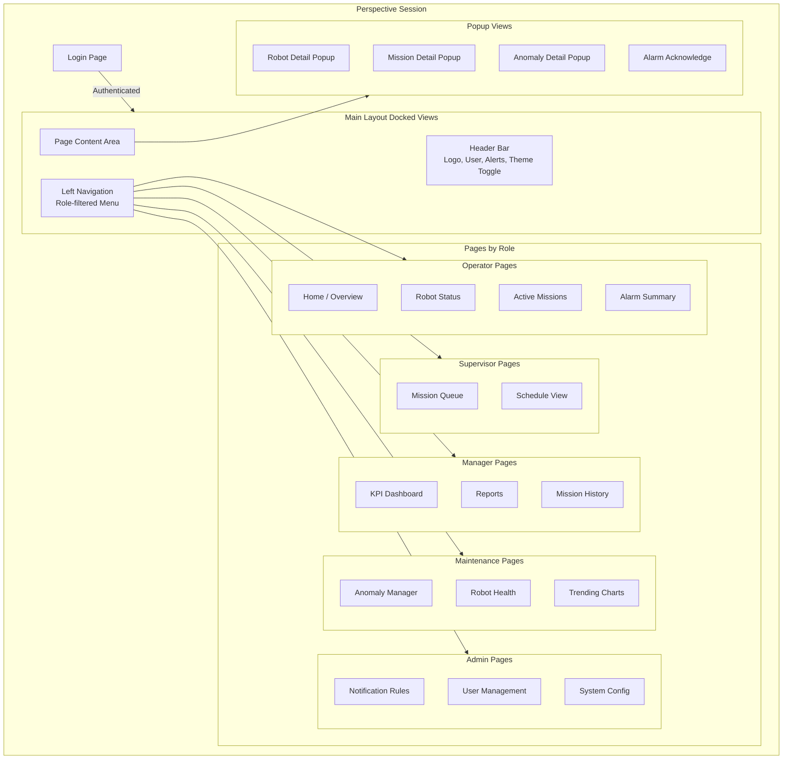
```mermaid
flowchart TB
    subgraph SESSION["Perspective Session"]
        LOGIN[Login Page]
        
        subgraph MAIN_LAYOUT["Main Layout Docked Views"]
            HEADER[Header Bar<br/>Logo, User, Alerts, Theme Toggle]
            NAV[Left Navigation<br/>Role-filtered Menu]
            CONTENT[Page Content Area]
        end
        
        subgraph PAGES["Pages by Role"]
            subgraph OPERATOR_PAGES["Operator Pages"]
                OP_HOME[Home / Overview]
                OP_ROBOTS[Robot Status]
                OP_MISSIONS[Active Missions]
                OP_ALARMS[Alarm Summary]
            end
            
            subgraph SUPERVISOR_PAGES["Supervisor Pages"]
                SUP_QUEUE[Mission Queue]
                SUP_SCHEDULE[Schedule View]
            end
            
            subgraph MANAGER_PAGES["Manager Pages"]
                MGR_KPI[KPI Dashboard]
                MGR_REPORTS[Reports]
                MGR_HISTORY[Mission History]
            end
            
            subgraph MAINT_PAGES["Maintenance Pages"]
                MAINT_ANOMALY[Anomaly Manager]
                MAINT_HEALTH[Robot Health]
                MAINT_TRENDING[Trending Charts]
            end
            
            subgraph ADMIN_PAGES["Admin Pages"]
                ADMIN_RULES[Notification Rules]
                ADMIN_USERS[User Management]
                ADMIN_CONFIG[System Config]
            end
        end
        
        subgraph POPUPS["Popup Views"]
            POP_ROBOT[Robot Detail Popup]
            POP_MISSION[Mission Detail Popup]
            POP_ANOMALY[Anomaly Detail Popup]
            POP_ALARM[Alarm Acknowledge]
        end
    end
    
    LOGIN -->|Authenticated| MAIN_LAYOUT
    NAV --> OPERATOR_PAGES & SUPERVISOR_PAGES & MANAGER_PAGES & MAINT_PAGES & ADMIN_PAGES
    CONTENT --> POPUPS
```

### 9.3 Page Hierarchy & View Structure

```
📁 Views/
├── 📁 Layouts/
│   ├── MainLayout              -- Primary layout with docked views
│   └── LoginLayout             -- Unauthenticated layout
│
├── 📁 Docked/
│   ├── Header                  -- Top bar (logo, user info, alerts badge)
│   ├── LeftNav                 -- Collapsible navigation menu
│   └── Footer                  -- Optional status bar
│
├── 📁 Pages/
│   ├── 📁 Operator/
│   │   ├── Home                -- Overview with robot cards
│   │   ├── RobotStatus         -- All robots grid view
│   │   ├── ActiveMissions      -- Currently running missions
│   │   └── AlarmSummary        -- Active alarms table
│   │
│   ├── 📁 Supervisor/
│   │   ├── MissionQueue        -- Pending/scheduled missions
│   │   └── ScheduleCalendar    -- Calendar view
│   │
│   ├── 📁 Manager/
│   │   ├── KPIDashboard        -- Charts and metrics
│   │   ├── Reports             -- Report launcher
│   │   └── MissionHistory      -- Historical table with filters
│   │
│   ├── 📁 Maintenance/
│   │   ├── AnomalyManager      -- Anomaly list with actions
│   │   ├── RobotHealth         -- Detailed health metrics
│   │   └── Trending            -- Historical charts
│   │
│   └── 📁 Admin/
│       ├── NotificationRules   -- CRUD for rules
│       ├── Recipients          -- Email recipient management
│       └── SystemConfig        -- Site/robot configuration
│
├── 📁 Popups/
│   ├── RobotDetail             -- Detailed robot view
│   ├── MissionDetail           -- Mission run details
│   ├── AnomalyDetail           -- Anomaly info and actions
│   ├── AlarmAcknowledge        -- Alarm ack dialog
│   └── Confirmation            -- Generic confirm dialog
│
├── 📁 Templates/                -- Reusable Embedded Views
│   ├── RobotCard               -- Robot status card (used in grids)
│   ├── MissionRow              -- Mission table row
│   ├── AnomalyRow              -- Anomaly table row
│   ├── AlarmBadge              -- Alarm count indicator
│   ├── BatteryGauge            -- Battery level component
│   ├── ConnectionStatus        -- Online/offline indicator
│   └── KPITile                 -- Metric display tile
│
└── 📁 Shared/
    ├── LoadingSpinner          -- Loading indicator
    ├── ErrorMessage            -- Error display
    ├── EmptyState              -- No data message
    └── SearchFilter            -- Reusable search/filter bar
```

### 9.4 Responsive Design with Breakpoints

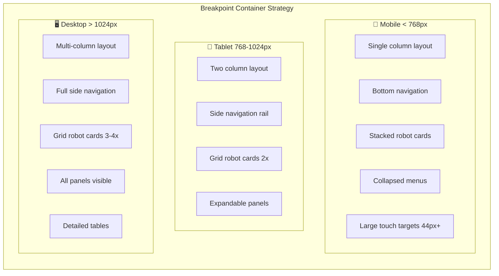
```mermaid
flowchart LR
    subgraph BREAKPOINTS["Breakpoint Container Strategy"]
        direction TB
        
        subgraph MOBILE["📱 Mobile < 768px"]
            M1[Single column layout]
            M2[Bottom navigation]
            M3[Stacked robot cards]
            M4[Collapsed menus]
            M5[Large touch targets 44px+]
        end
        
        subgraph TABLET["📱 Tablet 768-1024px"]
            T1[Two column layout]
            T2[Side navigation rail]
            T3[Grid robot cards 2x]
            T4[Expandable panels]
        end
        
        subgraph DESKTOP["🖥️ Desktop > 1024px"]
            D1[Multi-column layout]
            D2[Full side navigation]
            D3[Grid robot cards 3-4x]
            D4[All panels visible]
            D5[Detailed tables]
        end
    end
```

**Breakpoint Configuration:**

| Breakpoint | Width | Navigation | Content Layout |
|------------|-------|------------|----------------|
| Mobile | < 768px | Bottom tab bar | Single column, stacked |
| Tablet | 768-1024px | Collapsible rail | 2 columns |
| Desktop | > 1024px | Full left nav | 3-4 columns |

### 9.5 Docked View Configuration

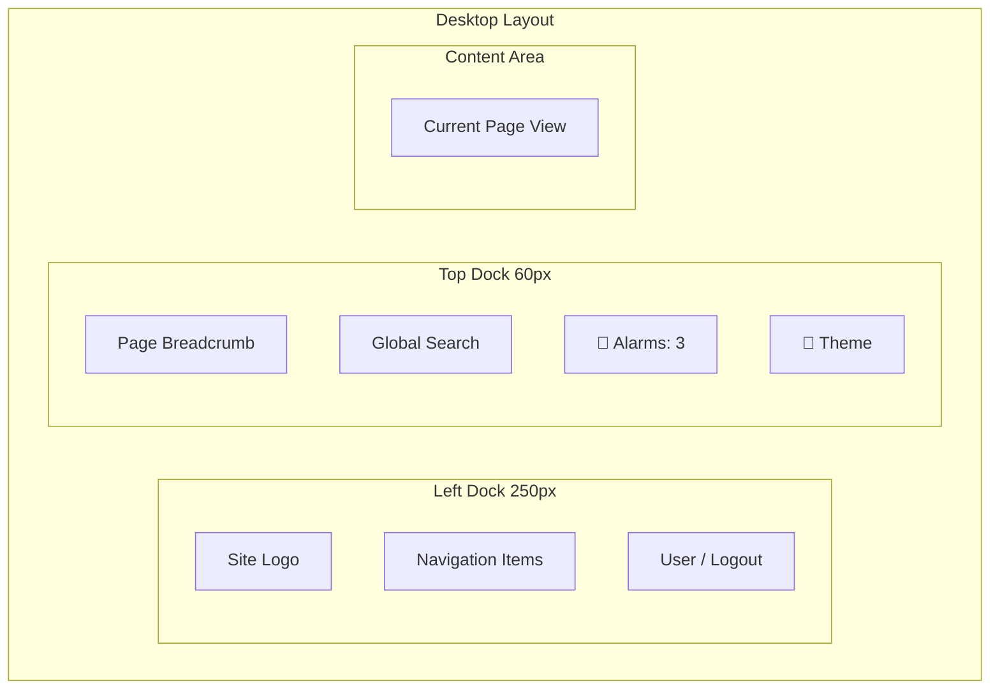
```mermaid
flowchart TB
    subgraph DESKTOP_LAYOUT["Desktop Layout"]
        direction LR
        
        subgraph LEFT_DOCK["Left Dock 250px"]
            LOGO[Site Logo]
            NAV_ITEMS[Navigation Items]
            USER_INFO[User / Logout]
        end
        
        subgraph TOP_DOCK["Top Dock 60px"]
            BREADCRUMB[Page Breadcrumb]
            SEARCH[Global Search]
            ALARM_BADGE[🔔 Alarms: 3]
            THEME[🌙 Theme]
        end
        
        subgraph CONTENT["Content Area"]
            PAGE[Current Page View]
        end
    end
```

**Docked View Specifications:**

| Dock Position | View | Width/Height | Behavior |
|---------------|------|--------------|----------|
| Left | LeftNav | 250px (desktop), 60px rail (tablet), hidden (mobile) | Collapsible |
| Top | Header | 60px | Always visible |
| Bottom | MobileNav | 60px (mobile only) | Tab bar navigation |

### 9.6 Component Templates (Embedded Views)

#### RobotCard Template

```mermaid
flowchart TB
    subgraph ROBOT_CARD["RobotCard Template"]
        direction TB
        
        subgraph HEADER_ROW["Header"]
            ICON[🤖]
            NAME[Robot Nickname]
            STATUS[● Online]
        end
        
        subgraph METRICS["Metrics Row"]
            BATTERY[🔋 78%]
            MISSION[📋 Running: Inspection-A]
        end
        
        subgraph FOOTER_ROW["Footer"]
            UPTIME[Uptime: 4h 23m]
            ACTIONS[View Details →]
        end
    end
```

**Template Parameters:**

```
RobotCard
├── Parameters (Inputs)
│   ├── robotId         : Int
│   ├── tagBasePath     : String    -- e.g., "[default]Enterprise/Site/Area/Line/Spot001"
│   └── showActions     : Boolean   -- Show/hide action buttons
│
└── Internal Bindings
    ├── BatteryLevel    : Tag binding → {tagBasePath}/BatteryLevel
    ├── IsConnected     : Tag binding → {tagBasePath}/IsConnected
    ├── MissionName     : Tag binding → {tagBasePath}/MissionName
    └── MissionStatus   : Tag binding → {tagBasePath}/MissionStatusCode
```

### 9.7 Binding Strategies

| Data Type | Binding Method | Reason |
|-----------|----------------|--------|
| Real-time robot status | **Direct Tag Binding** | Automatic updates, low latency |
| Mission history table | **Named Query Binding** | Filtered, paginated data from MSSQL |
| KPI calculations | **Expression Binding** | Computed from multiple sources |
| User role/permissions | **Session Props** | Cached per session |
| Current page context | **Page Props** | Page-specific state |
| Dropdown options | **Named Query** with polling | Lookup tables |

**Example Bindings:**

```python
# Direct Tag Binding (for real-time)
{tagBasePath}/BatteryLevel

# Named Query Binding (for historical data)
runNamedQuery("GetMissionHistory", {
    "site_id": {session.custom.siteId},
    "start_date": {view.params.startDate},
    "limit": 100
})

# Expression Binding (for computed values)
if({[.]BatteryLevel} < 20, "Low", 
   if({[.]BatteryLevel} < 50, "Medium", "Good"))

# Transform (for formatting)
dateFormat({this}, "yyyy-MM-dd HH:mm:ss")
```

### 9.8 Session and Page Properties

```mermaid
flowchart TB
    subgraph SESSION_PROPS["Session Properties session.custom.*"]
        S1[userId]
        S2[username]
        S3[roles - array]
        S4[siteId]
        S5[siteName]
        S6[timezone]
        S7[theme - light/dark]
        S8[language]
    end
    
    subgraph PAGE_PROPS["Page Properties page.params.*"]
        P1[robotId - for detail pages]
        P2[missionId - for detail pages]
        P3[dateRange - for history pages]
        P4[filterStatus - for list pages]
    end
    
    subgraph VIEW_PARAMS["View Parameters view.params.*"]
        V1[tagBasePath - for templates]
        V2[robotId - for embedded views]
        V3[showActions - boolean flags]
    end
```

### 9.9 Security Integration

```mermaid
flowchart TB
    subgraph IDP["Identity Provider"]
        IGNITION_IDP[Ignition Internal IDP]
        AD[Active Directory / LDAP]
    end
    
    subgraph ROLES["Security Roles"]
        R1[Operator]
        R2[Supervisor]
        R3[Manager]
        R4[Maintenance]
        R5[Administrator]
    end
    
    subgraph PERMISSIONS["Page Permissions"]
        PERM1[/Operator/* - Operator+]
        PERM2[/Supervisor/* - Supervisor+]
        PERM3[/Manager/* - Manager+]
        PERM4[/Maintenance/* - Maintenance+]
        PERM5[/Admin/* - Administrator only]
    end
    
    IDP --> ROLES
    ROLES --> PERMISSIONS
```

**Role-based Navigation Filtering:**

```python
# Script to filter navigation based on role
def get_nav_items(roles):
    all_items = [
        {"label": "Home", "path": "/operator/home", "roles": ["Operator", "Supervisor", "Manager", "Maintenance", "Administrator"]},
        {"label": "Robots", "path": "/operator/robots", "roles": ["Operator", "Supervisor", "Manager", "Maintenance", "Administrator"]},
        {"label": "Mission Queue", "path": "/supervisor/queue", "roles": ["Supervisor", "Manager", "Administrator"]},
        {"label": "KPIs", "path": "/manager/kpi", "roles": ["Manager", "Administrator"]},
        {"label": "Anomalies", "path": "/maintenance/anomalies", "roles": ["Maintenance", "Manager", "Administrator"]},
        {"label": "Settings", "path": "/admin/rules", "roles": ["Administrator"]},
    ]
    
    user_roles = set(roles)
    return [item for item in all_items if user_roles.intersection(set(item["roles"]))]
```

### 9.10 Style Classes and Theming

**Theme Variables (CSS):**

```css
/* Light Theme */
:root {
  --primary-color: #1976D2;
  --secondary-color: #424242;
  --background-color: #FAFAFA;
  --surface-color: #FFFFFF;
  --text-primary: #212121;
  --text-secondary: #757575;
  --success-color: #4CAF50;
  --warning-color: #FF9800;
  --error-color: #F44336;
  --border-radius: 8px;
}

/* Dark Theme */
[data-theme="dark"] {
  --primary-color: #90CAF9;
  --secondary-color: #B0BEC5;
  --background-color: #121212;
  --surface-color: #1E1E1E;
  --text-primary: #FFFFFF;
  --text-secondary: #B0B0B0;
}
```

**Style Classes:**

| Class Name | Purpose | Usage |
|------------|---------|-------|
| `psc-robot-card` | Robot status card styling | RobotCard template |
| `psc-kpi-tile` | KPI metric tile | KPIDashboard |
| `psc-alarm-critical` | Critical alarm highlight | Alarm tables |
| `psc-alarm-warning` | Warning alarm highlight | Alarm tables |
| `psc-status-online` | Green online indicator | Status badges |
| `psc-status-offline` | Red offline indicator | Status badges |
| `psc-battery-low` | Low battery warning | Battery gauges |

### 9.11 Perspective Mobile App Considerations

For operators using the **Ignition Perspective App** on iOS/Android:

| Feature | Implementation |
|---------|----------------|
| **Push Notifications** | Not native - use email/SMS for alerts |
| **Barcode Scanning** | Can use for robot/asset identification |
| **GPS Location** | Can track operator location for safety |
| **Offline Mode** | Tags cached briefly; graceful degradation |
| **Biometric Login** | Supported by app |

### 9.12 Performance Best Practices

| Practice | Implementation |
|----------|----------------|
| **Tag Binding Efficiency** | Use indirect tag bindings with parameters |
| **Query Pagination** | Limit results, use offset for large tables |
| **Lazy Loading** | Load popup content on demand |
| **Polling Intervals** | Named queries: 5-30s depending on data freshness needs |
| **Component Caching** | Use session props for static lookups |
| **Image Optimization** | Use SVG for icons, compress images |

---

## 10. Implementation Plan

### 10.1 Phase Overview (Mermaid Gantt)

```mermaid
gantt
    title Implementation Phases
    dateFormat  YYYY-MM-DD
    
    section Phase 1: Foundation
    Database setup           :p1a, 2026-02-01, 3d
    Ignition DB connection   :p1b, after p1a, 1d
    Named Queries            :p1c, after p1b, 2d
    SpotRobot UDT            :p1d, after p1c, 2d
    
    section Phase 2: Polling Flow A
    poll_robots.py script    :p2a, after p1d, 2d
    Gateway Timer setup      :p2b, after p2a, 1d
    Historian config         :p2c, after p2b, 2d
    Store & Forward setup    :p2d, after p2c, 1d
    
    section Phase 3: Webhook Flow B
    Web Dev endpoint         :p3a, after p2d, 2d
    Webhook handler          :p3b, after p3a, 3d
    Orbit webhook config     :p3c, after p3b, 1d
    
    section Phase 4: Notifications
    Rule engine              :p4a, after p3c, 3d
    Email templates          :p4b, after p4a, 2d
    SMTP integration         :p4c, after p4b, 1d
    
    section Phase 5: Alarms
    Alarm pipeline setup     :p5a, after p4c, 2d
    Alarm thresholds         :p5b, after p5a, 2d
    Alarm notifications      :p5c, after p5b, 2d
    
    section Phase 6: Perspective UI
    View structure setup     :p6a, after p5c, 2d
    Templates/components     :p6b, after p6a, 3d
    Operator dashboard       :p6c, after p6b, 5d
    Manager dashboard        :p6d, after p6c, 5d
    Maintenance view         :p6e, after p6d, 3d
    Trending charts          :p6f, after p6e, 3d
    Mobile responsive        :p6g, after p6f, 3d
    
    section Phase 7: Testing
    Unit tests               :p7a, after p6g, 3d
    Integration tests        :p7b, after p7a, 3d
    Mobile testing           :p7c, after p7b, 2d
    UAT                      :p7d, after p7c, 5d
```

### 10.2 Detailed Task List

#### Phase 1: Foundation (Database & Basic Setup)
- [ ] **1.1** Create MSSQL database and Robotics schema
- [ ] **1.2** Execute DDL scripts for all tables
- [ ] **1.3** Insert seed data for lookup tables
- [ ] **1.4** Configure Ignition database connection
- [ ] **1.5** Create Named Queries in Ignition
- [ ] **1.6** Create SpotRobot UDT in Ignition
- [ ] **1.7** Create tag hierarchy structure

#### Phase 2: Orbit API Polling (Flow A)
- [ ] **2.1** Create `orbit/poll_robots.py` project script
- [ ] **2.2** Configure Gateway Timer Script (every 15 sec)
- [ ] **2.3** Test tag updates from Orbit API
- [ ] **2.4** Configure Tag Historian provider
- [ ] **2.5** Configure Store & Forward buffer
- [ ] **2.6** Set up historian partitioning
- [ ] **2.7** Verify trending works in Perspective

#### Phase 3: Webhook Integration (Flow B)
- [ ] **3.1** Enable Web Dev Module in Ignition Gateway
- [ ] **3.2** Create webhook endpoint: `/system/webdev/orbit/webhook`
- [ ] **3.3** Implement webhook payload parser (Python)
- [ ] **3.4** Configure Orbit webhook to point to Ignition endpoint
- [ ] **3.5** Test webhook connectivity end-to-end
- [ ] **3.6** Implement tag updates from webhook events

#### Phase 4: Notification Engine
- [ ] **4.1** Implement rule evaluation logic (Python)
- [ ] **4.2** Create email template rendering function
- [ ] **4.3** Configure SMTP settings in Ignition
- [ ] **4.4** Implement `send_notification()` function
- [ ] **4.5** Create scheduled polling for missed webhooks (backup)

#### Phase 5: Alarm System
- [ ] **5.1** Configure Alarm Pipeline in Ignition
- [ ] **5.2** Set up alarm thresholds on SpotRobot UDT
- [ ] **5.3** Configure Alarm Journal (historian)
- [ ] **5.4** Create alarm email notifications
- [ ] **5.5** Set up AlarmHistory table sync

#### Phase 6: Perspective UI Development
- [ ] **6.1** Create project structure (Views/, Pages/, Templates/, Popups/)
- [ ] **6.2** Build MainLayout with docked views (Header, LeftNav)
- [ ] **6.3** Create reusable templates (RobotCard, KPITile, StatusBadge)
- [ ] **6.4** Implement Breakpoint Container for responsive design
- [ ] **6.5** Build Operator/Home page with robot grid
- [ ] **6.6** Build Operator/RobotStatus page
- [ ] **6.7** Build Operator/AlarmSummary page
- [ ] **6.8** Build Manager/KPIDashboard page
- [ ] **6.9** Build Manager/MissionHistory page with Named Query binding
- [ ] **6.10** Build Maintenance/AnomalyManager page
- [ ] **6.11** Build Maintenance/Trending page with historian charts
- [ ] **6.12** Build Admin/NotificationRules CRUD page
- [ ] **6.13** Create popup views (RobotDetail, MissionDetail, AnomalyDetail)
- [ ] **6.14** Implement role-based navigation filtering
- [ ] **6.15** Configure style classes and themes (Light/Dark)
- [ ] **6.16** Test mobile responsive layouts (phone, tablet, desktop)
- [ ] **6.17** Test on Perspective mobile app (iOS/Android)

#### Phase 7: Testing & Documentation
- [ ] **7.1** Unit test webhook handlers
- [ ] **7.2** Integration test: Orbit → Ignition → Email
- [ ] **7.3** Test Store & Forward recovery
- [ ] **7.4** Load test with multiple simultaneous events
- [ ] **7.5** User Acceptance Testing
- [ ] **7.6** Create user documentation
- [ ] **7.7** Create administrator guide

---

## 11. Appendix

### A. Orbit Webhook Configuration

```json
{
  "url": "https://ignition-gateway.company.com/system/webdev/orbit/webhook",
  "enabled": true,
  "events": {
    "run": ["started", "completed", "failed"],
    "anomaly": ["opened", "closed"],
    "robot": ["connected", "disconnected"]
  },
  "validateTlsCert": true,
  "secret": "<32-bit-hex-string>"
}
```

### B. Email Template Variables

| Variable | Source | Description |
|----------|--------|-------------|
| `{{SiteName}}` | Sites.Name | Site display name |
| `{{RobotNickname}}` | Robots.Nickname | Robot friendly name |
| `{{RobotHostname}}` | Robots.Hostname | Robot network name |
| `{{MissionName}}` | Runs.MissionName | Mission/SiteWalk name |
| `{{MissionStatusCode}}` | Runs.MissionStatusCode | Status enum |
| `{{StartedAtUtc}}` | Runs.StartedAtUtc | Run start time |
| `{{CompletedAtUtc}}` | Runs.CompletedAtUtc | Run end time |
| `{{Duration}}` | Runs.DurationMinutes | Minutes elapsed |
| `{{ActionCount}}` | Runs.ActionCount | Number of actions |
| `{{OperatorId}}` | Runs.OperatorId | Driver username |
| `{{Title}}` | Anomalies.Title | Anomaly headline |
| `{{Severity}}` | Anomalies.Severity | 1-5 scale |
| `{{AssetId}}` | Anomalies.AssetId | Equipment identifier |
| `{{DetectedAtUtc}}` | Anomalies.DetectedAtUtc | Alert timestamp |
| `{{BatteryLevel}}` | Tags | Current battery % |
| `{{AlarmName}}` | Alarms | Triggered alarm name |

### C. Alarm Configuration Reference

| Alarm Name | Tag | Condition | Priority | Notification |
|------------|-----|-----------|----------|--------------|
| BatteryLow | BatteryLevel | < 20% | Medium | Email to Operator |
| BatteryCritical | BatteryLevel | < 10% | Critical | Email to Operator + Maintenance |
| CommLost | IsConnected | false > 60s | High | Email to Operator + Maintenance |
| MissionFailed | MissionStatusCode | = "FAIL" | High | Email to Operator |
| AnomalyActive | HasActiveAnomaly | = true | Medium | Email to Maintenance |

### D. Store and Forward Settings

| Setting | Value | Description |
|---------|-------|-------------|
| Buffer Location | `/var/lib/ignition/historian-buffer` | Local disk path |
| Max Buffer Size | 5000 MB | Maximum local storage |
| Forward Interval | 5000 ms | How often to attempt forward |
| Batch Size | 10000 | Records per batch insert |
| Compression | LZ4 | Buffer compression type |

### E. Database Connection Configuration

**MSSQL Connection String (Gateway Config):**

```
# MSSQL_Robotics Connection
jdbc:sqlserver://dbserver.company.com:1433;databaseName=Robotics;encrypt=true;trustServerCertificate=false

# Settings
- Driver: Microsoft SQL Server (jTDS or Microsoft JDBC)
- Default Schema: Robotics
- Connection Pool Min: 2
- Connection Pool Max: 10
- Connection Timeout: 30000 ms
- Validation Query: SELECT 1
- Validation Timeout: 5000 ms
```

**MSSQL_Historian Connection:**

```
# MSSQL_Historian Connection  
jdbc:sqlserver://dbserver.company.com:1433;databaseName=Historian;encrypt=true;trustServerCertificate=false

# Settings (optimized for historian)
- Connection Pool Min: 5
- Connection Pool Max: 20
- Connection Timeout: 60000 ms
- Batch Size: 10000 (for Store & Forward)
```

### F. Tag History Provider Configuration

**Gateway Config > Tags > History:**

| Setting | Value |
|---------|-------|
| Name | SpotRobotHistorian |
| Description | Spot robot tag history storage |
| History Provider Type | Database |
| Datasource | MSSQL_Historian |
| Store & Forward | Enabled |
| Partition Period | Month |
| Pre-create Partitions | 3 |
| Enable Data Pruning | Yes |
| Pruning Age (days) | 90 (raw), configured per tag |

### G. Perspective Component Reference

| Component | Use Case | Binding Type |
|-----------|----------|--------------|
| **Flex Container** | Responsive layouts | N/A |
| **Breakpoint Container** | Mobile/tablet/desktop switching | N/A |
| **Embedded View** | Reusable templates | view.params |
| **Table** | Mission history, anomalies | Named Query |
| **Power Chart** | Trending with historian | Tag History (historical tagpath) |
| **XY Chart** | Real-time trends | Tag Binding (realtime tagpath) |
| **LED Display** | Status indicators | Direct tag binding |
| **Linear Scale** | Battery gauge | Direct tag binding |
| **Alarm Status Table** | Active alarms | Alarm query binding |
| **Alarm Journal Table** | Alarm history | Alarm journal binding |
| **Icon** | Material Design icons | Static / Expression |
| **Button** | Actions | onClick script |
| **Dropdown** | Filters | Named Query (cached) |
| **Label** | Text display | Tag / Expression |
| **Cylindrical Tank** | Level visualization | Tag binding |

### H. Named Query Reference for Perspective

| Query Name | Return Type | Caching | Polling | Used In |
|------------|-------------|---------|---------|---------|
| `GetAllRobots` | Dataset | No | 30 sec | Robot grid |
| `GetMissionHistory` | Dataset | No | Manual | Mission table |
| `GetActiveAnomalies` | Dataset | No | 10 sec | Anomaly table |
| `GetKPIMetrics` | Dataset | 30 sec TTL | 60 sec | KPI dashboard |
| `GetNotificationRules` | Dataset | No | Manual | Admin page |
| `GetRecentNotifications` | Dataset | No | 30 sec | Email log |
| `GetLookupMissionStatus` | Dataset | 5 min TTL | Session start | Dropdowns |
| `GetLookupTriggerTypes` | Dataset | 5 min TTL | Session start | Dropdowns |
| `GetRobotBySiteHostname` | Dataset | No | On demand | Webhook handler |
| `UpsertRun` | Update Query | N/A | On webhook | Event processing |
| `UpsertAnomaly` | Update Query | N/A | On webhook | Event processing |

### H.1 Tag History Binding Configuration (Power Chart)

For trending charts using Tag History bindings:

```yaml
# Power Chart Tag History Binding
binding_type: "Tag History"
configuration:
  tags:
    # Use HISTORICAL tagpaths when History Access Mode = Database
    - path: "[MSSQL_Historian/ignition:default]Enterprise/Site001/Assembly/Line001/Spot001/BatteryLevel"
      alias: "Battery %"
      aggregate: "Average"
    - path: "[MSSQL_Historian/ignition:default]Enterprise/Site001/Assembly/Line001/Spot001/Pose/X"
      alias: "Position X"
      aggregate: "LastValue"
  
  date_range:
    mode: "Historical"
    start: "view.params.startDate"  # Bound to page parameter
    end: "view.params.endDate"
  
  return_size: 1000              # Max data points
  polling_rate: 0                # Manual refresh for history
  prevent_interpolation: false   # Allow interpolation for gaps
```

**Tag Path Format Reference:**

| Access Mode | Tag Path Format | Example |
|-------------|-----------------|---------|
| Gateway Network | Realtime tagpath | `[default]Enterprise/Site001/.../BatteryLevel` |
| Database (Direct) | Historical tagpath | `[MSSQL_Historian/ignition:default]Enterprise/Site001/.../BatteryLevel` |

### H.2 UDT Definition Export (JSON Format)

Per Ignition best practice, export UDT definitions to JSON for version control:

```json
{
  "name": "SpotRobot",
  "tagType": "UdtType",
  "tags": [
    {
      "name": "BatteryLevel",
      "tagType": "AtomicTag",
      "valueSource": "memory",
      "dataType": "Float8",
      "historyEnabled": true,
      "historyProvider": "SpotRobotHistorian",
      "historicalDeadband": 1.0,
      "historicalDeadbandStyle": "Percent",
      "alarms": [
        {
          "name": "BatteryLow",
          "priority": "Medium",
          "setpointA": 20.0,
          "mode": "BelowSetpoint"
        },
        {
          "name": "BatteryCritical", 
          "priority": "Critical",
          "setpointA": 10.0,
          "mode": "BelowSetpoint"
        }
      ]
    },
    {
      "name": "IsConnected",
      "tagType": "AtomicTag",
      "valueSource": "memory",
      "dataType": "Boolean",
      "historyEnabled": true,
      "historyProvider": "SpotRobotHistorian",
      "alarms": [
        {
          "name": "CommLost",
          "priority": "High",
          "setpointA": false,
          "mode": "Equality",
          "timeOnDelaySeconds": 60
        }
      ]
    },
    {
      "name": "Pose",
      "tagType": "Folder",
      "tags": [
        {
          "name": "X",
          "tagType": "AtomicTag",
          "dataType": "Float8",
          "historyEnabled": true,
          "historicalDeadband": 0.1,
          "historicalDeadbandStyle": "Absolute",
          "engUnit": "m"
        },
        {
          "name": "Y",
          "tagType": "AtomicTag",
          "dataType": "Float8",
          "historyEnabled": true,
          "historicalDeadband": 0.1,
          "historicalDeadbandStyle": "Absolute",
          "engUnit": "m"
        },
        {
          "name": "Theta",
          "tagType": "AtomicTag",
          "dataType": "Float8",
          "historyEnabled": true,
          "historicalDeadband": 0.05,
          "historicalDeadbandStyle": "Absolute",
          "engUnit": "rad"
        }
      ]
    },
    {
      "name": "MissionStatusCode",
      "tagType": "AtomicTag",
      "valueSource": "memory",
      "dataType": "String",
      "historyEnabled": false
    }
  ],
  "parameters": {
    "RobotHostname": {
      "dataType": "String"
    },
    "SiteId": {
      "dataType": "Int4"
    },
    "TagBasePath": {
      "dataType": "String"
    }
  }
}
```

### I. Perspective Session Events

```python
# Session Startup Script
# Path: Project > Perspective > Session Events > onStartup

def onStartup(session):
    """Initialize session properties on login."""
    user = session.props.auth.user
    
    # Set custom session properties
    session.custom.userId = user.id
    session.custom.username = user.userName
    session.custom.roles = [r.name for r in user.roles]
    
    # Default site (could be from user preferences)
    session.custom.siteId = 1
    session.custom.siteName = "Default Site"
    
    # Theme preference (could be from user preferences)
    session.custom.theme = "light"
    
    # Log session start
    system.util.getLogger("Session").info(
        "User {} started session".format(user.userName)
    )
```

---

*Document maintained by: AME*  
*Version: 2.1*  
*Next review date: Quarterly*
