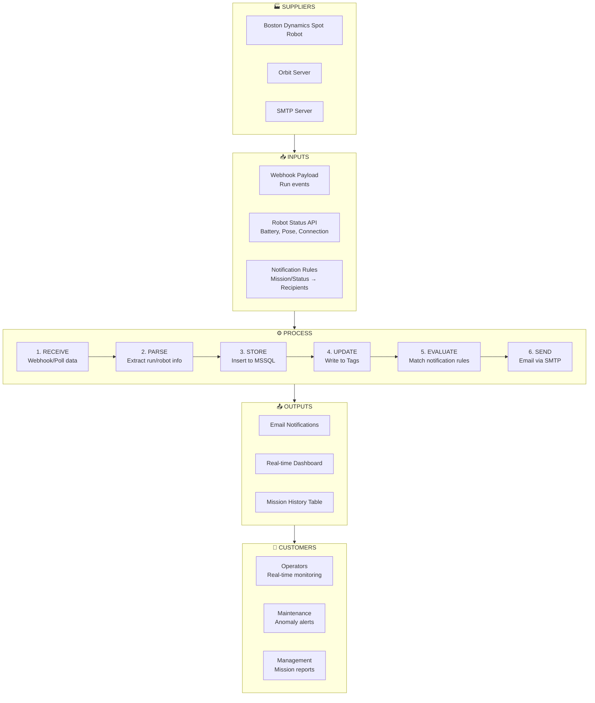
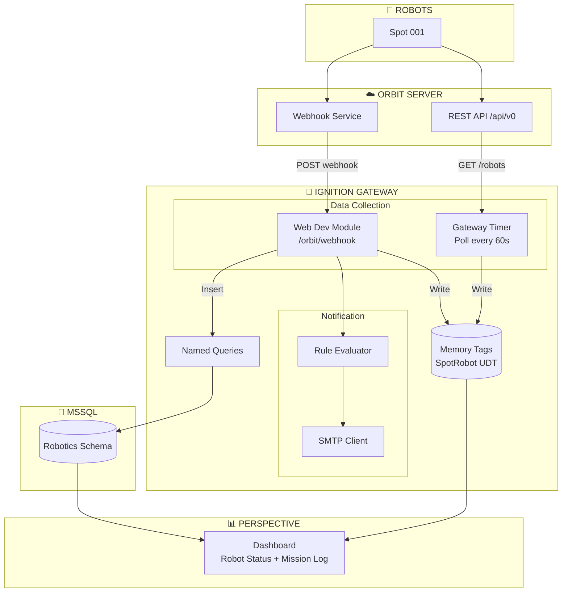
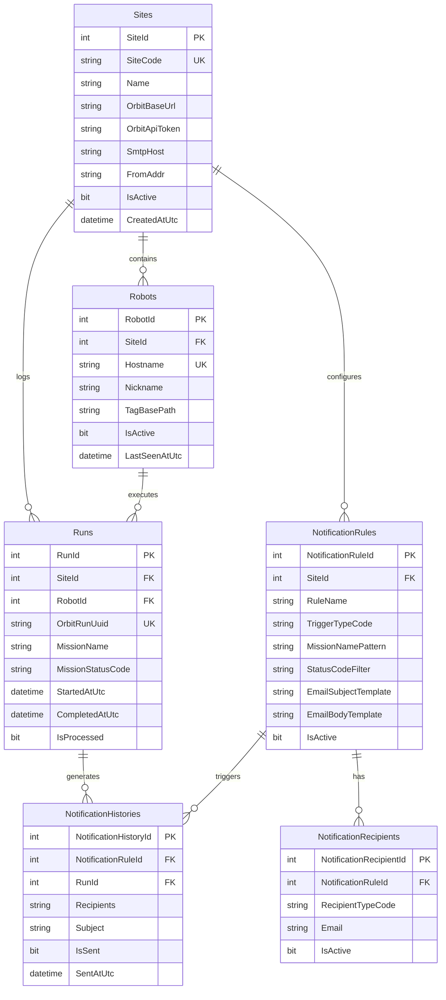

# Spot Mission → Orbit → Ignition Perspective Integration (Demo MVP)

**Project:** Spot Robot Mission Notification System (Simplified)  
**Version:** 2.6 (Demo) - Simplified Script Console Tests  
**Last Updated:** 2026-02-03

> **Key Documentation References:**
> - [Project Library](https://docs.inductiveautomation.com/docs/8.1/platform/scripting/scripting-in-ignition/project-library)
> - [Gateway Event Scripts](https://docs.inductiveautomation.com/docs/8.1/platform/scripting/scripting-in-ignition/gateway-event-scripts)
> - [Web Dev Module](https://docs.inductiveautomation.com/docs/8.1/ignition-modules/web-dev)
> - [Named Queries](https://docs.inductiveautomation.com/docs/8.1/platform/sql-in-ignition/named-queries)
> - [system.net.httpClient](https://docs.inductiveautomation.com/docs/8.1/appendix/scripting-functions/system-net/system-net-httpClient)
> - [Deployment Best Practices](https://docs.inductiveautomation.com/docs/8.1/tutorials/ignition-8-deployment-best-practices)

## Version History

| Version | Date       | Changes |
|---------|------------|---------|
| **2.6** | 2026-02-03 | **Simplified Script Console Test Pattern**<br>• Removed `system.util.invokeLater()` pattern from Script Console tests (function does not exist in Ignition 8.1)<br>• Restructured test script from three separate functions to sequential execution<br>• Tests now run immediately one after another without delays<br>• Simplified output formatting for cleaner console results<br>• Improves usability for developers testing webhook handlers in Script Console |
| **2.5** | 2026-02-03 | **TEST_MODE for SMTP-Free Testing**<br>• Added `TEST_MODE` flag to `notification_engine` module for testing without SMTP configuration<br>• Updated `_send_and_log()` function to skip email sending when TEST_MODE=True<br>• Enhanced testing section with comprehensive guidance for development without SMTP<br>• Added expected results checklist (logs, database, tags) for Script Console tests<br>• Prevents SMTP errors from blocking webhook handler development workflow<br>• Enables full integration testing (DB updates, tag writes, notification logic) before production |
| **2.4** | 2026-02-03 | **Named Query Default Value Handling Documentation**<br>• Added critical warning: Ignition 8.1 Named Queries do NOT have built-in default value feature<br>• Documented two approaches for handling defaults: Calling Code vs SQL COALESCE<br>• Updated all parameter tables to clarify "Recommended Default" vs "Required" columns<br>• Added SQL COALESCE() fallbacks to queries (`GetAllRobots`, `GetSiteConfig`, `GetMissionHistory`)<br>• Enhanced "Calling Named Queries from Scripts" section with proper default handling patterns<br>• Added helper function examples showing best practices for wrapping Named Queries<br>• Corrects common misconception about Named Query parameter configuration |
| **2.3** | 2026-02-02 | **Notification Rules Scalability Design Documentation**<br>• Documented hybrid approach for notification rule processing (flexible scaling)<br>• Enhanced `GetNotificationRules` query documentation with design philosophy<br>• Explained 3 phases: Simple (single rule), Multi-Team (all rules), Enterprise (complex routing)<br>• Added scaling guide to `notification_engine` module with Phase 1/2/3 examples<br>• Clarified why query returns ALL rules ordered by priority (no TOP 1)<br>• Enables easy migration from simple to complex notification logic without database changes<br>• Aligns with modern industrial IoT best practices for alerting systems |
| **2.2** | 2026-02-02 | **Fixed Notification Rules Schema Consistency**<br>• Fixed INSERT statement for `RoboticsNotificationRules` to explicitly include `StatusCodeFilter` column<br>• Added Rule 7: example demonstrating status filtering (Failed Patrol missions only)<br>• Updated comment to reflect "All 6 Trigger Types" (was showing 5 with 6 rules)<br>• Improved documentation clarity for mission pattern and status filtering features<br>• Aligns INSERT with table schema, query logic, and Orbit API field mapping |
| **2.1** | 2026-02-02 | **Added Comprehensive Webhook Testing Documentation**<br>• Added Section 6.11: Testing the Webhook Implementation (~480 lines)<br>• Includes 3 testing methods: Script Console (recommended), HTTP endpoint (curl), and optional test utility module<br>• Added validation checklist for logs, database, tags, and notifications<br>• Added troubleshooting guide with common issues and solutions<br>• Added performance testing script for load testing and thread safety<br>• Renumbered section 6.11 (Named Queries) → 6.12 |
| **2.0** | 2026-02-02 | **Simplified Plan for Actual Orbit API Capabilities**<br>• Restructured UDT to focus on mission data (what Orbit provides)<br>• Renamed `robot_polling` → `runs_polling` module (polls /runs, not telemetry)<br>• Updated `orbit_api` module with accurate docstrings and `get_anomalies()` function<br>• Added Gateway Startup Script for initial configuration sync<br>• Changed timer interval from 15s to 60s (webhooks are primary, polling is backup)<br>• Telemetry tags (Battery, Pose) marked as placeholders for future Spot SDK<br>• Updated deployment checklist to reflect actual data flow |
| **1.9** | 2026-02-02 | **Orbit API Limitation Documentation & Spot SDK Alternative**<br>• Documented that Orbit `/api/v0/robots` only provides configuration data, NOT real-time telemetry<br>• Added Section 11.1: Orbit API Limitation Details (what it does/doesn't provide)<br>• Added Section 11.2: Future Enhancement - Direct Spot SDK Integration (Plan B)<br>• Includes middleware architecture, Spot SDK data available, implementation outline<br>• Corrected Section 11 to accurately reflect Orbit API capabilities<br>• **Note:** Spot SDK integration not implemented, documented for future reference |
| **1.8** | 2026-02-02 | **Hostname-Based Tag Naming (Production Best Practice)**<br>• Updated all examples to use actual hostname (e.g., `spot-BD-12345678`) instead of friendly names<br>• Modified `get_robot_tag_base()` to append hostname directly (no formatting) in demo mode<br>• Updated tag hierarchy examples, seed data, and UDT instances<br>• Supports both database lookup (production) and hostname concatenation (demo)<br>• Better traceability and consistency with Orbit API |
| **1.7** | 2026-02-02 | **Tag Path Configuration Update**<br>• Centralized tag base path in `helpers` module<br>• Added `get_robot_tag_base()` function with demo/production modes<br>• Added `Robotics/GetRobotTagPath` Named Query for multi-site support<br>• Updated `robot_polling` and `webhook` to use helper function<br>• Added section 4.3: Tag Path Configuration Strategy<br>• **Migration Path:** Demo (hardcoded) → Production (database lookup)<br>• **Bug Fix:** Corrected syntax error in `_update_robot_tags()` error checking logic |
| **1.6** | 2026-02-02 | Added robot validation filter for invalid/empty robots from Orbit API |
| **1.5** | 2026-02-01 | Initial simplified demo plan |

---

## 1. Objectives

| Objective | Description |
|-----------|-------------|
| **Core Integration** | Integrate Spot mission → Orbit → Ignition Perspective |
| **Conditional Notifications** | Automatically send emails to different recipients based on mission, tag, or status |
| **Scalable Naming** | Maintain consistent naming and rules even as sites/projects scale up |
| **Process Clarity** | Summarize the overall flow using a **SIPOC** diagram |

### 1.1 Demo Scope (MVP)

| In Scope | Out of Scope (Future) |
|----------|----------------------|
| Single site, 1-2 robots | Multi-site federation |
| Basic polling (60s) | Store & Forward historian |
| Webhook for run events | Complex alarm pipelines |
| Simple email notifications | SMS/Push notifications |
| Basic Perspective dashboard | Role-based multi-dashboards |
| Core database tables | Advanced partitioning |

---

## 2. SIPOC Diagram

### 2.1 SIPOC Flow



### 2.2 SIPOC Summary Table

| Element | Description |
|---------|-------------|
| **S**uppliers | Spot Robot, Orbit Server, SMTP Server |
| **I**nputs | Webhook payloads, Robot API data, Notification rules |
| **P**rocess | Receive → Parse → Store → Update Tags → Evaluate Rules → Send Email |
| **O**utputs | Emails, Dashboard, Mission History |
| **C**ustomers | Operators, Maintenance, Management |

---

## 3. System Architecture

### 3.1 Simple Architecture Diagram



### 3.2 Two Data Flows

| Flow | Trigger | Purpose | Update Rate |
|------|---------|---------|-------------|
| **Flow A: Polling** | Gateway Timer | Mission runs sync (backup to webhooks) | Every 60000ms |
| **Flow B: Webhook** | Orbit event | Mission events (start, complete, fail) | Event-driven |

---

## 4. Naming Convention Summary

> **Reference:** `naming_convention.md` for full details

### 4.1 Quick Reference

| Layer | Convention | Example |
|-------|------------|---------|
| **SQL Tables** | PascalCase, Plural | `RoboticsRuns`, `RoboticsRobots` *(schema-less prefix variant)* |
| **SQL Columns** | PascalCase | `MissionStatusCode`, `StartedAtUtc` |
| **Tag Paths** | ISA-95 Hierarchy + Hostname-based Device | `Enterprise/Site001/Assembly/Line001/spot-BD-12345678/BatteryLevel` |
| **Tag Names** | PascalCase | `BatteryLevel`, `IsConnected`, `MissionStatusCode` |
| **Robot Device Names** | **Use Orbit hostname as-is** | `spot-BD-12345678` *(not formatted - use actual hostname)* |
| **Display Names** | Use Nickname field from DB | "Assembly Line Spot" *(stored in `RoboticsRobots.Nickname`)* |
| **Python** | snake_case | `battery_level`, `mission_status_code` |
| **Named Queries** | PascalCase | `GetMissionHistory`, `UpsertRun` |

### 4.2 Tag Hierarchy (Demo)

**Note:** This project uses **hostname-based naming** (e.g., `spot-BD-12345678`) for better traceability and consistency with Orbit API.

```
[default]
└── Enterprise/
    └── Site001/
        └── Assembly/
            └── Line001/
                └── spot-BD-12345678/  ← SpotRobot UDT Instance (uses Orbit hostname)
                    ├── BatteryLevel
                    ├── IsConnected
                    ├── IsCharging
                    ├── RobotStateCode
                    ├── MissionId
                    ├── MissionName
                    ├── MissionStatusCode
                    ├── LastRunAtUtc
                    └── Pose/
                        ├── X
                        ├── Y
                        └── Theta
```

### 4.3 Tag Path Configuration Strategy

This project uses a **hostname-based naming approach** with two operational modes for tag base paths:

#### Naming Convention: Hostname-Based (Production Best Practice)

**Why hostname-based naming?**

| Benefit | Description |
|---------|-------------|
| **API Consistency** | Tag names match Orbit hostname exactly (no translation needed) |
| **Traceability** | Direct correlation between tags and physical robot serial numbers |
| **Robot Swaps** | No confusion when hardware is replaced or moved |
| **Debugging** | Logs, tags, and API responses use identical identifiers |
| **Multi-Site** | BD serial numbers guarantee uniqueness across all sites |

**Example:** Robot hostname `spot-BD-12345678` creates tag path:
```
[default]Enterprise/Site001/Assembly/Line001/spot-BD-12345678
```

**Human-Readable Names:** Use the `Nickname` database field for displays:
- **Tags/Data:** `spot-BD-12345678` (hostname)
- **UI Display:** "Assembly Line Spot" (nickname)

#### Stage 1: Demo Mode (Hardcoded Concatenation)

**When to use:** Single site with 1-2 robots, quick testing

**Configuration:** Set in `helpers` module
```python
TAG_BASE_PATH = "[default]Enterprise/Site001/Assembly/Line001"
USE_DATABASE_FOR_TAG_PATHS = False
```

**How it works:**
- Tag paths are constructed as: `TAG_BASE_PATH + "/" + robot_hostname`
- Example: `[default]Enterprise/Site001/Assembly/Line001/spot-BD-12345678`
- **No name formatting/conversion** - uses hostname exactly as-is
- Fast and simple for demo environments
- **To customize:** Change `TAG_BASE_PATH` to match your tag hierarchy

#### Stage 2: Production Mode (Database Lookup)

**When to use:** Multiple sites, different tag hierarchies, or 3+ robots

**Configuration:** Set in `helpers` module
```python
USE_DATABASE_FOR_TAG_PATHS = True
```

**How it works:**
- Tag paths are retrieved from `RoboticsRobots.TagBasePath` column
- Queries database using `Robotics/GetRobotTagPath` Named Query
- Supports different tag structures per site/robot
- Centralized configuration in database

**Migration Example:**

| Robot Hostname | Demo Mode Path (Concatenated) | Production Mode Path (From DB) |
|----------------|-------------------------------|--------------------------------|
| spot-BD-12345678 | `[default]Enterprise/Site001/Assembly/Line001/spot-BD-12345678` | `[default]Enterprise/Site001/Assembly/Line001/spot-BD-12345678` |
| spot-BD-87654321 | `[default]Enterprise/Site001/Assembly/Line001/spot-BD-87654321` | `[default]Enterprise/Site002/Warehouse/Area03/spot-BD-87654321` |

**Advantages of This Approach:**

| Benefit | Description |
|---------|-------------|
| **Easy Start** | Demo mode requires no database setup for tag paths |
| **Clean Migration** | Change one flag (`USE_DATABASE_FOR_TAG_PATHS`) to switch modes |
| **No Code Rewrite** | Both modes use the same `helpers.get_robot_tag_base()` function |
| **Flexible Scaling** | Production mode supports multi-site with different hierarchies |
| **Backwards Compatible** | Can test database mode before full cutover |

**Implementation Locations:**

The `helpers.get_robot_tag_base()` function is called in:
1. `robot_polling._update_robot_tags()` - For polling tag updates
2. `orbit_webhook._update_mission_tags()` - For webhook tag updates

---

## 5. Database Schema (Simplified)

**Logical vs Physical Names (important):**

- The ERD below uses **logical entity names** (`Sites`, `Robots`, `Runs`, etc.) for readability.
- The physical database tables in this project use the **schema-less prefix variant** because `Robotics.<TableName>` cannot be used in the target environment.
  - Physical table examples: `RoboticsSites`, `RoboticsRobots`, `RoboticsRuns`

**Logical → Physical mapping (Demo MVP):**

| Logical Entity | Physical Table |
|---------------|----------------|
| `Sites` | `RoboticsSites` |
| `Robots` | `RoboticsRobots` |
| `Runs` | `RoboticsRuns` |
| `NotificationRules` | `RoboticsNotificationRules` |
| `NotificationRecipients` | `RoboticsNotificationRecipients` |
| `NotificationHistories` | `RoboticsNotificationHistories` |
| `MissionStatusCodes` | `RoboticsMissionStatusCodes` |
| `TriggerTypeCodes` | `RoboticsTriggerTypeCodes` |

### 5.1 Entity Relationship Diagram



### 5.2 SQL DDL (Core Tables Only)

```sql
-- ============================================================
-- ROBOTICS SCHEMA - Demo MVP
-- ============================================================

-- NOTE:
-- This plan uses the schema-less naming variant where tables are created in dbo
-- and prefixed with "Robotics" (e.g., RoboticsRuns) because Robotics.<Table> is
-- not available in the target environment.

-- Lookup: Mission Status Codes
CREATE TABLE RoboticsMissionStatusCodes (
    MissionStatusCode NVARCHAR(10) NOT NULL,
    Description NVARCHAR(100) NOT NULL,
    DisplayOrder INT NOT NULL DEFAULT 0,
    CONSTRAINT PK_RoboticsMissionStatusCodes PRIMARY KEY (MissionStatusCode)
);

INSERT INTO RoboticsMissionStatusCodes VALUES
('PEND', 'Pending', 1),
('RUN', 'Running', 2),
('COMP', 'Completed', 3),
('FAIL', 'Failed', 4);

-- Lookup: Trigger Types
CREATE TABLE RoboticsTriggerTypeCodes (
    TriggerTypeCode NVARCHAR(20) NOT NULL,
    Description NVARCHAR(100) NOT NULL,
    CONSTRAINT PK_RoboticsTriggerTypeCodes PRIMARY KEY (TriggerTypeCode)
);

INSERT INTO RoboticsTriggerTypeCodes VALUES
('RUN_START', 'Run Started'),
('RUN_COMP', 'Run Completed'),
('RUN_FAIL', 'Run Failed');

-- Core: Sites
CREATE TABLE RoboticsSites (
    SiteId INT IDENTITY(1,1) NOT NULL,
    SiteCode NVARCHAR(20) NOT NULL,
    Name NVARCHAR(200) NOT NULL,
    OrbitBaseUrl NVARCHAR(500) NOT NULL,
    OrbitApiToken NVARCHAR(500) NULL,
    SmtpHost NVARCHAR(200) NULL,        -- SMTP server for notifications (NULL = use fallback)
    FromAddr NVARCHAR(200) NULL,        -- Email "from" address (NULL = use fallback)
    IsActive BIT NOT NULL DEFAULT 1,
    CreatedAtUtc DATETIME2(3) NOT NULL DEFAULT SYSUTCDATETIME(),
    CONSTRAINT PK_RoboticsSites PRIMARY KEY (SiteId),
    CONSTRAINT UQ_RoboticsSites_SiteCode UNIQUE (SiteCode)
);

-- Core: Robots
CREATE TABLE RoboticsRobots (
    RobotId INT IDENTITY(1,1) NOT NULL,
    SiteId INT NOT NULL,
    Hostname NVARCHAR(100) NOT NULL,
    Nickname NVARCHAR(100) NULL,
    TagBasePath NVARCHAR(500) NULL,
    IsActive BIT NOT NULL DEFAULT 1,
    LastSeenAtUtc DATETIME2(3) NULL,
    CreatedAtUtc DATETIME2(3) NOT NULL DEFAULT SYSUTCDATETIME(),
    CONSTRAINT PK_RoboticsRobots PRIMARY KEY (RobotId),
    CONSTRAINT FK_RoboticsRobots_RoboticsSites FOREIGN KEY (SiteId) REFERENCES RoboticsSites(SiteId),
    CONSTRAINT UQ_RoboticsRobots_SiteId_Hostname UNIQUE (SiteId, Hostname)
);

-- Core: Runs (Mission Executions)
CREATE TABLE RoboticsRuns (
    RunId INT IDENTITY(1,1) NOT NULL,
    SiteId INT NOT NULL,
    RobotId INT NULL,
    OrbitRunUuid NVARCHAR(100) NOT NULL,
    MissionName NVARCHAR(200) NULL,
    MissionStatusCode NVARCHAR(10) NULL,
    StartedAtUtc DATETIME2(3) NULL,
    CompletedAtUtc DATETIME2(3) NULL,
    DurationMinutes AS DATEDIFF(MINUTE, StartedAtUtc, CompletedAtUtc),
    IsProcessed BIT NOT NULL DEFAULT 0,
    CreatedAtUtc DATETIME2(3) NOT NULL DEFAULT SYSUTCDATETIME(),
    CONSTRAINT PK_RoboticsRuns PRIMARY KEY (RunId),
    CONSTRAINT FK_RoboticsRuns_RoboticsSites FOREIGN KEY (SiteId) REFERENCES RoboticsSites(SiteId),
    CONSTRAINT FK_RoboticsRuns_RoboticsRobots FOREIGN KEY (RobotId) REFERENCES RoboticsRobots(RobotId),
    CONSTRAINT FK_RoboticsRuns_RoboticsMissionStatusCodes FOREIGN KEY (MissionStatusCode) REFERENCES RoboticsMissionStatusCodes(MissionStatusCode),
    CONSTRAINT UQ_RoboticsRuns_OrbitRunUuid UNIQUE (OrbitRunUuid)
);

-- Notification: Rules
CREATE TABLE RoboticsNotificationRules (
    NotificationRuleId INT IDENTITY(1,1) NOT NULL,
    SiteId INT NULL,
    RuleName NVARCHAR(200) NOT NULL,
    TriggerTypeCode NVARCHAR(20) NOT NULL,
    MissionNamePattern NVARCHAR(200) NULL,  -- NULL = all missions
    StatusCodeFilter NVARCHAR(100) NULL,    -- NULL = all statuses
    EmailSubjectTemplate NVARCHAR(500) NULL,
    EmailBodyTemplate NVARCHAR(MAX) NULL,
    IsActive BIT NOT NULL DEFAULT 1,
    Priority INT NOT NULL DEFAULT 100,
    CreatedAtUtc DATETIME2(3) NOT NULL DEFAULT SYSUTCDATETIME(),
    CONSTRAINT PK_RoboticsNotificationRules PRIMARY KEY (NotificationRuleId),
    CONSTRAINT FK_RoboticsNotificationRules_RoboticsSites FOREIGN KEY (SiteId) REFERENCES RoboticsSites(SiteId),
    CONSTRAINT FK_RoboticsNotificationRules_RoboticsTriggerTypeCodes FOREIGN KEY (TriggerTypeCode) REFERENCES RoboticsTriggerTypeCodes(TriggerTypeCode)
);

-- Notification: Recipients
CREATE TABLE RoboticsNotificationRecipients (
    NotificationRecipientId INT IDENTITY(1,1) NOT NULL,
    NotificationRuleId INT NOT NULL,
    RecipientTypeCode NVARCHAR(10) NOT NULL DEFAULT 'to',  -- to, cc, bcc
    Email NVARCHAR(200) NOT NULL,
    DisplayName NVARCHAR(200) NULL,
    IsActive BIT NOT NULL DEFAULT 1,
    CreatedAtUtc DATETIME2(3) NOT NULL DEFAULT SYSUTCDATETIME(),
    CONSTRAINT PK_RoboticsNotificationRecipients PRIMARY KEY (NotificationRecipientId),
    CONSTRAINT FK_RoboticsNotificationRecipients_RoboticsNotificationRules FOREIGN KEY (NotificationRuleId) REFERENCES RoboticsNotificationRules(NotificationRuleId)
);

-- Notification: History (Audit Trail)
CREATE TABLE RoboticsNotificationHistories (
    NotificationHistoryId INT IDENTITY(1,1) NOT NULL,
    NotificationRuleId INT NULL,
    RunId INT NULL,
    TriggerTypeCode NVARCHAR(20) NOT NULL,
    Recipients NVARCHAR(MAX) NULL,
    Subject NVARCHAR(500) NOT NULL,
    Body NVARCHAR(MAX) NULL,
    IsSent BIT NOT NULL DEFAULT 0,
    SentAtUtc DATETIME2(3) NULL,
    ErrorMessage NVARCHAR(MAX) NULL,
    CreatedAtUtc DATETIME2(3) NOT NULL DEFAULT SYSUTCDATETIME(),
    CONSTRAINT PK_RoboticsNotificationHistories PRIMARY KEY (NotificationHistoryId),
    CONSTRAINT FK_RoboticsNotificationHistories_RoboticsNotificationRules FOREIGN KEY (NotificationRuleId) REFERENCES RoboticsNotificationRules(NotificationRuleId),
    CONSTRAINT FK_RoboticsNotificationHistories_RoboticsRuns FOREIGN KEY (RunId) REFERENCES RoboticsRuns(RunId),
    CONSTRAINT FK_RoboticsNotificationHistories_RoboticsTriggerTypeCodes FOREIGN KEY (TriggerTypeCode) REFERENCES RoboticsTriggerTypeCodes(TriggerTypeCode)
);

-- Indexes
CREATE INDEX IX_RoboticsRuns_SiteId ON RoboticsRuns(SiteId);
CREATE INDEX IX_RoboticsRuns_StartedAtUtc ON RoboticsRuns(StartedAtUtc DESC);
CREATE INDEX IX_RoboticsRuns_IsProcessed ON RoboticsRuns(IsProcessed) WHERE IsProcessed = 0;
CREATE INDEX IX_RoboticsNotificationHistories_CreatedAtUtc ON RoboticsNotificationHistories(CreatedAtUtc DESC);
GO
```

### 5.3 Seed Data (Demo)

```sql
-- ============================================================
-- DEMO SEED DATA - Complete test dataset
-- ============================================================

-- Demo Site
-- SmtpHost/FromAddr are optional; if NULL, Python code falls back to hardcoded defaults.
INSERT INTO RoboticsSites (SiteCode, Name, OrbitBaseUrl, OrbitApiToken, SmtpHost, FromAddr)
VALUES (
    'SITE001', 
    'Demo Factory', 
    'https://orbit.demo.local', 
    'your-api-token-here',
    'smtp.company.com',              -- Replace with your SMTP server (or NULL to use fallback)
    'factory-alerts@company.com'     -- Replace with your from address (or NULL to use fallback)
);

-- Demo Robot
-- Note: 
--   - Hostname must match exactly what's registered in Orbit (typically BD serial-based)
--   - TagBasePath uses the hostname for consistency and traceability
--   - Nickname is human-friendly name for UI display
INSERT INTO RoboticsRobots (SiteId, Hostname, Nickname, TagBasePath)
VALUES (1, 'spot-BD-12345678', 'Assembly Line Spot', '[default]Enterprise/Site001/Assembly/Line001/spot-BD-12345678');

-- Add Missing Trigger Types
INSERT INTO RoboticsTriggerTypeCodes VALUES
('BATTERY_LOW', 'Battery Level Below Threshold'),
('CONNECTIVITY', 'Robot Connection Lost');

-- Sample Notification Rules (All 6 Trigger Types)
-- Demonstrates both MissionNamePattern (LIKE matching) and StatusCodeFilter (exact matching)
INSERT INTO RoboticsNotificationRules (SiteId, RuleName, TriggerTypeCode, MissionNamePattern, StatusCodeFilter, EmailSubjectTemplate, EmailBodyTemplate)
VALUES 
-- Rule 1: Mission Started (any mission, any status)
(1, 'Mission Started Alert', 'RUN_START', NULL, NULL,
 '[INFO] Mission Started: {{MissionName}}', 
 'Robot {{RobotNickname}} has started mission {{MissionName}} at {{StartedAtUtc}}. Monitor progress in dashboard.'),

-- Rule 2: Mission Completed (any mission, any status)
(1, 'Mission Completed', 'RUN_COMP', NULL, NULL,
 '[SUCCESS] Mission Completed: {{MissionName}}', 
 'Robot {{RobotNickname}} completed mission {{MissionName}} at {{CompletedAtUtc}}. Duration: {{Duration}} minutes.'),

-- Rule 3: Mission Failed (any mission, any status)
(1, 'Mission Failed Alert', 'RUN_FAIL', NULL, NULL,
 '[ALERT] Mission Failed: {{MissionName}}', 
 'Robot {{RobotNickname}} failed mission {{MissionName}} at {{CompletedAtUtc}}. Please investigate immediately.'),

-- Rule 4: Inspection Complete (specific mission pattern, any status)
(1, 'Inspection Complete', 'RUN_COMP', '%Inspection%', NULL,
 '[INFO] Inspection Complete: {{MissionName}}', 
 'Inspection mission {{MissionName}} completed successfully on {{CompletedAtUtc}}. Duration: {{Duration}} minutes. Review results in Orbit.'),

-- Rule 5: Battery Low Warning (not mission-related)
(1, 'Battery Low Warning', 'BATTERY_LOW', NULL, NULL,
 '[WARNING] Low Battery: {{RobotNickname}}',
 'Robot {{RobotNickname}} battery is below 20%. Current level: {{BatteryLevel}}%. Please recharge soon.'),

-- Rule 6: Robot Connectivity Issue (not mission-related)
(1, 'Robot Connectivity Issue', 'CONNECTIVITY', NULL, NULL,
 '[CRITICAL] Robot Connection Lost: {{RobotNickname}}',
 'Robot {{RobotNickname}} has lost connection to Orbit. Last seen: {{LastSeenUtc}}. Check network and robot status.'),

-- Rule 7: Failed Patrol Missions Only (demonstrates both pattern AND status filtering)
(1, 'Failed Patrol Alert', 'RUN_FAIL', '%Patrol%', 'FAIL',
 '[URGENT] Patrol Mission Failed: {{MissionName}}',
 'ATTENTION: Patrol mission {{MissionName}} has FAILED at {{CompletedAtUtc}}. This requires immediate investigation by the robotics team.');

-- Recipients for rules (using same email with different display names for testing)
INSERT INTO RoboticsNotificationRecipients (NotificationRuleId, RecipientTypeCode, Email, DisplayName)
VALUES 
-- Rule 1: Mission Started
(1, 'to', 'your.email@example.com', 'Operations Team'),

-- Rule 2: Mission Completed
(2, 'to', 'your.email@example.com', 'Operations Team'),
(2, 'cc', 'your.email@example.com', 'Management'),

-- Rule 3: Mission Failed
(3, 'to', 'your.email@example.com', 'Operations Team'),
(3, 'cc', 'your.email@example.com', 'Robotics Manager'),

-- Rule 4: Inspection Complete
(4, 'to', 'your.email@example.com', 'Quality Team'),
(4, 'cc', 'your.email@example.com', 'Operations Team'),

-- Rule 5: Battery Low
(5, 'to', 'your.email@example.com', 'Maintenance Team'),
(5, 'cc', 'your.email@example.com', 'Operations Team'),

-- Rule 6: Connectivity Issues
(6, 'to', 'your.email@example.com', 'IT Support'),
(6, 'cc', 'your.email@example.com', 'Maintenance Team'),

-- Rule 7: Failed Patrol (escalated priority)
(7, 'to', 'your.email@example.com', 'Robotics Manager'),
(7, 'cc', 'your.email@example.com', 'Operations Director');

-- Sample Run Data (for testing dashboard and notifications)
INSERT INTO RoboticsRuns (SiteId, RobotId, OrbitRunUuid, MissionName, MissionStatusCode, StartedAtUtc, CompletedAtUtc, IsProcessed)
VALUES 
-- Completed missions
(1, 1, '550e8400-e29b-41d4-a716-446655440001', 'Inspection-Zone-A', 'COMP', DATEADD(HOUR, -2, SYSUTCDATETIME()), DATEADD(MINUTE, -105, SYSUTCDATETIME()), 1),
(1, 1, '550e8400-e29b-41d4-a716-446655440002', 'Patrol-North', 'COMP', DATEADD(HOUR, -4, SYSUTCDATETIME()), DATEADD(HOUR, -3, SYSUTCDATETIME()), 1),
(1, 1, '550e8400-e29b-41d4-a716-446655440003', 'Inspection-Zone-B', 'COMP', DATEADD(HOUR, -6, SYSUTCDATETIME()), DATEADD(MINUTE, -330, SYSUTCDATETIME()), 1),

-- Failed missions
(1, 1, '550e8400-e29b-41d4-a716-446655440004', 'Patrol-South', 'FAIL', DATEADD(HOUR, -8, SYSUTCDATETIME()), DATEADD(HOUR, -7, SYSUTCDATETIME()), 1),
(1, 1, '550e8400-e29b-41d4-a716-446655440005', 'Inspection-Zone-C', 'FAIL', DATEADD(HOUR, -10, SYSUTCDATETIME()), DATEADD(MINUTE, -590, SYSUTCDATETIME()), 1),

-- Currently running mission
(1, 1, '550e8400-e29b-41d4-a716-446655440006', 'Patrol-East', 'RUN', DATEADD(MINUTE, -15, SYSUTCDATETIME()), NULL, 0),

-- Pending mission
(1, 1, '550e8400-e29b-41d4-a716-446655440007', 'Inspection-Zone-D', 'PEND', SYSUTCDATETIME(), NULL, 0);

-- Sample Notification History (for audit trail testing)
-- Note: Recipients field stores actual recipients from RoboticsNotificationRecipients at send time
INSERT INTO RoboticsNotificationHistories (NotificationRuleId, RunId, TriggerTypeCode, Recipients, Subject, Body, IsSent, SentAtUtc)
VALUES 
-- Successfully sent notifications
-- Rule 2 recipients: Operations Team (TO), Management (CC)
(2, 1, 'RUN_COMP', 
 '{"to":[{"email":"your.email@example.com","displayName":"Operations Team"}],"cc":[{"email":"your.email@example.com","displayName":"Management"}]}', 
 '[SUCCESS] Mission Completed: Inspection-Zone-A', 
 'Robot Assembly Line Spot completed mission Inspection-Zone-A. Duration: 15 minutes.', 1, DATEADD(MINUTE, -105, SYSUTCDATETIME())),
 
-- Rule 3 recipients: Operations Team (TO), Robotics Manager (CC)
(3, 4, 'RUN_FAIL', 
 '{"to":[{"email":"your.email@example.com","displayName":"Operations Team"}],"cc":[{"email":"your.email@example.com","displayName":"Robotics Manager"}]}', 
 '[ALERT] Mission Failed: Patrol-South', 
 'Robot Assembly Line Spot failed mission Patrol-South. Please investigate immediately.', 1, DATEADD(HOUR, -7, SYSUTCDATETIME())),

-- Rule 4 recipients: Quality Team (TO), Operations Team (CC)
(4, 3, 'RUN_COMP', 
 '{"to":[{"email":"your.email@example.com","displayName":"Quality Team"}],"cc":[{"email":"your.email@example.com","displayName":"Operations Team"}]}', 
 '[INFO] Inspection Complete: Inspection-Zone-B', 
 'Inspection mission Inspection-Zone-B completed successfully. Duration: 30 minutes.', 1, DATEADD(MINUTE, -330, SYSUTCDATETIME())),

-- Failed to send (for error testing)
-- Rule 5 recipients: Maintenance Team (TO), Operations Team (CC)
(5, NULL, 'BATTERY_LOW', 
 '{"to":[{"email":"your.email@example.com","displayName":"Maintenance Team"}],"cc":[{"email":"your.email@example.com","displayName":"Operations Team"}]}', 
 '[WARNING] Low Battery: Assembly Line Spot', 
 'Robot Assembly Line Spot battery is below 20%. Current level: 18%. Please recharge soon.', 0, NULL);

GO
```

**Note:** Replace `your.email@example.com` with your actual email address for testing. The different `DisplayName` values help you identify which rule triggered each email.

---

## 6. Ignition Implementation

### 6.1 Script Organization Overview

> **Reference:** [Project Library](https://docs.inductiveautomation.com/docs/8.1/platform/scripting/scripting-in-ignition/project-library), [Gateway Event Scripts](https://docs.inductiveautomation.com/docs/8.1/platform/scripting/scripting-in-ignition/gateway-event-scripts), [Deployment Best Practices](https://docs.inductiveautomation.com/docs/8.1/tutorials/ignition-8-deployment-best-practices)

#### How Ignition Stores Scripts

**Important:** Ignition uses **internal project resources** for scripts, NOT file paths. Scripts are stored in Ignition's internal SQLite database as project resources. There are no `.py` files like `project/orbit/poll_robots.py`.

| Resource Type | Location | Storage | Access Scope |
|---------------|----------|---------|--------------|
| **Project Library** | Designer > Project Browser > Scripting > Project Library | Internal database (project resource) | Accessible from all scripts within the same project |
| **Gateway Event Scripts** | Designer > Project Browser > Scripting > Gateway Events | Internal database (project resource) | Gateway scope (runs regardless of clients); can access Project Library |
| **Web Dev Resources** | Designer > Project Browser > Web Dev | `.py` and `.json` files in `data/projects/` | HTTP endpoints; can access Project Library |

#### Recommended Architecture: Project Library + Gateway Timer Script

**Best Practice:** Store reusable logic in **Project Library modules**, then call those modules from **Gateway Timer Scripts**. This provides:

- ✅ **Reusability** - Call functions from multiple places (polling, webhooks, UI buttons)
- ✅ **Testability** - Test functions in Script Console: `orbit_api.get_robots()`
- ✅ **Maintainability** - Edit Project Library without restarting gateway events
- ✅ **Separation of concerns** - Timer = "when", Library = "what"

#### Project Library Structure for This Project

```
Project: SpotOrbitIntegration
│
├── Project Library (Designer > Scripting > Project Library)
│   │
│   ├── orbit_api                   ← Orbit API client (reusable HTTP client)
│   │   ├── _client                 # Cached httpClient instance (heavyweight, reuse!)
│   │   ├── get_robots()            # GET /api/v0/robots
│   │   ├── get_runs()              # GET /api/v0/runs
│   │   └── _make_request()         # Internal helper
│   │
│   ├── robot_polling               ← Robot polling logic
│   │   ├── poll_all_robots()       # Main polling function
│   │   └── update_robot_tags()     # Write to UDT tags
│   │
│   ├── webhook_handlers            ← Webhook processing logic
│   │   ├── handle_run_event()      # Process run events
│   │   ├── upsert_run()            # Database upsert
│   │   └── update_mission_tags()   # Write mission tags
│   │
│   ├── notification_engine         ← Notification logic
│   │   ├── evaluate_rules()        # Match rules to events
│   │   ├── send_notification()     # Send via SMTP
│   │   └── render_template()       # {{variable}} replacement
│   │
│   └── helpers                     ← Shared utilities
│       ├── get_robot_tag_base()    # Get tag path (demo: concat, prod: DB lookup)
│       ├── hostname_to_tag_path()  # DEPRECATED - kept for compatibility
│       └── get_site_config()       # Read site configuration
│
├── Gateway Events (Designer > Scripting > Gateway Events)
│   │
│   └── Timer Scripts
│       └── RobotPolling            ← Simple 1-line executor
│           Code: robot_polling.poll_all_robots()
│           Delay: 15000ms, Fixed Rate
│
└── Web Dev (Designer > Web Dev)
    └── orbit/
        └── webhook                 ← Python Resource (doPost)
            Code: webhook_handlers.handle_run_event(request)
```

#### Gateway Scripting Project Setup (Optional for This Project)

> **Important Clarification:** Gateway Event Scripts (Timer Scripts, Startup/Shutdown Scripts, etc.) defined within a project in the Designer **automatically have access to that project's script library**. You do NOT need to configure the Gateway Scripting Project setting for these scripts.

**When is this setting needed?**

| Script Type | Needs Gateway Scripting Project Setting? |
|-------------|------------------------------------------|
| Gateway Timer Scripts (in project) | ❌ No - runs in project context |
| Gateway Startup/Shutdown Scripts (in project) | ❌ No - runs in project context |
| Web Dev endpoints (in project) | ❌ No - runs in project context |
| Tag Event Scripts (on individual tags) | ✅ Yes - not project-specific |
| Expression tags with scripting | ✅ Yes - not project-specific |
| Scripts in Tag Change events | ✅ Yes - not project-specific |

**If you DO need it** (e.g., using Tag Event Scripts that call your Project Library):

1. Open Gateway webpage: `http://localhost:8088`
2. Navigate to **Config > Gateway Settings**
3. Find **Gateway Scripting Project** setting
4. Enter your project name: `SpotOrbitIntegration`
5. Click **Save Changes**

> **Reference:** [Gateway Scripting Project documentation](https://docs.inductiveautomation.com/docs/8.1/platform/scripting/scripting-in-ignition/project-library#gateway-scripting-project)

#### Important Best Practices from Documentation

1. **Wrap all code in functions or classes** - Code outside functions executes when the Designer loads or project saves
2. **httpClient instances are heavyweight** - Create once in Project Library and reuse
3. **Save project after creating scripts** - Project Library scripts aren't accessible until saved
4. **Use hierarchical logger names** - e.g., `orbit.polling`, `orbit.webhook.notify`

### 6.2 SpotRobot UDT Definition

> **Reference:** [User Defined Types - UDTs](https://docs.inductiveautomation.com/docs/8.1/platform/tags/user-defined-types-udts), [UDT Parameters](https://docs.inductiveautomation.com/docs/8.1/platform/tags/user-defined-types-udts/udt-parameters)

> **⚠️ Important (v1.9):** The UDT is designed for mission-focused data from Orbit API. Real-time telemetry (battery, pose, state) is NOT available from Orbit - see Section 11.2 for future Spot SDK integration.

**Location:** Designer > Tag Browser > Tag Provider > _types_ > SpotRobot

```
SpotRobot (UDT Definition)
│
├── [Parameters] ← Configure per instance, referenced in member tags
│   ├── RobotHostname       : String   -- e.g., "spot-BD-12345678" (must match Orbit exactly)
│   └── SiteId              : Int      -- FK to Sites table
│
├── [Pre-defined Parameters Available] ← Built-in, no configuration needed
│   ├── {InstanceName}      -- Name of this UDT instance (e.g., "spot-BD-12345678")
│   ├── {PathToParentFolder}-- Full path to containing folder
│   └── {TagName}           -- Name of the specific tag using this parameter
│
├── [Mission Tags] ← Updated by Webhook and/or Runs Polling
│   ├── MissionId           : String   -- Current/last mission UUID
│   ├── MissionName         : String   -- Mission name
│   ├── MissionStatusCode   : String   -- Mission status (see below)
│   ├── MissionStartTime    : DateTime -- When mission started
│   ├── MissionEndTime      : DateTime -- When mission ended (null if running)
│   └── LastRunAtUtc        : DateTime -- Last mission activity timestamp
│
├── [Robot Config Tags] ← Updated by Runs Polling (from Orbit /robots)
│   ├── Nickname            : String   -- Robot display name from Orbit
│   └── RobotIndex          : Int      -- Orbit slot number (0-32)
│
├── [Future: Telemetry Tags] ← NOT available from Orbit API
│   │                          Requires Spot SDK middleware (See Section 11.2)
│   ├── BatteryLevel        : Float    -- 0-100% (default: 0, placeholder)
│   ├── IsConnected         : Boolean  -- (default: false, placeholder)
│   ├── IsCharging          : Boolean  -- (default: false, placeholder)
│   ├── RobotStateCode      : String   -- (default: "unknown", placeholder)
│   └── Pose/
│       ├── X               : Float    -- (default: 0, placeholder)
│       ├── Y               : Float    -- (default: 0, placeholder)
│       └── Theta           : Float    -- (default: 0, placeholder)
│
└── [System Tags]
    ├── LastPollAtUtc       : DateTime -- Last successful poll timestamp
    └── PollErrorCount      : Int      -- Consecutive poll error count
```

**Mission Status Codes:**

| Code | Description | Source |
|------|-------------|--------|
| `IDLE` | No active mission | Default state |
| `RUNNING` | Mission in progress | Webhook `run.started` or `/runs` poll |
| `COMPLETED` | Mission finished successfully | Webhook `run.completed` or `/runs` poll |
| `FAILED` | Mission failed | Webhook `run.failed` or `/runs` poll |

**UDT Instance Example (Hostname-Based Naming):**
```
[default]Enterprise/Site001/Assembly/Line001/spot-BD-12345678  ← Instance of SpotRobot UDT
    Parameters:
        RobotHostname = "spot-BD-12345678"   ← Must match Orbit hostname exactly
        SiteId = 1

Note: Instance name uses the hostname for consistency with Orbit API.
      Display "Assembly Line Spot" nickname in UI using the Nickname database field.
      
      Telemetry tags (Battery, Pose, etc.) are placeholders for future Spot SDK integration.
      They will show default values until Section 11.2 middleware is implemented.
```

### 6.3 Project Library: orbit_api Module

> **Reference:** [system.net.httpClient](https://docs.inductiveautomation.com/docs/8.1/appendix/scripting-functions/system-net/system-net-httpClient)

**Location:** Designer > Project Browser > Scripting > Project Library > orbit_api

**Important:** `httpClient` instances are **heavyweight** objects. Per Ignition documentation: *"httpClient instances are heavyweight, so they should be created sparingly and reused as much as possible. For ease of reuse, consider instantiating a new httpClient as a top-level variable in a project library script."*

> **⚠️ API Limitation (v1.9):** The Orbit API provides **configuration and mission data only**. It does NOT provide real-time telemetry (battery, pose, state). See Section 11.1 for details.

**Available Endpoints:**

| Function | Endpoint | Data Returned |
|----------|----------|---------------|
| `get_robots()` | `/api/v0/robots` | Robot config: hostname, nickname, robotIndex, username |
| `get_runs()` | `/api/v0/runs` | Mission runs: uuid, missionName, status, times, robot info |
| `get_anomalies()` | `/api/v0/anomalies` | Anomalies: uuid, severity, title, status, timestamps |

**Robot Validation Strategy:** The Orbit API may return robots with empty or invalid data (e.g., empty hostname, null values). This module implements a **defense-in-depth approach**:

1. **Primary Filtering** (`_is_valid_robot()`): Validates and filters robots at the API level before returning them
2. **Secondary Validation** (in `runs_polling.poll_recent_runs()`): Additional checks when processing data
3. **Logging**: Invalid data is logged with warnings for debugging and audit purposes

```python
"""
Project Library: orbit_api
Location: Designer > Project Browser > Scripting > Project Library
Purpose: Orbit API client with reusable httpClient instance

IMPORTANT: Orbit API provides configuration and mission data only.
           Real-time telemetry (battery, pose, state) requires Spot SDK.
           See Section 11.2 for future Spot SDK integration.

Available Data from Orbit:
    - /robots: hostname, nickname, robotIndex, username (CONFIG ONLY)
    - /runs: mission run history with status, times, robot info
    - /anomalies: detected anomalies/alerts from missions
    
NOT Available from Orbit:
    - Battery level, charging status
    - Robot pose (x, y, theta)
    - Connection status
    - Robot operational state
"""

# ==============================================================================
# HEAVYWEIGHT CLIENT - Created once, reused for all API calls
# Per Ignition docs: "httpClient instances are heavyweight, so they should be 
# created sparingly and reused as much as possible"
# ==============================================================================
_client = None

def _get_client():
    """Get or create the shared httpClient instance."""
    global _client
    if _client is None:
        _client = system.net.httpClient(
            timeout=30000,  # 30 second timeout
            bypass_cert_validation=False  # Set True only for dev/testing
        )
    return _client

def _get_config():
    """Get Orbit configuration from database or tags."""
    # In production, read from database or secure tag
    return {
        "base_url": "https://orbit.demo.local",
        "api_token": "your-api-token-here"  # Move to encrypted storage in production
    }

def get_robots():
    """
    GET /api/v0/robots - Fetch robot CONFIGURATION from Orbit API.
    
    IMPORTANT: This returns configuration data only, NOT real-time telemetry.
    
    Returns:
        list: List of robot config dictionaries with fields:
            - hostname (str): Robot hostname, e.g., "spot-BD-12345678"
            - nickname (str): Display name
            - robotIndex (int): Orbit slot number (0-32)
            - username (str): Connection username
            
    Does NOT return: battery, pose, connection status, charging status, state
    """
    logger = system.util.getLogger("orbit.api.robots")
    config = _get_config()
    client = _get_client()
    
    try:
        response = client.get(
            url=config["base_url"] + "/api/v0/robots",
            headers={"Authorization": "Bearer " + config["api_token"]}
        )
        
        if response.good:
            raw_robots = response.json
            
            # Filter out invalid robots (empty hostname, null values, etc.)
            valid_robots = []
            for robot in raw_robots:
                if _is_valid_robot(robot):
                    valid_robots.append(robot)
                else:
                    logger.warn("Skipping invalid robot: {}".format(robot))
            
            logger.debug("Fetched {} valid robots (filtered from {} total)".format(
                len(valid_robots), len(raw_robots)))
            return valid_robots
        else:
            logger.error("API error: {} - {}".format(response.statusCode, response.text))
            return []
            
    except Exception as e:
        logger.error("Request failed: {}".format(str(e)))
        return []

def _is_valid_robot(robot):
    """
    Validate that a robot has required fields.
    Filters out robots with empty/null hostname or invalid robotIndex.
    
    Args:
        robot: Robot dictionary from API
        
    Returns:
        bool: True if robot is valid, False otherwise
    """
    if not robot:
        return False
    
    # Check required field: hostname (must be non-empty string)
    hostname = robot.get("hostname")
    if not hostname or hostname == "" or hostname is None:
        return False
    
    # Check robotIndex is valid (must be >= 0)
    robot_index = robot.get("robotIndex")
    if robot_index is None or robot_index < 0:
        return False
    
    return True

def get_runs(limit=100, robot_hostname=None, start_time=None):
    """
    GET /api/v0/runs - Fetch mission runs from Orbit API.
    
    This is the PRIMARY source of mission activity data.
    
    Args:
        limit: Maximum number of runs to fetch (default 100)
        robot_hostname: Optional filter by robot hostname
        start_time: Optional ISO timestamp to filter runs after this time
    
    Returns:
        list: List of run dictionaries with fields:
            - uuid (str): Run unique identifier
            - missionName (str): Mission name
            - missionStatus (str): Status of the mission
            - startTime (str): ISO timestamp when run started
            - endTime (str): ISO timestamp when run ended (null if running)
            - robotHostname (str): Robot that executed the run
            - robotNickname (str): Robot display name
            - robotSerial (str): Robot serial number
            - runType (str): "mission" or "teleop"
            - actionCount (int): Number of actions in run
    """
    logger = system.util.getLogger("orbit.api.runs")
    config = _get_config()
    client = _get_client()
    
    params = {"limit": limit}
    if robot_hostname:
        params["robotHostname"] = robot_hostname
    if start_time:
        params["startTime"] = start_time
    
    try:
        response = client.get(
            url=config["base_url"] + "/api/v0/runs",
            headers={"Authorization": "Bearer " + config["api_token"]},
            params=params
        )
        
        if response.good:
            # Orbit returns {"resources": [...]} for runs endpoint
            data = response.json
            runs = data.get("resources", data) if isinstance(data, dict) else data
            logger.debug("Fetched {} runs".format(len(runs) if runs else 0))
            return runs if runs else []
        else:
            logger.error("API error: {} - {}".format(response.statusCode, response.text))
            return []
            
    except Exception as e:
        logger.error("Request failed: {}".format(str(e)))
        return []

def get_anomalies(limit=100, status=None, start_time=None):
    """
    GET /api/v0/anomalies - Fetch anomalies/alerts from Orbit API.
    
    Anomalies are issues detected during mission execution.
    
    Args:
        limit: Maximum number of anomalies to fetch
        status: Optional filter by status ("open" or "closed")
        start_time: Optional ISO timestamp to filter anomalies after this time
    
    Returns:
        list: List of anomaly dictionaries with fields:
            - uuid (str): Anomaly unique identifier
            - time (str): ISO timestamp when detected
            - severity (int): Severity level
            - title (str): Anomaly title/description
            - status (str): "open" or "closed"
            - runUuid (str): Associated run UUID
            - elementId (str): Site element that triggered anomaly
    """
    logger = system.util.getLogger("orbit.api.anomalies")
    config = _get_config()
    client = _get_client()
    
    params = {"limit": limit}
    if status:
        params["status"] = status
    if start_time:
        params["startTime"] = start_time
    
    try:
        response = client.get(
            url=config["base_url"] + "/api/v0/anomalies",
            headers={"Authorization": "Bearer " + config["api_token"]},
            params=params
        )
        
        if response.good:
            data = response.json
            anomalies = data.get("resources", data) if isinstance(data, dict) else data
            logger.debug("Fetched {} anomalies".format(len(anomalies) if anomalies else 0))
            return anomalies if anomalies else []
        else:
            logger.error("API error: {} - {}".format(response.statusCode, response.text))
            return []
            
    except Exception as e:
        logger.error("Request failed: {}".format(str(e)))
        return []
```

### 6.4 Project Library: runs_polling Module

> **Note (v1.9):** This module was renamed from `robot_polling` to `runs_polling` to reflect its actual purpose. It polls mission runs data, not robot telemetry.

**Location:** Designer > Project Browser > Scripting > Project Library > runs_polling

**Purpose:** Poll the Orbit `/runs` endpoint to update mission status tags. This serves as a backup to webhooks and ensures tags stay synchronized even if webhooks are missed.

```python
"""
Project Library: runs_polling
Location: Designer > Project Browser > Scripting > Project Library
Purpose: Poll Orbit /runs endpoint to update mission status tags

This module serves as:
1. Backup to webhooks - ensures tags update even if webhook fails
2. Initial sync - populates tags when system starts
3. Historical sync - can fetch older runs for reporting

Note: Real-time telemetry (battery, pose, state) is NOT available from Orbit.
      See Section 11.2 for future Spot SDK integration if telemetry is needed.
"""

# Track last poll time to fetch only new runs
_last_poll_time = None

def poll_recent_runs():
    """
    Main polling function - called by Gateway Timer Script.
    Fetches recent mission runs from Orbit API and updates UDT mission tags.
    
    This provides:
    - Mission status updates (started, completed, failed)
    - Mission timing information (start/end times)
    - Robot-to-mission association
    
    This does NOT provide (Orbit API limitation):
    - Battery level
    - Robot pose/position
    - Connection status
    - Charging status
    """
    global _last_poll_time
    logger = system.util.getLogger("orbit.runs_polling")
    
    try:
        # Fetch recent runs (last 60 seconds or since last poll)
        runs = orbit_api.get_runs(limit=50)
        
        if not runs:
            logger.debug("No runs returned from API")
            return
        
        # Group runs by robot hostname to get latest run per robot
        latest_runs_by_robot = {}
        for run in runs:
            hostname = run.get("robotHostname", "")
            if not hostname:
                continue
            
            # Keep only the most recent run per robot
            existing = latest_runs_by_robot.get(hostname)
            if not existing:
                latest_runs_by_robot[hostname] = run
            else:
                # Compare start times to keep the most recent
                run_start = run.get("startTime", "")
                existing_start = existing.get("startTime", "")
                if run_start > existing_start:
                    latest_runs_by_robot[hostname] = run
        
        # Update tags for each robot's latest run
        updated_count = 0
        for hostname, run in latest_runs_by_robot.items():
            if _update_mission_tags(hostname, run):
                updated_count += 1
        
        _last_poll_time = system.date.now()
        logger.info("Updated mission tags for {} robots".format(updated_count))
        
    except Exception as e:
        logger.error("Runs polling failed: {}".format(str(e)))

def _update_mission_tags(hostname, run_data):
    """
    Update mission-related tags for a single robot.
    
    Args:
        hostname: Robot hostname from Orbit
        run_data: Run dictionary from Orbit API /runs endpoint
        
    Returns:
        bool: True if tags were updated, False otherwise
    """
    logger = system.util.getLogger("orbit.runs_polling.tags")
    
    # Get tag base path using helper
    tag_base = helpers.get_robot_tag_base(hostname)
    if not tag_base:
        logger.warn("Tag path not found for robot: {}".format(hostname))
        return False
    
    # Extract run data
    mission_id = run_data.get("uuid", "")
    mission_name = run_data.get("missionName", "")
    mission_status = _map_mission_status(run_data.get("missionStatus", ""))
    start_time = _parse_iso_timestamp(run_data.get("startTime"))
    end_time = _parse_iso_timestamp(run_data.get("endTime"))
    nickname = run_data.get("robotNickname", hostname)
    
    # Prepare tag paths and values
    tags_to_write = [
        "{}/MissionId".format(tag_base),
        "{}/MissionName".format(tag_base),
        "{}/MissionStatusCode".format(tag_base),
        "{}/MissionStartTime".format(tag_base),
        "{}/MissionEndTime".format(tag_base),
        "{}/LastRunAtUtc".format(tag_base),
        "{}/Nickname".format(tag_base),
        "{}/LastPollAtUtc".format(tag_base),
    ]
    
    values = [
        mission_id,
        mission_name,
        mission_status,
        start_time,
        end_time,
        start_time if start_time else system.date.now(),  # Use start time as last activity
        nickname,
        system.date.now(),
    ]
    
    # Write all tags in single blocking call
    try:
        results = system.tag.writeBlocking(tags_to_write, values)
        
        # Check for write errors
        success = True
        for i, result in enumerate(results):
            if not result.isGood():
                logger.error("Failed to write {}: {}".format(tags_to_write[i], result))
                success = False
        
        return success
    except Exception as e:
        logger.error("Tag write failed for {}: {}".format(hostname, str(e)))
        return False

def _map_mission_status(orbit_status):
    """
    Map Orbit mission status to our status codes.
    
    Args:
        orbit_status: Status string from Orbit API
        
    Returns:
        str: Standardized status code (IDLE, RUNNING, COMPLETED, FAILED)
    """
    if not orbit_status:
        return "IDLE"
    
    status_lower = orbit_status.lower()
    
    if status_lower in ["running", "started", "in_progress"]:
        return "RUNNING"
    elif status_lower in ["completed", "success", "succeeded"]:
        return "COMPLETED"
    elif status_lower in ["failed", "error", "aborted", "cancelled"]:
        return "FAILED"
    else:
        return "IDLE"

def _parse_iso_timestamp(iso_string):
    """
    Parse ISO timestamp string to Java Date.
    
    Args:
        iso_string: ISO 8601 timestamp string (e.g., "2026-02-02T10:30:00Z")
        
    Returns:
        java.util.Date or None if parsing fails
    """
    if not iso_string:
        return None
    
    try:
        # Handle ISO format with timezone
        # Remove 'Z' and replace with +00:00 for parsing
        clean_string = iso_string.replace("Z", "+00:00")
        # Remove microseconds if present (Jython limitation)
        if "." in clean_string:
            parts = clean_string.split(".")
            clean_string = parts[0] + clean_string[clean_string.rfind("+"):]
        
        return system.date.parse(clean_string, "yyyy-MM-dd'T'HH:mm:ssXXX")
    except:
        # Fallback: try simpler format
        try:
            return system.date.parse(iso_string[:19], "yyyy-MM-dd'T'HH:mm:ss")
        except:
            return None

def sync_robot_config():
    """
    One-time sync of robot configuration from Orbit.
    Updates Nickname and RobotIndex tags from /robots endpoint.
    
    Call this on startup or when robots are added to Orbit.
    """
    logger = system.util.getLogger("orbit.runs_polling.config")
    
    try:
        robots = orbit_api.get_robots()
        
        for robot in robots:
            hostname = robot.get("hostname", "")
            if not hostname:
                continue
            
            tag_base = helpers.get_robot_tag_base(hostname)
            if not tag_base:
                continue
            
            # Update config tags
            system.tag.writeBlocking([
                "{}/Nickname".format(tag_base),
                "{}/RobotIndex".format(tag_base),
            ], [
                robot.get("nickname", hostname),
                robot.get("robotIndex", -1),
            ])
        
        logger.info("Synced config for {} robots".format(len(robots)))
        
    except Exception as e:
        logger.error("Robot config sync failed: {}".format(str(e)))
```

### 6.5 Project Library: helpers Module

**Location:** Designer > Project Browser > Scripting > Project Library > helpers

```python
"""
Project Library: helpers
Location: Designer > Project Browser > Scripting > Project Library
Purpose: Shared utility functions
"""

# ============================================================
# CONFIGURATION - Tag Base Path
# ============================================================
# Hostname-Based Naming: Tag paths use Orbit hostname (e.g., spot-BD-12345678) for consistency
# 
# For Demo: Set USE_DATABASE_FOR_TAG_PATHS = False
#   - Tag path constructed as: TAG_BASE_PATH + "/" + robot_hostname
#   - Example: "[default]Enterprise/Site001/Assembly/Line001/spot-BD-12345678"
#   - Change TAG_BASE_PATH below to match your tag provider and hierarchy
#
# For Production: Set USE_DATABASE_FOR_TAG_PATHS = True
#   - Tag paths queried from RoboticsRobots.TagBasePath column
#   - Supports multiple sites with different tag hierarchies
#
TAG_BASE_PATH = "[default]Enterprise/Site001/Assembly/Line001"
USE_DATABASE_FOR_TAG_PATHS = False  # Set True when scaling to multiple sites

def hostname_to_tag_path(name):
    """
    Convert robot nickname to tag path format.
    
    DEPRECATED: This function is kept for backwards compatibility but is no longer
    recommended. The current best practice is to use the hostname directly.
    
    Note: For hostname-based naming (recommended), use the hostname as-is instead
    of formatting it. This function was designed for friendly names like "Assembly Line Spot".
    
    Examples (legacy approach):
        "Assembly Line Spot" → "AssemblyLineSpot"
        "Spot 001" → "Spot001"
    
    Args:
        name: Robot nickname string (for legacy friendly-name approach)
    
    Returns:
        str: Formatted tag path component
    """
    return name.replace("-", "").replace(" ", "").title()

def get_robot_tag_base(robot_hostname, robot_nickname=None):
    """
    Get the full tag base path for a robot using hostname-based naming.
    
    Hostname-Based Approach (v1.8+):
        Uses Orbit hostname directly (e.g., "spot-BD-12345678") for better
        traceability, API consistency, and multi-site scalability.
    
    Migration Strategy:
        Demo (USE_DATABASE_FOR_TAG_PATHS=False):
            Returns: TAG_BASE_PATH + "/" + robot_hostname
            Example: "[default]Enterprise/Site001/Assembly/Line001/spot-BD-12345678"
            Note: Hostname is used directly without formatting
        
        Production (USE_DATABASE_FOR_TAG_PATHS=True):
            Queries RoboticsRobots table for TagBasePath by hostname
            Example: "[default]Enterprise/Site001/Assembly/Line001/spot-BD-12345678" (from DB)
            Supports multiple sites with different tag hierarchies
    
    Args:
        robot_hostname: Robot hostname from Orbit (e.g., 'spot-BD-12345678')
        robot_nickname: Optional robot nickname (not used in hostname-based approach)
    
    Returns:
        str: Full tag base path, or None if robot not found (database mode)
    
    Examples:
        Demo mode: get_robot_tag_base("spot-BD-12345678")
            → "[default]Enterprise/Site001/Assembly/Line001/spot-BD-12345678"
        
        Production mode: get_robot_tag_base("spot-BD-12345678")
            → "[default]Enterprise/Site001/Assembly/Line001/spot-BD-12345678" (from database)
    """
    logger = system.util.getLogger("helpers")
    
    if USE_DATABASE_FOR_TAG_PATHS:
        # Production: Query database for TagBasePath
        try:
            result = system.db.runNamedQuery(
                "Robotics/GetRobotTagPath",
                {"hostname": robot_hostname}
            )
            
            if result.getRowCount() > 0:
                tag_path = result.getValueAt(0, "TagBasePath")
                logger.debug("Retrieved tag path from database for {}: {}".format(
                    robot_hostname, tag_path))
                return tag_path
            else:
                logger.error("Robot not found in database: {}".format(robot_hostname))
                return None
        except Exception as e:
            logger.error("Failed to query robot tag path: {}".format(str(e)))
            return None
    else:
        # Demo: Use hardcoded TAG_BASE_PATH + hostname (no formatting)
        tag_path = "{}/{}".format(TAG_BASE_PATH, robot_hostname)
        logger.debug("Using hardcoded tag path for {}: {}".format(
            robot_hostname, tag_path))
        return tag_path

def get_site_config(site_id=1):
    """
    Get site configuration from database.
    
    Args:
        site_id: Site ID to fetch configuration for
    
    Returns:
        dict: Site configuration or None if not found
    """
    result = system.db.runNamedQuery(
        "GetSiteConfig", 
        {"site_id": site_id}
    )
    
    if result and len(result) > 0:
        return dict(result[0])
    return None
```

### 6.6 Gateway Timer Script: RunsPolling

> **Reference:** [Gateway Event Scripts - Timer Script](https://docs.inductiveautomation.com/docs/8.1/platform/scripting/scripting-in-ignition/gateway-event-scripts#timer-script)

> **Note (v1.9):** Renamed from `RobotPolling` to `RunsPolling` to reflect actual purpose. This script polls mission runs, NOT robot telemetry (which is not available from Orbit API).

**Location:** Designer > Project Browser > Scripting > Gateway Events > Timer Scripts  
**Script Name:** `RunsPolling`  
**Settings:**
- **Delay:** 60000 (milliseconds) - 60 seconds is sufficient since webhooks provide real-time updates
- **Delay Type:** Fixed Rate
- **Enabled:** ✓
- **Threading:** Shared

**Purpose:** Backup polling for mission status. Webhooks provide real-time updates, but this ensures tags stay synchronized if webhooks fail.

```python
"""
Gateway Timer Script: RunsPolling
Location: Designer > Scripting > Gateway Events > Timer Scripts
Schedule: Fixed Rate, 60000ms (60 seconds)

Purpose: Poll Orbit /runs endpoint to update mission status tags.
         Serves as backup to webhooks for reliability.

Note: This does NOT poll robot telemetry (battery, pose, state).
      Orbit API does not provide real-time telemetry data.
      See Section 11.2 for future Spot SDK integration if telemetry is needed.
"""

# One-line executor - all logic in Project Library
runs_polling.poll_recent_runs()
```

**Testing:** Before enabling the timer, test in Script Console:
```python
# Open: Designer > Tools > Script Console
runs_polling.poll_recent_runs()

# To sync robot configuration (nickname, robotIndex):
runs_polling.sync_robot_config()
```

### 6.7 Gateway Startup Script: Initial Sync

> **Reference:** [Gateway Event Scripts - Startup Script](https://docs.inductiveautomation.com/docs/8.1/platform/scripting/scripting-in-ignition/gateway-event-scripts#startup-script)

**Location:** Designer > Project Browser > Scripting > Gateway Events > Startup  
**Purpose:** Sync robot configuration on gateway startup.

```python
"""
Gateway Startup Script
Location: Designer > Scripting > Gateway Events > Startup

Purpose: Initialize robot configuration tags on gateway startup.
         Syncs Nickname and RobotIndex from Orbit /robots endpoint.
"""

def initialize():
    logger = system.util.getLogger("orbit.startup")
    logger.info("Starting Orbit integration initialization...")
    
    try:
        # Sync robot configuration from Orbit
        runs_polling.sync_robot_config()
        logger.info("Robot configuration synced successfully")
        
        # Initial poll of recent runs to populate mission tags
        runs_polling.poll_recent_runs()
        logger.info("Initial runs poll completed")
        
    except Exception as e:
        logger.error("Initialization failed: {}".format(str(e)))

# Execute initialization
initialize()
```

### 6.8 Web Dev Webhook Endpoint

> **Reference:** [Web Dev Module](https://docs.inductiveautomation.com/docs/8.1/ignition-modules/web-dev)

**Location:** Designer > Project Browser > Web Dev  
**Resource Type:** Python Resource  
**Resource Name:** `orbit/webhook`  
**Endpoint URL:** `http://<gateway>:8088/system/webdev/<project>/orbit/webhook`  
**Method:** POST (enable doPost)

#### Web Dev Resource Configuration

1. Right-click **Web Dev** in Project Browser → **New Python Resource**
2. Name it `webhook` inside an `orbit` folder (creates `orbit/webhook`)
3. Check **Enabled** for **doPost** method
4. Optionally enable **Require HTTPS** for production
5. Optionally enable **Require Authentication** with appropriate User Source

#### Request Object Properties

Per Ignition documentation, the `request` parameter contains:

| Key | Description |
|-----|-------------|
| `request["data"]` | POST body - automatically parsed as dict if Content-Type is `application/json` |
| `request["headers"]` | Dictionary of HTTP headers |
| `request["params"]` | URL query parameters |
| `request["remoteAddr"]` | Client IP address |

#### Return Value Format

Return a dictionary with one of these keys:
- `{"json": data}` - Returns JSON response (recommended for webhooks)
- `{"html": string}` - Returns HTML response
- `{"response": string}` - Returns plain text

```python
"""
Web Dev Endpoint: Receive Orbit webhook events
Location: Designer > Project Browser > Web Dev > orbit/webhook
Endpoint: POST /system/webdev/<project>/orbit/webhook

Return Value Reference:
- {"json": data} → application/json response
- {"status": "ok"} → Will be converted to JSON automatically
"""

def doPost(request, session):
    """
    Handle incoming webhook from Orbit.
    
    Args:
        request: Dictionary with keys: data, headers, params, remoteAddr, etc.
        session: Dictionary for session state (cookies must be enabled)
    
    Returns:
        dict: Response dictionary with 'json', 'html', or 'response' key
    """
    logger = system.util.getLogger("orbit.webhook")
    
    try:
        # request["data"] is automatically parsed as dict when Content-Type is application/json
        payload = request["data"]
        
        # If payload is string (non-JSON content type), parse it
        # NOTE: Ignition 8.1 uses Jython 2.7 where `basestring` exists (Python 3 uses `str`).
        if isinstance(payload, basestring):
            import json
            payload = json.loads(payload)
        
        event_type = payload.get("type", "")
        logger.info("Received webhook: {} from {}".format(event_type, request["remoteAddr"]))
        
        # Route by event type - delegate to Project Library modules
        # Orbit webhook implementations may send values like "run", "run.started", etc.
        if event_type.startswith("run"):
            webhook_handlers.handle_run_event(payload)
        else:
            logger.warn("Unknown event type: {}".format(event_type))
        
        # Return JSON response
        return {"json": {"status": "ok", "received": event_type}}
        
    except Exception as e:
        logger.error("Webhook error: {}".format(str(e)))
        # Return error response (still 200 OK, but with error in body)
        return {"json": {"status": "error", "message": str(e)}}

```

### 6.9 Project Library: webhook_handlers Module

**Location:** Designer > Project Browser > Scripting > Project Library > webhook_handlers

```python
"""
Project Library: webhook_handlers
Location: Designer > Project Browser > Scripting > Project Library
Purpose: Webhook event processing logic
"""

def handle_run_event(payload):
    """
    Process run (mission) events from Orbit webhook.
    
    Args:
        payload: Parsed webhook payload dictionary
    """
    logger = system.util.getLogger("orbit.webhook.run")
    
    run_data = payload.get("data", {})
    run_uuid = run_data.get("uuid", "")
    mission_name = run_data.get("missionName", "")
    status = run_data.get("status", "")  # started, completed, failed
    robot_hostname = run_data.get("robot", {}).get("hostname", "")
    
    # Map Orbit status to our codes
    status_map = {
        "started": "RUN",
        "completed": "COMP",
        "failed": "FAIL",
        "pending": "PEND"
    }
    mission_status_code = status_map.get(status, "PEND")
    
    # 1. Upsert to database using Named Query
    _upsert_run(run_uuid, mission_name, mission_status_code, robot_hostname)
    
    # 2. Update mission tags
    _update_mission_tags(robot_hostname, run_uuid, mission_name, mission_status_code)
    
    # 3. Evaluate notification rules
    trigger_type_map = {
        "started": "RUN_START",
        "completed": "RUN_COMP",
        "failed": "RUN_FAIL",
    }
    trigger_type = trigger_type_map.get(status, None)
    if trigger_type is None:
        logger.warn("Unhandled run status for trigger mapping: {}".format(status))
        return
    notification_engine.evaluate_and_send(trigger_type, run_uuid, mission_name, mission_status_code, robot_hostname)
    
    logger.info("Processed run event: {} - {}".format(mission_name, mission_status_code))


def _upsert_run(run_uuid, mission_name, status_code, robot_hostname):
    """
    Insert or update run in database using Named Query.
    Uses atomic MERGE operation for thread safety.
    """
    logger = system.util.getLogger("orbit.webhook.db")
    
    try:
        # Use Named Query for secure, maintainable database access
        rows_affected = system.db.runNamedQuery(
            "UpsertRun",
            {
                "run_uuid": run_uuid,
                "mission_name": mission_name,
                "status_code": status_code,
                "robot_hostname": robot_hostname
            }
        )
        logger.debug("Upserted run {}: {} rows affected".format(run_uuid, rows_affected))
    except Exception as e:
        logger.error("Failed to upsert run: {}".format(str(e)))


def _update_mission_tags(robot_hostname, run_uuid, mission_name, status_code):
    """Update mission-related tags for the robot."""
    logger = system.util.getLogger("orbit.webhook.tags")
    
    # Get tag base path using helper (supports both demo and production modes)
    tag_base = helpers.get_robot_tag_base(robot_hostname)
    if not tag_base:
        logger.error("Cannot update tags: tag path not found for robot {}".format(robot_hostname))
        return
    
    tags = [
        "{}/MissionId".format(tag_base),
        "{}/MissionName".format(tag_base),
        "{}/MissionStatusCode".format(tag_base),
        "{}/LastRunAtUtc".format(tag_base),
    ]
    
    values = [run_uuid, mission_name, status_code, system.date.now()]
    
    results = system.tag.writeBlocking(tags, values)
    
    # Check for write errors
    for i, result in enumerate(results):
        if not result.isGood():
            logger.error("Failed to write {}: {}".format(tags[i], result.getName()))
```

### 6.10 Project Library: notification_engine Module

**Location:** Designer > Project Browser > Scripting > Project Library > notification_engine

**Implementation Note:** The code below uses the **Phase 2 approach** (processes all matching rules). For simpler deployments, you can modify to use only `rules[0]` (Phase 1 approach - see comments in code).

```python
"""
Project Library: notification_engine
Location: Designer > Project Browser > Scripting > Project Library
Purpose: Notification rule evaluation and email sending

Design: Processes all matching notification rules returned by GetNotificationRules.
This enables different teams to receive different messages for the same event.

Scaling Options:
  - Phase 1 (Simple): Process only rules[0] - highest priority rule fires
  - Phase 2 (Multi-Team): Process all rules - multiple teams get different messages
  - Phase 3 (Enterprise): Add deduplication, multi-channel routing, etc.
"""

# ==============================================================================
# TEST MODE CONFIGURATION
# ==============================================================================
# Set to True to skip actual email sending (logs notification intent only)
# Set to False for production email sending when SMTP is configured
# This allows testing webhook handlers, database updates, and tag writes
# without requiring SMTP server configuration
TEST_MODE = True  # Change to False when SMTP is ready
# ==============================================================================

def evaluate_and_send(trigger_type, run_uuid, mission_name, status_code, robot_hostname):
    """
    Evaluate notification rules and send matching emails.
    
    Current Implementation: Phase 2 (All Rules)
    - Loops through all matching rules
    - Each matching rule sends a separate notification
    - Different teams can receive different messages
    
    To switch to Phase 1 (Simple):
      Change: for rule in rules:
      To:     if rules and len(rules) > 0:
              rule = rules[0]  # Use only highest priority rule
              ... process single rule ...
    
    Args:
        trigger_type: Event type (RUN_START, RUN_COMP, RUN_FAIL)
        run_uuid: Orbit run UUID
        mission_name: Mission name
        status_code: Mission status code
        robot_hostname: Robot hostname
    """
    logger = system.util.getLogger("orbit.notification")
    
    # Optional but recommended: enrich templates with DB-backed context (times, duration, nickname, tag path).
    # This avoids relying on placeholders that aren't available in the webhook payload.
    ctx = None
    try:
        ctx_ds = system.db.runNamedQuery("GetRunNotificationContext", {"run_uuid": run_uuid})
        if ctx_ds and len(ctx_ds) > 0:
            ctx = dict(ctx_ds[0])
    except Exception as e:
        logger.warn("GetRunNotificationContext failed for {}: {}".format(run_uuid, str(e)))
    
    battery_level = None
    try:
        tag_base_path = (ctx or {}).get("TagBasePath")
        if tag_base_path:
            battery_level = system.tag.readBlocking(["{}/BatteryLevel".format(tag_base_path)])[0].value
    except Exception as e:
        logger.warn("BatteryLevel read failed for {}: {}".format(run_uuid, str(e)))
    
    # Get matching rules using Named Query
    # Returns all matching rules ordered by Priority ASC (highest priority first)
    rules = system.db.runNamedQuery(
        "GetNotificationRules",
        {"trigger_type_code": trigger_type, "status_code": status_code}
    )
    
    # Phase 2: Process ALL matching rules
    # For Phase 1 (simple): Replace loop with: if rules and len(rules) > 0: rule = rules[0]
    for rule in rules:
        rule_id = rule["NotificationRuleId"]
        pattern = rule["MissionNamePattern"]
        
        # Check mission name pattern match
        if pattern and pattern.replace("%", "") not in mission_name:
            continue
        
        # Get recipients
        recipients = system.db.runNamedQuery(
            "GetNotificationRecipients",
            {"rule_id": rule_id}
        )
        
        if not recipients or len(recipients) == 0:
            continue
        
        # Build recipient lists
        to_list = [r["Email"] for r in recipients if r["RecipientTypeCode"] == "to"]
        cc_list = [r["Email"] for r in recipients if r["RecipientTypeCode"] == "cc"]
        
        if not to_list:
            continue
        
        # Render templates
        template_vars = {
            "TriggerTypeCode": trigger_type,
            "RunUuid": run_uuid,
            "MissionName": mission_name,
            "StatusCode": status_code,
            "RobotHostname": robot_hostname,
            "RobotNickname": (ctx or {}).get("RobotNickname") or robot_hostname.replace("-", " ").title(),
            "StartedAtUtc": (ctx or {}).get("StartedAtUtc"),
            "CompletedAtUtc": (ctx or {}).get("CompletedAtUtc"),
            "DurationMinutes": (ctx or {}).get("DurationMinutes"),
            # Backwards-compatible aliases for common templates
            "Duration": (ctx or {}).get("DurationMinutes"),
            "BatteryLevel": battery_level,
            "LastSeenAtUtc": (ctx or {}).get("LastSeenAtUtc"),
            "LastSeenUtc": (ctx or {}).get("LastSeenAtUtc")
        }
        
        subject = _render_template(rule["EmailSubjectTemplate"], template_vars)
        body = _render_template(rule["EmailBodyTemplate"], template_vars)
        
        # Send email
        _send_and_log(rule_id, run_uuid, trigger_type, to_list, cc_list, subject, body)


def _render_template(template, variables):
    """Simple template rendering with {{variable}} syntax."""
    if not template:
        return ""
    result = template
    for key, value in variables.items():
        result = result.replace("{{" + key + "}}", str(value) if value else "")
    return result


def _send_and_log(rule_id, run_uuid, trigger_type, to_list, cc_list, subject, body):
    """Send email and log the notification attempt."""
    logger = system.util.getLogger("orbit.notification.send")
    
    # Check TEST_MODE flag
    if TEST_MODE:
        logger.info("[TEST MODE] Notification evaluated - TO: {} | SUBJECT: {}".format(to_list, subject))
        logger.info("[TEST MODE] Email not sent (TEST_MODE=True)")
        _log_notification(
            rule_id, run_uuid, trigger_type, to_list + cc_list, 
            subject, body, True, "TEST_MODE: Email not sent"
        )
        return
    
    try:
        # Prefer config-driven SMTP and fromAddr (database, project properties, etc.).
        # For the demo, fallback to placeholders if not configured.
        site_config = None
        try:
            site_config = helpers.get_site_config(site_id=1)
        except:
            site_config = None
        
        smtp_host = (site_config or {}).get("SmtpHost") or "smtp.company.com"
        from_addr = (site_config or {}).get("FromAddr") or "ignition@company.com"
        
        system.net.sendEmail(
            smtp=smtp_host,
            fromAddr=from_addr,
            to=to_list,
            cc=cc_list if cc_list else None,
            subject=subject,
            body=body
        )
        
        _log_notification(rule_id, run_uuid, trigger_type, to_list + cc_list, subject, body, True, None)
        logger.info("Sent notification: {}".format(subject))
        
    except Exception as e:
        _log_notification(rule_id, run_uuid, trigger_type, to_list + cc_list, subject, body, False, str(e))
        logger.error("Failed to send notification: {}".format(str(e)))


def _log_notification(rule_id, run_uuid, trigger_type, recipients, subject, body, is_sent, error_msg):
    """Log notification to history table using Named Query."""
    try:
        system.db.runNamedQuery(
            "InsertNotificationHistory",
            {
                "rule_id": rule_id,
                "run_uuid": run_uuid,
                "trigger_type_code": trigger_type,
                "recipients": str(recipients),
                "subject": subject,
                "body": body,
                "is_sent": is_sent,
                "error_message": error_msg
            }
        )
    except Exception as e:
        system.util.getLogger("orbit.notification.log").error(
            "Failed to log notification: {}".format(str(e))
        )
```

#### Notification Engine Scaling Guide

**Current Implementation:** The code above uses **Phase 2** (processes all matching rules).

**When to Use Each Approach:**

| Phase | When To Use | Complexity | Flexibility |
|-------|-------------|------------|-------------|
| **Phase 1: Simple** | 1-5 robots, small team, everyone sees same alerts | ⭐ Low | ⭐ Limited |
| **Phase 2: Multi-Team** | 10+ robots, multiple teams need different alerts | ⭐⭐ Medium | ⭐⭐⭐ Good |
| **Phase 3: Enterprise** | Multi-site, complex routing, integrations | ⭐⭐⭐ High | ⭐⭐⭐⭐⭐ Maximum |

**Phase 1 Example (Simplified):**

```python
# Replace the "for rule in rules:" loop in evaluate_and_send() with:

if not rules or len(rules) == 0:
    logger.info("No notification rules matched for {}".format(trigger_type))
    return

# Use only highest priority rule (first in ordered result)
rule = rules[0]
rule_id = rule["NotificationRuleId"]
pattern = rule["MissionNamePattern"]

# Check mission name pattern match
if pattern and pattern.replace("%", "") not in mission_name:
    logger.info("Mission name '{}' does not match pattern '{}'".format(mission_name, pattern))
    return

# Get recipients and send (rest of logic stays the same)
recipients = system.db.runNamedQuery("GetNotificationRecipients", {"rule_id": rule_id})
# ... continue with email sending ...
```

**Phase 3 Considerations (Future Enhancement):**

When scaling to enterprise needs, consider adding:

1. **Deduplication by recipient:**
```python
# Track which recipients already received a notification
recipient_to_rule = {}  # email -> highest priority rule
for rule in rules:
    recipients = system.db.runNamedQuery("GetNotificationRecipients", {"rule_id": rule["NotificationRuleId"]})
    for recipient in recipients:
        email = recipient["Email"]
        if email not in recipient_to_rule:
            recipient_to_rule[email] = (rule, recipient)  # First match wins (highest priority)

# Send one email per unique recipient
for email, (rule, recipient) in recipient_to_rule.items():
    # ... send notification ...
```

2. **Multi-channel routing:**
```python
# Support different notification channels
if rule["ChannelType"] == "email":
    send_email(...)
elif rule["ChannelType"] == "sms":
    send_sms(...)
elif rule["ChannelType"] == "webhook":
    trigger_webhook(...)  # e.g., create Jira ticket
```

3. **Site-specific filtering:**
```python
# Add site_id parameter to GetNotificationRules query:
rules = system.db.runNamedQuery(
    "GetNotificationRules",
    {
        "trigger_type_code": trigger_type,
        "status_code": status_code,
        "site_id": site_id  # Filter rules by site
    }
)
```

### 6.11 Testing the Webhook Implementation

After implementing the webhook endpoint and handlers, test the integration to ensure everything works correctly.

**Testing Strategy:**

The webhook implementation includes a `TEST_MODE` flag in the `notification_engine` module that allows you to:
- ✅ Test webhook processing, database updates, and tag writes
- ✅ Verify notification logic without SMTP configuration
- ✅ See what emails *would* be sent in gateway logs
- ✅ Avoid SMTP errors blocking your development workflow

**Quick Start:**
1. Set `TEST_MODE = True` in `notification_engine` module (default)
2. Run Script Console tests below
3. Verify database and tag updates
4. When SMTP is ready, set `TEST_MODE = False` to enable email sending

#### 6.11.1 Test Preparation

Before testing, ensure:
- ✅ Database tables are created with sample data
- ✅ Tag provider has demo robot structure (`[default]Demo/Robots/spot-demo-01/`)
- ✅ Web Dev resource `orbit/webhook` is created with doPost enabled
- ✅ Project Library modules (`webhook_handlers`, `notification_engine`, `helpers`) exist
- ✅ Named Queries are created (see section 6.12)
- ✅ At least one notification rule exists in the database

**Testing Without SMTP Configuration:**

If SMTP is not yet configured, add a test mode flag to the notification engine to skip email sending. Add this at the top of the `notification_engine` module:

```python
# Test Mode Configuration
# Set to True to skip actual email sending (logs only)
# Set to False for production email sending
TEST_MODE = True  # Change to False when SMTP is configured
```

Then modify the `_send_and_log` function to check this flag:

```python
def _send_and_log(rule_id, run_uuid, trigger_type, to_list, cc_list, subject, body):
    """Send email and log the notification attempt."""
    logger = system.util.getLogger("orbit.notification.send")
    
    # Check test mode
    if TEST_MODE:
        logger.info("[TEST MODE] Would send notification to {}: {}".format(to_list, subject))
        _log_notification(rule_id, run_uuid, trigger_type, to_list + cc_list, subject, body, True, "Test mode - not sent")
        return
    
    try:
        # ... rest of existing code ...
```

This allows you to test the entire webhook flow (database updates, tag writes, notification logic) without requiring SMTP configuration. When SMTP is ready, simply set `TEST_MODE = False`.

#### 6.11.2 Method 1: Script Console Test (Recommended for Development)

**Location:** Designer > Tools > Script Console

This method tests the handler logic directly without requiring external HTTP calls.

**Prerequisites:**
- Ensure `TEST_MODE = True` is set in the `notification_engine` module if SMTP is not configured
- This will test database updates, tag writes, and notification logic without sending actual emails

```python
"""
Script Console Test: Simulate webhook event processing
Run this in the Designer Script Console to test webhook handlers

Note: Set TEST_MODE = True in notification_engine module to test without SMTP
"""

# Test Case 1: Mission Started Event
print "=" * 60
print "TEST 1: Mission Started Event"
print "=" * 60

test_payload_started = {
    "type": "run.started",
    "data": {
        "uuid": "test-run-001",
        "missionName": "Daily Inspection",
        "status": "started",
        "robot": {"hostname": "spot-demo-01"},
    },
}

try:
    webhook_handlers.handle_run_event(test_payload_started)
    print "OK: Mission started event processed"
except Exception as e:
    print "ERROR: {}".format(str(e))

# Test Case 2: Mission Completed Event
print "\n" + "=" * 60
print "TEST 2: Mission Completed Event"
print "=" * 60

test_payload_completed = {
    "type": "run.completed",
    "data": {
        "uuid": "test-run-001",  # Same UUID to test update
        "missionName": "Daily Inspection",
        "status": "completed",
        "robot": {"hostname": "spot-demo-01"},
    },
}

try:
    webhook_handlers.handle_run_event(test_payload_completed)
    print "OK: Mission completed event processed"
except Exception as e:
    print "ERROR: {}".format(str(e))

# Test Case 3: Mission Failed Event
print "\n" + "=" * 60
print "TEST 3: Mission Failed Event"
print "=" * 60

test_payload_failed = {
    "type": "run.failed",
    "data": {
        "uuid": "test-run-002",
        "missionName": "Emergency Response",
        "status": "failed",
        "robot": {"hostname": "spot-demo-01"},
    },
}

try:
    webhook_handlers.handle_run_event(test_payload_failed)
    print "OK: Mission failed event processed"
except Exception as e:
    print "ERROR: {}".format(str(e))

print "\n" + "=" * 60
print "TEST COMPLETE - Check results below"
print "=" * 60
print "Check Gateway logs: Status > Diagnostics > Logs"
print "Filter by: orbit.webhook"
```

**Expected Results with TEST_MODE=True:**

After running the test, verify the following:

1. **Script Console Output:**
   - Should show "OK: Mission started event processed" for each test
   - No SMTP-related errors should appear

2. **Gateway Logs** (Status > Diagnostics > Logs):
   ```
   Filter by: orbit.notification
   Expected log entries:
   - "[TEST MODE] Notification evaluated - TO: ['test@example.com']"
   - "[TEST MODE] Email not sent (TEST_MODE=True)"
   ```

3. **Database Verification:**
   ```sql
   -- Check runs table was updated
   SELECT * FROM orbit_runs WHERE run_uuid IN ('test-run-001', 'test-run-002');
   
   -- Check notification history was logged
   SELECT * FROM orbit_notification_history 
   WHERE run_uuid IN ('test-run-001', 'test-run-002')
   ORDER BY created_at_utc DESC;
   
   -- You should see error_message = 'TEST_MODE: Email not sent'
   ```

4. **Tag Values** (Designer > Tag Browser):
   ```
   [default]Demo/Robots/spot-demo-01/
     - MissionId: "test-run-002"
     - MissionName: "Emergency Response"
     - MissionStatusCode: should match last test
     - LastRunAtUtc: recent timestamp
   ```

**When to Disable TEST_MODE:**

Once SMTP is configured (see Section X for SMTP setup), disable test mode:
1. Open `notification_engine` module
2. Change `TEST_MODE = False`
3. Re-run tests - emails should now be sent
4. Verify emails are received by checking your inbox

#### 6.11.3 Method 2: HTTP Endpoint Test (Production-Ready)

Test the actual Web Dev HTTP endpoint using `curl` or Postman.

**Step 1:** Get your endpoint URL
- Format: `http://<gateway>:8088/system/webdev/<ProjectName>/orbit/webhook`
- Example: `http://localhost:8088/system/webdev/SpotDemo/orbit/webhook`

**Step 2:** Send test request from terminal

```bash
# Test 1: Mission Started
curl -X POST \
  http://localhost:8088/system/webdev/SpotDemo/orbit/webhook \
  -H "Content-Type: application/json" \
  -d '{
    "type": "run.started",
    "data": {
      "uuid": "curl-test-001",
      "missionName": "Test Mission via curl",
      "status": "started",
      "robot": {
        "hostname": "spot-demo-01"
      }
    }
  }'

# Expected Response:
# {"status":"ok","received":"run.started"}
```

```bash
# Test 2: Mission Completed
curl -X POST \
  http://localhost:8088/system/webdev/SpotDemo/orbit/webhook \
  -H "Content-Type: application/json" \
  -d '{
    "type": "run.completed",
    "data": {
      "uuid": "curl-test-001",
      "missionName": "Test Mission via curl",
      "status": "completed",
      "robot": {
        "hostname": "spot-demo-01"
      }
    }
  }'
```

#### 6.11.4 Method 3: Test Utility Module (Optional)

Create a reusable test utility in Project Library for ongoing testing.

**Location:** Designer > Project Browser > Scripting > Project Library > webhook_test_utils

```python
"""
Project Library: webhook_test_utils
Location: Designer > Project Browser > Scripting > Project Library
Purpose: Testing utilities for webhook implementation
"""

def send_test_webhook(event_type, run_uuid=None, mission_name="Test Mission", robot_hostname="spot-demo-01"):
    """
    Send a test webhook event to handlers.
    
    Args:
        event_type: "run.started", "run.completed", or "run.failed"
        run_uuid: Optional UUID (generates one if not provided)
        mission_name: Mission name for test
        robot_hostname: Robot hostname for test
    
    Returns:
        dict: Test results with success/error information
    """
    import uuid
    logger = system.util.getLogger("orbit.webhook.test")
    
    if not run_uuid:
        run_uuid = "test-" + str(uuid.uuid4())[:8]
    
    status_map = {
        "run.started": "started",
        "run.completed": "completed",
        "run.failed": "failed"
    }
    
    payload = {
        "type": event_type,
        "data": {
            "uuid": run_uuid,
            "missionName": mission_name,
            "status": status_map.get(event_type, "started"),
            "robot": {
                "hostname": robot_hostname
            }
        }
    }
    
    try:
        webhook_handlers.handle_run_event(payload)
        logger.info("Test webhook sent: {} - {}".format(event_type, run_uuid))
        return {
            "success": True,
            "run_uuid": run_uuid,
            "event_type": event_type,
            "message": "Test webhook processed successfully"
        }
    except Exception as e:
        logger.error("Test webhook failed: {}".format(str(e)))
        return {
            "success": False,
            "run_uuid": run_uuid,
            "event_type": event_type,
            "error": str(e)
        }


def verify_test_results(run_uuid):
    """
    Verify test webhook results in database and tags.
    
    Args:
        run_uuid: UUID of test run to verify
    
    Returns:
        dict: Verification results
    """
    logger = system.util.getLogger("orbit.webhook.test")
    results = {
        "run_uuid": run_uuid,
        "database_check": False,
        "tags_check": False,
        "notification_check": False,
        "errors": []
    }
    
    # Check 1: Database record
    try:
        ds = system.db.runPrepQuery(
            "SELECT * FROM RoboticsRuns WHERE OrbitRunUuid = ?",
            [run_uuid],
            database="MSSQL_Robotics"
        )
        if ds and len(ds) > 0:
            results["database_check"] = True
            results["database_record"] = dict(ds[0])
        else:
            results["errors"].append("Run not found in database")
    except Exception as e:
        results["errors"].append("Database check failed: {}".format(str(e)))
    
    # Check 2: Tag updates
    try:
        tag_path = "[default]Demo/Robots/spot-demo-01/MissionId"
        tag_value = system.tag.readBlocking([tag_path])[0]
        if tag_value.value == run_uuid:
            results["tags_check"] = True
        else:
            results["errors"].append("Tag MissionId does not match: expected {}, got {}".format(
                run_uuid, tag_value.value
            ))
    except Exception as e:
        results["errors"].append("Tag check failed: {}".format(str(e)))
    
    # Check 3: Notification history
    try:
        ds = system.db.runPrepQuery(
            """SELECT nh.* FROM RoboticsNotificationHistories nh
               INNER JOIN RoboticsRuns r ON nh.RunId = r.RunId
               WHERE r.OrbitRunUuid = ?""",
            [run_uuid],
            database="MSSQL_Robotics"
        )
        if ds and len(ds) > 0:
            results["notification_check"] = True
            results["notifications_sent"] = len(ds)
        else:
            results["notification_check"] = True  # OK if no rules matched
            results["notifications_sent"] = 0
    except Exception as e:
        results["errors"].append("Notification check failed: {}".format(str(e)))
    
    results["overall_success"] = (
        results["database_check"] and 
        results["tags_check"] and 
        len(results["errors"]) == 0
    )
    
    return results


def run_full_test_suite():
    """
    Run complete test suite for webhook implementation.
    Returns detailed test results.
    """
    logger = system.util.getLogger("orbit.webhook.test")
    logger.info("Starting full webhook test suite...")
    
    results = {
        "timestamp": system.date.now(),
        "tests": []
    }
    
    test_cases = [
        ("run.started", "Full Test - Started"),
        ("run.completed", "Full Test - Completed"),
        ("run.failed", "Full Test - Failed")
    ]
    
    for event_type, mission_name in test_cases:
        # Send webhook
        send_result = send_test_webhook(event_type, mission_name=mission_name)
        
        # Wait for processing
        system.util.sleep(1000)
        
        # Verify results
        if send_result["success"]:
            verify_result = verify_test_results(send_result["run_uuid"])
            results["tests"].append({
                "event_type": event_type,
                "send_result": send_result,
                "verify_result": verify_result
            })
        else:
            results["tests"].append({
                "event_type": event_type,
                "send_result": send_result,
                "verify_result": None
            })
    
    logger.info("Test suite completed. Success: {}/{}".format(
        sum(1 for t in results["tests"] if t.get("verify_result", {}).get("overall_success")),
        len(results["tests"])
    ))
    
    return results
```

**Usage in Script Console:**

```python
# Quick test
result = webhook_test_utils.send_test_webhook("run.completed")
print result

# Verify results
verification = webhook_test_utils.verify_test_results(result["run_uuid"])
print verification

# Run full test suite
suite_results = webhook_test_utils.run_full_test_suite()
print suite_results
```

#### 6.11.5 Validation Checklist

After running tests, verify the following:

**✅ Gateway Logs** (Gateway > Status > Diagnostics > Logs)

Filter logs by these logger names:
- `orbit.webhook` - Webhook received and routing
- `orbit.webhook.run` - Run event processing
- `orbit.webhook.db` - Database operations
- `orbit.webhook.tags` - Tag write operations
- `orbit.notification` - Notification evaluation
- `orbit.notification.send` - Email sending

Expected log entries:
```
INFO [orbit.webhook] Received webhook: run.completed from 127.0.0.1
INFO [orbit.webhook.db] Upserted run test-run-001: 1 rows affected
INFO [orbit.webhook.run] Processed run event: Daily Inspection - COMP
INFO [orbit.notification] Sent notification: Mission Completed: Daily Inspection
```

**✅ Database Verification**

Run queries in Database Query Browser:

```sql
-- Check run was inserted/updated
SELECT * FROM RoboticsRuns 
WHERE OrbitRunUuid = 'test-run-001'
ORDER BY CreatedAtUtc DESC;

-- Check notification history
SELECT nh.* 
FROM RoboticsNotificationHistories nh
INNER JOIN RoboticsRuns r ON nh.RunId = r.RunId
WHERE r.OrbitRunUuid = 'test-run-001'
ORDER BY nh.SentAtUtc DESC;

-- Check run counts by status
SELECT MissionStatusCode, COUNT(*) as Count
FROM RoboticsRuns
GROUP BY MissionStatusCode;
```

**✅ Tag Verification** (Designer > Tag Browser)

Navigate to `[default]Demo/Robots/spot-demo-01/` and verify:
- `MissionId` = test run UUID
- `MissionName` = test mission name
- `MissionStatusCode` = appropriate code (RUN/COMP/FAIL)
- `LastRunAtUtc` = recent timestamp

**✅ Email Verification**

If notification rules are configured:
1. Check your email inbox for test notifications
2. Verify `NotificationHistory` table has entries with `IsSent = 1`
3. Check email subject and body contain correct template variables

#### 6.11.6 Common Issues and Troubleshooting

| Issue | Possible Cause | Solution |
|-------|---------------|----------|
| HTTP 404 on endpoint | Wrong project name or path | Verify URL matches project name exactly (case-sensitive) |
| `NameError: webhook_handlers` | Module not created | Create Project Library module `webhook_handlers` |
| Database write fails | Named Query missing | Verify `UpsertRun` Named Query exists |
| Tag write fails | Tag path doesn't exist | Create demo robot tag structure or update `get_robot_tag_base()` |
| No notification sent | No matching rules | Add test rule in `NotificationRule` table |
| `basestring not defined` error | Python 3 vs Jython 2.7 | Change `basestring` to `(str, unicode)` for Jython |

#### 6.11.7 Performance Testing

For production deployments, test webhook performance:

```python
"""
Performance test: Multiple rapid webhooks
Tests thread safety and database contention handling
"""
import time

def performance_test(num_requests=10):
    """Send multiple webhooks rapidly to test performance."""
    start_time = time.time()
    results = []
    
    for i in range(num_requests):
        result = webhook_test_utils.send_test_webhook(
            "run.completed",
            run_uuid="perf-test-{:03d}".format(i),
            mission_name="Performance Test {}".format(i)
        )
        results.append(result)
        
        # Small delay to prevent overwhelming the system
        system.util.sleep(100)
    
    elapsed = time.time() - start_time
    success_count = sum(1 for r in results if r["success"])
    
    print "Performance Test Results:"
    print "  Requests: {}".format(num_requests)
    print "  Successful: {}".format(success_count)
    print "  Failed: {}".format(num_requests - success_count)
    print "  Total Time: {:.2f}s".format(elapsed)
    print "  Avg Time: {:.2f}ms".format((elapsed / num_requests) * 1000)
    
    return results

# Run performance test
performance_test(20)
```

### 6.12 Named Queries

> **Reference:** [Named Queries](https://docs.inductiveautomation.com/docs/8.1/platform/sql-in-ignition/named-queries), [Named Query Parameters](https://docs.inductiveautomation.com/docs/8.1/platform/sql-in-ignition/named-queries/named-query-parameters)

**Location:** Designer > Project Browser > Named Queries

#### Parameter Best Practices

| Parameter Type | When to Use | Security |
|---------------|-------------|----------|
| **Value Parameter** (`:paramName`) | WHERE clause values, INSERT/UPDATE values | ✅ Safe - Prevents SQL injection |
| **QueryString Parameter** (`{paramName}`) | Column names, table names (rare) | ⚠️ Unsafe - Never use with user input |
| **Database Parameter** | Multi-database connections | ✅ Safe |

**Important:** Always use **Value Parameters** (`:paramName`) for user-provided values. They act like prepared statements and prevent SQL injection.

#### Handling Default Values

> ⚠️ **Ignition 8.1 Limitation:** Named Queries in Ignition 8.1 do **NOT** have a built-in default value feature in the parameter configuration UI. All parameters must be explicitly provided when calling the query.

**Two approaches to handle defaults:**

| Approach | Where | When to Use | Example |
|----------|-------|-------------|---------|
| **Calling Code** | Python script | Simple defaults, flexibility needed | `params = {"site_id": site_id or 1}` |
| **SQL COALESCE** | In the query | Database-level guarantee, NULL handling | `WHERE r.SiteId = COALESCE(:site_id, 1)` |

**Recommended Pattern:** Apply defaults in calling code for clarity and flexibility:

```python
# Helper function with documented defaults
def get_all_robots(site_id=1):
    """Get all active robots for a site.
    
    Args:
        site_id: Site ID (default: 1)
    """
    return system.db.runNamedQuery(
        "Robotics/GetAllRobots",
        {"site_id": site_id}
    )
```

**Note:** The "Recommended Default" column in parameter tables below indicates values that **calling code should provide** when the parameter is optional. These are NOT Ignition-configured defaults.

#### Named Query List

| Query Name | Type | Description | Parameters |
|------------|------|-------------|------------|
| `GetAllRobots` | Query | Get all active robots | `:site_id` (Int) |
| `GetMissionHistory` | Query | Get mission history with filters | `:site_id`, `:start_date`, `:end_date`, `:limit` |
| `GetNotificationRules` | Query | Get active notification rules (returns ALL matching, ordered by priority) | `:trigger_type_code`, `:status_code` |
| `GetNotificationRecipients` | Query | Get recipients for a rule | `:rule_id` (Int) |
| `GetRunNotificationContext` | Query | Data used for notification templates | `:run_uuid` (String) |
| `UpsertRun` | Update | Insert or update run record | `:run_uuid`, `:mission_name`, `:status_code`, `:robot_hostname` |
| `GetRobotByHostname` | Query | Find robot by hostname | `:hostname` |
| `GetRobotTagPath` | Query | Get robot's tag base path (for production/multi-site) | `:hostname` |
| `GetSiteConfig` | Query | Get site configuration (SMTP, Orbit URL, etc.) | `:site_id` (Int) |
| `InsertNotificationHistory` | Update | Log sent notification | `:rule_id`, `:run_uuid`, `:trigger_type_code`, `:subject`, `:is_sent`, etc. |

#### GetAllRobots

**Type:** Query  
**Database:** MSSQL_Robotics  
**Caching:** None

**Parameters:**
| Name | Type | Recommended Default |
|------|------|---------------------|
| site_id | Int4 | 1 |

```sql
-- Named Query: GetAllRobots
-- Note: Calling code should provide site_id (recommend default: 1)
SELECT
    r.RobotId,
    r.SiteId,
    r.Hostname,
    r.Nickname,
    r.TagBasePath,
    r.IsActive,
    r.LastSeenAtUtc
FROM RoboticsRobots r
WHERE r.SiteId = COALESCE(:site_id, 1)
  AND r.IsActive = 1
ORDER BY COALESCE(r.Nickname, r.Hostname) ASC;
```

#### GetRobotByHostname

**Type:** Query  
**Database:** MSSQL_Robotics  
**Caching:** None

**Parameters:**
| Name | Type | Required |
|------|------|----------|
| hostname | String | Yes |

```sql
-- Named Query: GetRobotByHostname
SELECT TOP 1
    r.RobotId,
    r.SiteId,
    r.Hostname,
    r.Nickname,
    r.TagBasePath,
    r.LastSeenAtUtc
FROM RoboticsRobots r
WHERE r.Hostname = :hostname
  AND r.IsActive = 1
ORDER BY r.RobotId DESC;
```

#### GetRobotTagPath

**Type:** Query  
**Database:** MSSQL_Robotics  
**Caching:** None  
**Purpose:** Used in production/multi-site mode to retrieve robot's tag base path from database

**Parameters:**
| Name | Type | Required |
|------|------|----------|
| hostname | String | Yes |

**Usage:** Called by `helpers.get_robot_tag_base()` when `USE_DATABASE_FOR_TAG_PATHS = True`

```sql
-- Named Query: Robotics/GetRobotTagPath
-- Returns the full tag base path for a robot
-- Used when scaling to multiple sites with different tag hierarchies
SELECT TOP 1
    r.TagBasePath
FROM RoboticsRobots r
WHERE r.Hostname = :hostname
  AND r.IsActive = 1
ORDER BY r.RobotId DESC;
```

**Example Return (Hostname-Based Naming):**
| TagBasePath |
|-------------|
| `[default]Enterprise/Site001/Assembly/Line001/spot-BD-12345678` |

#### GetSiteConfig

**Type:** Query  
**Database:** MSSQL_Robotics  
**Caching:** None

**Parameters:**
| Name | Type | Recommended Default |
|------|------|---------------------|
| site_id | Int4 | 1 |

```sql
-- Named Query: GetSiteConfig
-- Note: Calling code should provide site_id (recommend default: 1)
-- SmtpHost/FromAddr are nullable; Python code falls back to defaults if NULL.
SELECT TOP 1
    s.SiteId,
    s.SiteCode,
    s.Name,
    s.OrbitBaseUrl,
    s.OrbitApiToken,
    s.SmtpHost,
    s.FromAddr
FROM RoboticsSites s
WHERE s.SiteId = COALESCE(:site_id, 1)
  AND s.IsActive = 1
ORDER BY s.SiteId DESC;
```

#### GetNotificationRules

**Type:** Query  
**Database:** MSSQL_Robotics  
**Caching:** None

**Parameters:**
| Name | Type | Required | Notes |
|------|------|----------|-------|
| trigger_type_code | String | Yes | e.g., `RUN_START`, `RUN_COMP`, `RUN_FAIL` |
| status_code | String | No | Pass `None` to match all statuses |

```sql
-- Named Query: GetNotificationRules
-- Design: Returns ALL matching rules ordered by priority (no TOP 1)
-- Python code decides how many rules to process (flexible scaling)
SELECT
    nr.NotificationRuleId,
    nr.SiteId,
    nr.RuleName,
    nr.TriggerTypeCode,
    nr.MissionNamePattern,
    nr.StatusCodeFilter,
    nr.EmailSubjectTemplate,
    nr.EmailBodyTemplate,
    nr.Priority
FROM RoboticsNotificationRules nr
WHERE nr.IsActive = 1
  AND nr.TriggerTypeCode = :trigger_type_code
  AND (nr.StatusCodeFilter IS NULL OR nr.StatusCodeFilter = :status_code)
ORDER BY nr.Priority ASC, nr.NotificationRuleId ASC;
```

**Design Philosophy:**

This query intentionally returns **all matching rules** (no `TOP 1` limit) to enable flexible scaling:

- **Phase 1 (Simple):** Python uses only `rules[0]` (highest priority rule)
  - One notification per event
  - Easy to understand and debug
  - Good for small teams where everyone sees everything

- **Phase 2 (Multi-Team):** Python loops through all rules with deduplication
  - Different teams get different messages for same event
  - No duplicate emails to same person
  - Each recipient gets notification from their highest-priority matching rule

- **Phase 3 (Enterprise):** Multi-channel routing (email, SMS, webhooks)
  - Integration with ticketing systems
  - Site-specific routing
  - Complex escalation workflows

**Why not use `TOP 1` in SQL?**
- Changing notification behavior only requires Python code updates (easy)
- No database schema or query changes needed when scaling (hard)
- Query stays flexible for future requirements
- Ordered by Priority ASC ensures highest-priority rules come first

**Filtering Logic:**
- **`TriggerTypeCode`**: Exact match (e.g., `RUN_START`, `RUN_COMP`, `RUN_FAIL`)
- **`StatusCodeFilter`**: `NULL` = match all statuses, or exact match required (e.g., `FAIL`, `COMP`)
  - Rules with `NULL` act as catch-all rules
  - Specific status rules are more targeted
  - Multiple rules can match (e.g., Rule 3: NULL + Rule 7: 'FAIL')
- **`MissionNamePattern`**: Checked in Python code using LIKE-style matching (evaluated after query returns)
  - `NULL` = match all missions
  - Pattern like `%Patrol%` = match missions containing "Patrol"

**Example:** For a failed patrol mission with status='FAIL':
- Orbit sends: `status="FAIL"`, `mission="Patrol-North"`
- Query returns multiple rules (ordered by priority):
  - Rule 7 (Priority=1): Specific patrol failures → `patrol-team@company.com`
  - Rule 3 (Priority=99): All failures catch-all → `operations@company.com`
- Python decides how to handle multiple matches:
  - Simple: Use only Rule 7 (first/highest priority)
  - Advanced: Send both, but deduplicate if same recipient

#### GetRunNotificationContext

**Type:** Query  
**Database:** MSSQL_Robotics  
**Caching:** None

**Parameters:**
| Name | Type | Required |
|------|------|----------|
| run_uuid | String | Yes |

```sql
-- Named Query: GetRunNotificationContext
-- Returns data needed to render email templates consistently.
SELECT TOP 1
    r.OrbitRunUuid AS RunUuid,
    r.MissionName,
    r.MissionStatusCode AS StatusCode,
    r.StartedAtUtc,
    r.CompletedAtUtc,
    r.DurationMinutes,
    rob.Hostname AS RobotHostname,
    rob.Nickname AS RobotNickname,
    rob.TagBasePath,
    rob.LastSeenAtUtc
FROM RoboticsRuns r
LEFT JOIN RoboticsRobots rob ON r.RobotId = rob.RobotId
WHERE r.OrbitRunUuid = :run_uuid
ORDER BY r.RunId DESC;
```

#### InsertNotificationHistory

**Type:** Update Query  
**Database:** MSSQL_Robotics

**Parameters:**
| Name | Type | Required | Notes |
|------|------|----------|-------|
| rule_id | Int4 | No | FK to NotificationRules, pass `None` if unknown |
| run_uuid | String | No | FK lookup to Runs, pass `None` if not run-related |
| trigger_type_code | String | Yes | e.g., `RUN_START`, `RUN_COMP`, `RUN_FAIL` |
| recipients | String | No | Comma-separated email addresses |
| subject | String | Yes | Email subject line |
| body | String | No | Email body content |
| is_sent | Int1 | No | Pass `1` if sent, `0` if failed (calling code must provide) |
| error_message | String | No | Error details if send failed |

```sql
-- Named Query: InsertNotificationHistory
INSERT INTO RoboticsNotificationHistories
(
    NotificationRuleId,
    RunId,
    TriggerTypeCode,
    Recipients,
    Subject,
    Body,
    IsSent,
    SentAtUtc,
    ErrorMessage
)
VALUES
(
    :rule_id,
    (SELECT TOP 1 RunId FROM RoboticsRuns WHERE OrbitRunUuid = :run_uuid ORDER BY RunId DESC),
    :trigger_type_code,
    :recipients,
    :subject,
    :body,
    :is_sent,
    CASE WHEN :is_sent = 1 THEN SYSUTCDATETIME() ELSE NULL END,
    :error_message
);
```

#### GetMissionHistory

**Type:** Query  
**Database:** MSSQL_Robotics  
**Caching:** None (real-time data)

**Parameters:**
| Name | Type | Required | Recommended Default |
|------|------|----------|---------------------|
| site_id | Int4 | Yes | 1 |
| start_date | DateTime | No | `None` (no filter) |
| end_date | DateTime | No | `None` (no filter) |
| limit | Int4 | Yes | 100 |

```sql
-- Named Query: GetMissionHistory
-- All parameters use Value Parameter syntax (:param) for SQL injection protection
-- Note: Calling code must provide site_id and limit; use COALESCE for safety
SELECT 
    r.RunId,
    r.MissionName,
    r.MissionStatusCode,
    msc.Description AS StatusDescription,
    r.StartedAtUtc,
    r.CompletedAtUtc,
    r.DurationMinutes,
    rob.Nickname AS RobotName
FROM RoboticsRuns r
LEFT JOIN RoboticsRobots rob ON r.RobotId = rob.RobotId
LEFT JOIN RoboticsMissionStatusCodes msc ON r.MissionStatusCode = msc.MissionStatusCode
WHERE r.SiteId = COALESCE(:site_id, 1)
    AND (:start_date IS NULL OR r.StartedAtUtc >= :start_date)
    AND (:end_date IS NULL OR r.StartedAtUtc < :end_date)
ORDER BY r.StartedAtUtc DESC
OFFSET 0 ROWS FETCH NEXT COALESCE(:limit, 100) ROWS ONLY
```

#### UpsertRun

**Type:** Update Query  
**Database:** MSSQL_Robotics

**Parameters:**
| Name | Type | Required | Notes |
|------|------|----------|-------|
| run_uuid | String | Yes | Orbit run UUID |
| mission_name | String | No | Pass `None` if unknown |
| status_code | String | Yes | e.g., `RUN`, `COMP`, `FAIL` |
| robot_hostname | String | Yes | Robot hostname for FK lookup |

```sql
-- Named Query: UpsertRun
-- Uses MERGE for atomic upsert operation
MERGE INTO RoboticsRuns AS target
USING (
    SELECT 
        :run_uuid AS OrbitRunUuid,
        :mission_name AS MissionName,
        :status_code AS MissionStatusCode,
        r.RobotId,
        r.SiteId
    FROM RoboticsRobots r
    WHERE r.Hostname = :robot_hostname AND r.IsActive = 1
) AS source
ON target.OrbitRunUuid = source.OrbitRunUuid
WHEN MATCHED THEN
    UPDATE SET 
        MissionStatusCode = source.MissionStatusCode,
        CompletedAtUtc = CASE 
            WHEN source.MissionStatusCode IN ('COMP', 'FAIL') THEN SYSUTCDATETIME() 
            ELSE target.CompletedAtUtc 
        END
WHEN NOT MATCHED THEN
    INSERT (SiteId, RobotId, OrbitRunUuid, MissionName, MissionStatusCode, StartedAtUtc)
    VALUES (source.SiteId, source.RobotId, source.OrbitRunUuid, source.MissionName, 
            source.MissionStatusCode, SYSUTCDATETIME());
```

#### GetNotificationRecipients

**Type:** Query  
**Database:** MSSQL_Robotics  
**Caching:** None

**Parameters:**
| Name | Type | Required |
|------|------|----------|
| rule_id | Int4 | Yes |

```sql
-- Named Query: GetNotificationRecipients
-- Returns a normalized list of recipients for a rule.
SELECT
    nr.NotificationRecipientId,
    nr.NotificationRuleId,
    nr.RecipientTypeCode,
    nr.Email,
    nr.DisplayName
FROM RoboticsNotificationRecipients nr
WHERE nr.NotificationRuleId = :rule_id
  AND nr.IsActive = 1
ORDER BY nr.NotificationRecipientId ASC;
```

#### Calling Named Queries from Scripts

```python
# From Project Library or any script
# Reference: system.db.runNamedQuery()

# IMPORTANT: Ignition 8.1 Named Queries have no default value feature.
# All parameters must be explicitly provided. Apply defaults in calling code.

# Query example with defaults applied in calling code
def get_mission_history(site_id=1, start_date=None, end_date=None, limit=100):
    """Get mission history with optional filters.
    
    Args:
        site_id: Site ID (default: 1)
        start_date: Start datetime filter (default: None = no filter)
        end_date: End datetime filter (default: None = no filter)  
        limit: Max rows to return (default: 100)
    
    Returns:
        Dataset of mission history records
    """
    return system.db.runNamedQuery(
        "Robotics/GetMissionHistory",
        {
            "site_id": site_id,
            "start_date": start_date,
            "end_date": end_date,
            "limit": limit
        }
    )

# Usage
result = get_mission_history()                    # Uses all defaults
result = get_mission_history(site_id=2)           # Override site only
result = get_mission_history(limit=50)            # Override limit only

# Update example - required parameters have no defaults
rows_affected = system.db.runNamedQuery(
    "Robotics/UpsertRun",
    {
        "run_uuid": run_uuid,           # Required
        "mission_name": mission_name,    # Optional, can be None
        "status_code": status_code,      # Required
        "robot_hostname": robot_hostname # Required
    }
)
```

---

## 7. Perspective UI (Basic Dashboard)

### 7.1 View Structure

```
📁 Views/
├── 📁 Pages/
│   ├── Home                    -- Main dashboard
│   └── MissionHistory          -- Historical table
│
├── 📁 Templates/
│   ├── RobotCard               -- Robot status card
│   └── StatusBadge             -- Status indicator
│
└── 📁 Popups/
    └── MissionDetail           -- Mission popup details
```

### 7.2 Home Dashboard Layout

```mermaid
flowchart TB
    subgraph HOME_PAGE["📺 Home Dashboard"]
        subgraph HEADER["Header Row"]
            TITLE[Site: Demo Factory]
            REFRESH[🔄 Last Update: 14:32:05]
        end
        
        subgraph ROBOT_SECTION["Robot Status"]
            subgraph CARD1["Assembly Line Spot"]
                C1_BAT[🔋 78%]
                C1_CONN[● Connected]
                C1_MISSION[Running: Inspection-A]
            end
            NOTE1["(Display: Nickname | Tags: spot-BD-12345678)"]
        end
        
        subgraph MISSION_TABLE["Recent Missions"]
            TABLE[Mission Name | Status | Robot | Started | Duration]
            ROW1[Inspection-A | ✅ Complete | Assembly Line Spot | 14:00 | 15 min]
            ROW2[Patrol-B | 🔄 Running | Assembly Line Spot | 14:20 | -- ]
            NOTE2["(UI shows Nickname, data uses hostname)"]
        end
    end
```

### 7.3 RobotCard Template

**View Parameters:**
- `tagBasePath` : String (e.g., `[default]Enterprise/Site001/Assembly/Line001/spot-BD-12345678`)
- `robotName` : String (e.g., `Assembly Line Spot` - from Nickname field for display)

**Bindings:**

| Property | Binding Type | Path |
|----------|--------------|------|
| Battery Level | Tag | `{view.params.tagBasePath}/BatteryLevel` |
| Is Connected | Tag | `{view.params.tagBasePath}/IsConnected` |
| Mission Name | Tag | `{view.params.tagBasePath}/MissionName` |
| Mission Status | Tag | `{view.params.tagBasePath}/MissionStatusCode` |

### 7.4 Mission History Page

**Components:**
1. **Filter Bar**: Date range picker, Status dropdown
2. **Table**: Named Query binding to `GetMissionHistory`
3. **Row Click**: Opens `MissionDetail` popup

---

## 8. Notification Rules Examples

### 8.1 Rule: All Mission Failures → Operators + Maintenance

| Field | Value |
|-------|-------|
| Rule Name | Mission Failed Alert |
| Trigger Type | `RUN_FAIL` |
| Mission Pattern | `NULL` (all missions) |
| Status Filter | `NULL` |
| Subject | `[ALERT] Mission Failed: {{MissionName}}` |
| Recipients | operator@company.com (to), maintenance@company.com (cc) |

### 8.2 Rule: Inspection Complete → Quality Team

| Field | Value |
|-------|-------|
| Rule Name | Inspection Complete |
| Trigger Type | `RUN_COMP` |
| Mission Pattern | `%Inspection%` |
| Status Filter | `COMP` |
| Subject | `[INFO] Inspection Complete: {{MissionName}}` |
| Recipients | quality@company.com (to) |

### 8.3 Rule: Patrol Started → Security

| Field | Value |
|-------|-------|
| Rule Name | Patrol Started |
| Trigger Type | `RUN_START` |
| Mission Pattern | `%Patrol%` |
| Status Filter | `NULL` |
| Subject | `[INFO] Patrol Started: {{MissionName}}` |
| Recipients | security@company.com (to) |

### 8.4 Rule: Failed Patrol Only → Robotics Manager (Combined Filtering)

| Field | Value |
|-------|-------|
| Rule Name | Failed Patrol Alert |
| Trigger Type | `RUN_FAIL` |
| Mission Pattern | `%Patrol%` (LIKE match) |
| Status Filter | `FAIL` (exact match) |
| Subject | `[URGENT] Patrol Mission Failed: {{MissionName}}` |
| Recipients | robotics-manager@company.com (to), operations-director@company.com (cc) |

**Note:** This rule demonstrates combining both filters:
- `MissionNamePattern` uses SQL LIKE matching (`%Patrol%` matches any mission with "Patrol" in the name)
- `StatusCodeFilter` uses exact matching (only triggers when status is exactly `FAIL`)
- Together, they create a highly specific rule that only fires for failed patrol missions

---

## 9. Implementation Checklist

> **Reference:** [Ignition 8 Deployment Best Practices](https://docs.inductiveautomation.com/docs/8.1/tutorials/ignition-8-deployment-best-practices)

### Phase 1: Foundation (Day 1-2)

- [x] Create MSSQL database and Robotics schema
- [x] Execute DDL scripts (Section 5.2)
- [x] Insert seed data - site, robot, sample rules (Section 5.3)
- [x] Configure Ignition MSSQL connection (`MSSQL_Robotics`)
- [x] Test database connection in Designer

### Phase 2: Project Setup (Day 2)

- [x] Create project: `SpotOrbitIntegration`
- [x] ~~**Configure Gateway Scripting Project**~~ *(Not needed for this project)*
  - Gateway Timer Scripts and Web Dev endpoints created within the project already have access to the Project Library
  - Only required if using Tag Event Scripts or expression tags that call Project Library functions (see Section 6.1)
- [x] Create Project Library structure:
  - [x] `orbit_api` - Orbit API client with reusable httpClient (⚠️ **Note:** Returns config data only, not telemetry)
  - [x] `runs_polling` - Mission runs polling logic (renamed from `robot_polling` in v1.9)
  - [x] `webhook_handlers` - Webhook processing
  - [x] `notification_engine` - Notification logic
  - [x] `helpers` - Utility functions (⚠️ **Configure `TAG_BASE_PATH` to match your environment!**)
- [x] **Save project** (Project Library not accessible until saved!)
- [x] Test modules in Script Console: `orbit_api.get_robots()` and `orbit_api.get_runs()`

### Phase 3: Tags & UDT (Day 2-3)

- [x] Create SpotRobot UDT definition in Tag Browser > _types_ (See Section 6.2)
- [x] Configure UDT parameters: RobotHostname (must match Orbit hostname), SiteId
- [x] Create tag instance using **hostname-based naming**: `[default]Enterprise/Site001/Assembly/Line001/spot-BD-12345678`
  - ⚠️ **Important:** Use actual Orbit hostname for tag instance name (e.g., `spot-BD-12345678`)
  - This ensures consistency with Orbit API and database configuration
- [x] Set instance parameter values:
  - RobotHostname: `spot-BD-12345678` (match your robot's actual hostname)
  - SiteId: `1`
- [x] ⚠️ **Note:** Telemetry tags (BatteryLevel, Pose, etc.) are placeholders - Orbit does not provide this data. See Section 11.2 for future Spot SDK integration.

### Phase 4: Runs Polling Flow (Day 3)

> **Note (v1.9):** This polls mission RUNS, not robot telemetry. Real-time battery/pose data requires Spot SDK middleware (Section 11.2).

- [x] Create Gateway Timer Script:
  - Designer > Scripting > Gateway Events > Timer Scripts
  - Name: `RunsPolling`
  - Delay: 60000ms (60 seconds), Fixed Rate
  - Code: `runs_polling.poll_recent_runs()`
- [x] Create Gateway Startup Script:
  - Designer > Scripting > Gateway Events > Startup
  - Code: `runs_polling.sync_robot_config()` and `runs_polling.poll_recent_runs()`
- [x] Enable the timer script
- [x] Verify mission tag updates in Tag Browser (MissionName, MissionStatusCode, etc.)
- [x] Check Gateway logs for polling messages

### Phase 5: Named Queries (Day 3)

- [x] Create Named Queries:
  - [x] `GetMissionHistory` - Query with Value Parameters
  - [x] `UpsertRun` - Update Query with MERGE
  - [x] `GetNotificationRules` - Query
  - [x] `GetRobotByHostname` - Query
  - [x] `InsertNotificationHistory` - Update Query
  - [x] `GetNotificationRecipients` - Query
  - [x] `GetRunNotificationContext` - Query
- [x] Test each query using Named Query test interface
- [x] Update Project Library to use Named Queries

### Phase 6: Webhook Flow (Day 3-4)

- [x] Verify Web Dev Module is installed (Gateway > Config > Modules)
- [x] Create Web Dev Python Resource:
  - Designer > Project Browser > Web Dev
  - Create folder `orbit`, then resource `webhook`
  - Enable `doPost` method
- [ ] Test endpoint with curl or Postman:
  ```bash
  curl -X POST http://localhost:8088/system/webdev/SpotOrbitIntegration/orbit/webhook \
    -H "Content-Type: application/json" \
    -d '{"type": "run", "data": {"uuid": "test-123", "missionName": "Test", "status": "completed"}}'
  ```
- [ ] Configure Orbit webhook URL in Orbit server
- [ ] Test webhook → database → tag flow

### Phase 7: Notifications (Day 4-5)

- [ ] Configure SMTP profile in Gateway Config > Alarming > Notification
- [ ] Test `system.net.sendEmail()` in Script Console
- [ ] Implement `notification_engine` module
- [ ] Verify notification rules trigger correctly
- [ ] Check notification history in database

### Phase 8: Perspective UI (Day 5-7)

- [ ] Create view structure (Section 7.1)
- [ ] Build RobotCard template with tag bindings
- [ ] Build Home dashboard with Named Query bindings
- [ ] Build MissionHistory page with filters
- [ ] Test end-to-end flow

### Phase 9: Testing & Validation

- [ ] Test complete runs polling → mission tag update flow
- [ ] Test complete webhook → database → tag → notification flow
- [ ] Verify mission status tags update correctly (MissionStatusCode, MissionName, etc.)
- [ ] Verify logging in Gateway logs
- [ ] Document any configuration differences for production
- [ ] ⚠️ **Expected:** Telemetry tags (BatteryLevel, Pose, IsConnected) remain at default values - this is correct behavior per Orbit API limitations (Section 11.1)

---

## 10. Future Expansion Points

| Area | Current (Demo) | Future Enhancement |
|------|----------------|-------------------|
| **Sites** | 1 site | Multi-site with site selector |
| **Robots** | 1-2 robots | N robots per site |
| **Robot Telemetry** | Not available (Orbit limitation) | Spot SDK middleware for battery/pose/state (See Section 11.2) |
| **History** | Memory tags only | Tag Historian + Store & Forward |
| **Alarms** | None | Alarm pipeline (battery low, comm lost) |
| **Notifications** | Email only | SMS, Push, Teams/Slack webhooks |
| **UI** | Single dashboard | Role-based views (Operator/Manager/Admin) |
| **Anomalies** | Not tracked | Anomaly table + webhook handling |
| **Security** | None | Role-based access control |
| **Reports** | None | Scheduled PDF/Excel reports |

---

## 11. Orbit API Reference (Used Endpoints)

> **⚠️ Important Limitation Discovered (2026-02-02):**
> The Orbit API `/api/v0/robots` endpoint only returns **configuration data** (hostname, nickname, robotIndex, username), **NOT real-time telemetry** (battery, pose, connection status). See Section 11.1 for details and Section 11.2 for the alternative solution.

| Endpoint | Method | Actual Data Provided |
|----------|--------|----------------------|
| `/api/v0/robots` | GET | Robot configuration only (hostname, nickname, robotIndex) |
| `/api/v0/runs` | GET | Mission run history (status, times, robot info) |
| `/api/v0/run_events` | GET | Action events within runs |
| `/api/v0/anomalies` | GET | Detected anomalies/alerts |
| `/api/v0/webhooks` | POST | Register webhook endpoints |

**Webhook Events:** Event types are not documented in the official API. Empirical testing required to discover available events.

### 11.1 Orbit API Limitation Details

Based on official Orbit API v5.0.0 documentation review:

**What Orbit API DOES Provide:**

| Data | Endpoint | Available Fields |
|------|----------|------------------|
| Robot Config | `/robots` | hostname, nickname, robotIndex, username |
| Mission Runs | `/runs` | uuid, missionName, missionStatus, startTime, endTime, robotHostname |
| Run Events | `/run_events` | actionName, time, error, missionName |
| Anomalies | `/anomalies` | uuid, severity, title, status, runUuid |

**What Orbit API Does NOT Provide:**

| Data | Status | Alternative |
|------|--------|-------------|
| Battery level | ❌ Not available | Spot SDK (Section 11.2) |
| Robot pose (x, y, theta) | ❌ Not available | Spot SDK (Section 11.2) |
| Connection status | ❌ Not available | Spot SDK (Section 11.2) |
| Charging status | ❌ Not available | Spot SDK (Section 11.2) |
| Robot operational state | ❌ Not available | Spot SDK (Section 11.2) |
| Motor temperatures | ❌ Not available | Spot SDK (Section 11.2) |

**Impact on Current Plan:**
- The `robot_polling` module cannot retrieve real-time telemetry from Orbit
- Polling tags (BatteryLevel, IsConnected, IsCharging, Pose) will remain at default values
- Mission-related data via webhooks and `/runs` endpoint still works as designed

---

### 11.2 Future Enhancement: Direct Spot SDK Integration (Plan B)

> **Status:** Not implemented. Documented for future reference when real-time robot telemetry is required.

If real-time robot telemetry (battery, pose, state) is needed, the solution is to connect directly to Spot robots using the Boston Dynamics Spot SDK.

#### 11.2.1 Why Middleware is Required

```
┌─────────────────┐                              ┌─────────────────┐
│    Ignition     │         ❌ INCOMPATIBLE       │   Spot Robot    │
│                 │                              │                 │
│  • Jython 2.7   │   Cannot run Python 3        │  • gRPC/Protobuf│
│  • HTTP Client  │   Cannot use gRPC            │  • Python 3.7+  │
│  • JSON only    │   No bosdyn-client library   │  • Spot SDK     │
└─────────────────┘                              └─────────────────┘

                    ✅ SOLUTION: Middleware Service

┌─────────────────┐    HTTP/JSON    ┌─────────────────┐    gRPC    ┌─────────────────┐
│    Ignition     │ ◄────────────►  │   Middleware    │ ◄────────► │   Spot Robot    │
│                 │                 │   (Python 3)    │            │                 │
└─────────────────┘                 └─────────────────┘            └─────────────────┘
```

**The Problem:**
- Ignition runs Jython 2.7 (limited Python, no pip packages)
- Spot SDK requires Python 3.7+ and uses gRPC (binary protocol)
- Cannot install bosdyn-client in Ignition

**The Solution:**
- Python 3 microservice (Flask/FastAPI) that connects to Spot robots
- Exposes REST API endpoints returning JSON
- Ignition polls the middleware using `system.net.httpClient()`

#### 11.2.2 Data Available via Spot SDK

Based on official Boston Dynamics Spot SDK v5.1.0 (`robot_state.proto`):

| Data | Proto Message | Fields |
|------|---------------|--------|
| **Battery** | `BatteryState` | `charge_percentage` (0-100%), `estimated_runtime`, `current` (amps), `voltage`, `temperatures[]`, `status` (CHARGING/DISCHARGING) |
| **Power** | `PowerState` | `motor_power_state` (OFF/ON/POWERING_ON/ERROR), `shore_power_state`, `locomotion_charge_percentage` |
| **Position** | `KinematicState` | `transforms_snapshot` (body frame pose), `velocity_of_body_in_odom` |
| **E-Stop** | `EStopState` | `name`, `type` (HARDWARE/SOFTWARE), `state` (ESTOPPED/NOT_ESTOPPED) |
| **Behavior** | `BehaviorState` | `state` (NOT_READY/TRANSITION/STANDING/STEPPING) |
| **Faults** | `SystemFaultState` | `faults[]` with severity, error messages |
| **Foot State** | `FootState` | Per-foot position and contact state |
| **Motor Temps** | `SystemState` | `motor_temperatures[]` per motor |
| **WiFi** | `CommsState` | WiFi mode (AP/Client), ESSID |

**Official Documentation:**
- Spot SDK: https://dev.bostondynamics.com/readme
- Robot State Client: https://dev.bostondynamics.com/python/bosdyn-client/src/bosdyn/client/robot_state.html
- Proto definitions: https://github.com/boston-dynamics/spot-sdk/blob/master/protos/bosdyn/api/robot_state.proto

#### 11.2.3 Recommended Architecture

```
┌────────────────────────────────────────────────────────────────────────────┐
│                              Network Architecture                           │
│                                                                             │
│  ┌────────────────┐                                                         │
│  │    Ignition    │◄──────────────────────────────────────────┐             │
│  │    Gateway     │                                           │             │
│  └───────┬────────┘                                           │             │
│          │ HTTP :5000                                         │ Webhooks    │
│          ▼                                                    │             │
│  ┌────────────────┐     gRPC :443    ┌──────────┐             │             │
│  │     Spot       │◄────────────────►│  Spot 1  │             │             │
│  │   Middleware   │                  └──────────┘             │             │
│  │  (Flask/Docker)│     gRPC :443    ┌──────────┐             │             │
│  │                │◄────────────────►│  Spot 2  │             │             │
│  └────────────────┘                  └──────────┘             │             │
│                                                               │             │
│  ┌────────────────┐                                           │             │
│  │     Orbit      │───────────────────────────────────────────┘             │
│  │    Server      │  (Mission events remain via Orbit webhooks)             │
│  └────────────────┘                                                         │
└────────────────────────────────────────────────────────────────────────────┘
```

**Hybrid Data Flow:**

| Data Type | Source | Method | Update Rate |
|-----------|--------|--------|-------------|
| Battery, Pose, State | Spot Middleware | Ignition polls REST | Every 5-15s |
| Mission Events | Orbit Server | Webhook push | Real-time |
| Mission History | Orbit `/runs` | Ignition polls REST | Every 60s |
| Anomalies | Orbit `/anomalies` | Ignition polls REST | Every 60s |

#### 11.2.4 Middleware Implementation Outline

**Requirements:**
```txt
# requirements.txt
flask==3.0.0
bosdyn-client==4.0.0
bosdyn-mission==4.0.0
```

**Example Flask Service:**
```python
# spot_middleware.py
from flask import Flask, jsonify
from bosdyn.client import create_standard_sdk
from bosdyn.client.robot_state import RobotStateClient

app = Flask(__name__)

ROBOTS = {
    "spot-BD-12345678": {"ip": "192.168.80.3", "username": "admin", "password": "xxx"}
}

@app.route('/robots/<hostname>/state', methods=['GET'])
def get_robot_state(hostname):
    """Get current state of a specific robot."""
    config = ROBOTS.get(hostname)
    if not config:
        return jsonify({"error": "Robot not found"}), 404
    
    try:
        sdk = create_standard_sdk('IgnitionMiddleware')
        robot = sdk.create_robot(config["ip"])
        robot.authenticate(config["username"], config["password"])
        client = robot.ensure_client(RobotStateClient.default_service_name)
        state = client.get_robot_state()
        
        battery = state.battery_states[0] if state.battery_states else None
        power = state.power_state
        
        return jsonify({
            "hostname": hostname,
            "batteryLevel": battery.charge_percentage.value if battery else 0,
            "isCharging": battery.status == 2 if battery else False,
            "motorPowerState": power.motor_power_state,
            "isConnected": True
        })
    except Exception as e:
        return jsonify({"hostname": hostname, "isConnected": False, "error": str(e)})

@app.route('/robots', methods=['GET'])
def get_all_robots():
    """Get state of all configured robots."""
    return jsonify([get_robot_state(h).get_json() for h in ROBOTS.keys()])

if __name__ == '__main__':
    app.run(host='0.0.0.0', port=5000)
```

**Ignition Polling Script:**
```python
# Modified robot_polling module for middleware
def poll_all_robots():
    logger = system.util.getLogger("spot.polling")
    
    try:
        # Call middleware instead of Orbit
        response = system.net.httpClient().get("http://spot-middleware:5000/robots")
        
        if not response.good:
            logger.error("Middleware error: {}".format(response.statusCode))
            return
        
        for robot in response.json:
            tag_base = helpers.get_robot_tag_base(robot["hostname"])
            if not tag_base:
                continue
            
            system.tag.writeBlocking([
                tag_base + "/BatteryLevel",
                tag_base + "/IsCharging",
                tag_base + "/IsConnected",
                tag_base + "/LastPollAtUtc"
            ], [
                robot.get("batteryLevel", 0),
                robot.get("isCharging", False),
                robot.get("isConnected", False),
                system.date.now()
            ])
        
        logger.info("Polled {} robots via middleware".format(len(response.json)))
    except Exception as e:
        logger.error("Middleware polling failed: {}".format(str(e)))
```

#### 11.2.5 Deployment Options

| Option | Complexity | Notes |
|--------|------------|-------|
| **Python Script** | Low | Run directly on server with Python 3.7+ |
| **Docker Container** | Low-Medium | Portable, easy deployment |
| **Kubernetes** | Medium-High | For production scalability |
| **Ignition Module** | High | Native integration (requires Java development) |

**Docker Deployment:**
```dockerfile
FROM python:3.10-slim
WORKDIR /app
COPY requirements.txt .
RUN pip install -r requirements.txt
COPY spot_middleware.py .
EXPOSE 5000
CMD ["python", "spot_middleware.py"]
```

```bash
docker build -t spot-middleware .
docker run -d -p 5000:5000 --name spot-middleware spot-middleware
```

#### 11.2.6 Prerequisites for Implementation

- [ ] Network access from Ignition server to Spot robots (typically port 443)
- [ ] Robot credentials (username/password) for each Spot robot
- [ ] Python 3.7+ environment for middleware
- [ ] Server/VM to host middleware service
- [ ] Firewall rules allowing Ignition → Middleware → Robots

#### 11.2.7 Decision Matrix

| Requirement | Orbit Only | Orbit + Spot SDK |
|-------------|------------|------------------|
| Mission notifications | ✅ Yes | ✅ Yes |
| Mission history | ✅ Yes | ✅ Yes |
| Real-time battery | ❌ No | ✅ Yes |
| Real-time pose | ❌ No | ✅ Yes |
| Robot state (idle/moving) | ❌ No | ✅ Yes |
| Setup complexity | Low | Medium |
| Infrastructure | Ignition only | Ignition + Middleware |
| Maintenance | Low | Medium |

**Recommendation:** Start with Orbit-only approach for mission notifications. Add Spot SDK middleware when real-time telemetry becomes a requirement.

---

## 12. Documentation References Summary

| Topic | Official Documentation |
|-------|----------------------|
| **Script Organization** | [Project Library](https://docs.inductiveautomation.com/docs/8.1/platform/scripting/scripting-in-ignition/project-library) |
| **Gateway Timer Scripts** | [Gateway Event Scripts](https://docs.inductiveautomation.com/docs/8.1/platform/scripting/scripting-in-ignition/gateway-event-scripts#timer-script) |
| **Web Dev Module** | [Web Dev](https://docs.inductiveautomation.com/docs/8.1/ignition-modules/web-dev) |
| **HTTP Client** | [system.net.httpClient](https://docs.inductiveautomation.com/docs/8.1/appendix/scripting-functions/system-net/system-net-httpClient) |
| **Named Queries** | [Named Queries](https://docs.inductiveautomation.com/docs/8.1/platform/sql-in-ignition/named-queries) |
| **UDT Best Practices** | [User Defined Types](https://docs.inductiveautomation.com/docs/8.1/platform/tags/user-defined-types-udts) |
| **Logging** | [system.util.getLogger](https://docs.inductiveautomation.com/docs/8.1/appendix/scripting-functions/system-util/system-util-getLogger) |
| **Deployment** | [Deployment Best Practices](https://docs.inductiveautomation.com/docs/8.1/tutorials/ignition-8-deployment-best-practices) |

---

*Document maintained by: AME-Junsu Lee*  
*Version: 2.6 (Demo MVP) - Simplified Script Console Tests*  
*Based on: ignition-spot-long-plan.md (Enterprise Version)*
