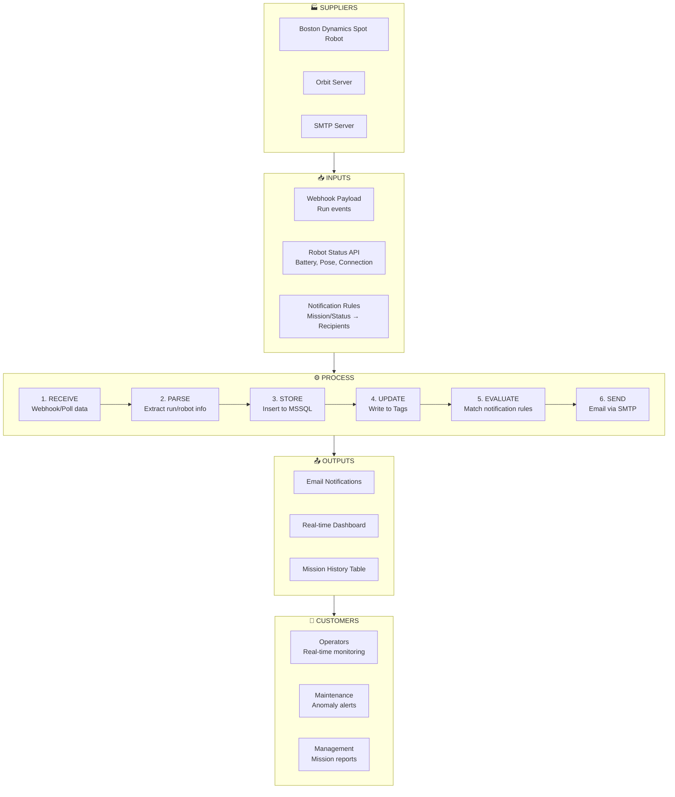
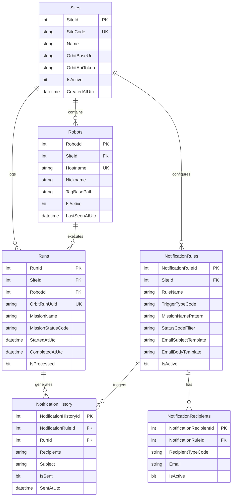

# Spot Mission → Orbit → Ignition Perspective Integration (Demo MVP)

**Project:** Spot Robot Mission Notification System (Simplified)  
**Version:** 1.1 (Demo)  
**Last Updated:** 2026-01-29

---

## 1. Objectives

| Objective | Description |
|-----------|-------------|
| **Core Integration** | Integrate Spot mission → Orbit → Ignition Perspective |
| **Conditional Notifications** | Automatically send emails to different recipients based on mission, tag, or status |
| **Scalable Naming** | Maintain consistent naming and rules even as sites/projects scale up |
| **Process Clarity** | Summarize the overall flow using a **SIPOC** diagram |

### 1.1 Demo Scope (MVP)

| In Scope | Out of Scope (Future) |
|----------|----------------------|
| Single site, 1-2 robots | Multi-site federation |
| Basic polling (15s) | Store & Forward historian |
| Webhook for run events | Complex alarm pipelines |
| Simple email notifications | SMS/Push notifications |
| Basic Perspective dashboard | Role-based multi-dashboards |
| Core database tables | Advanced partitioning |

---

## 2. SIPOC Diagram

### 2.1 SIPOC Flow



### 2.2 SIPOC Summary Table

| Element | Description |
|---------|-------------|
| **S**uppliers | Spot Robot, Orbit Server, SMTP Server |
| **I**nputs | Webhook payloads, Robot API data, Notification rules |
| **P**rocess | Receive → Parse → Store → Update Tags → Evaluate Rules → Send Email |
| **O**utputs | Emails, Dashboard, Mission History |
| **C**ustomers | Operators, Maintenance, Management |

---

## 3. System Architecture

### 3.1 Simple Architecture Diagram


### 3.2 Two Data Flows

| Flow | Trigger | Purpose | Update Rate |
|------|---------|---------|-------------|
| **Flow A: Polling** | Gateway Timer | Robot status (battery, pose, connection) | Every 15 seconds |
| **Flow B: Webhook** | Orbit event | Mission events (start, complete, fail) | Event-driven |

---

## 4. Naming Convention Summary

> **Reference:** `naming_convention.md` for full details

### 4.1 Quick Reference

| Layer | Convention | Example |
|-------|------------|---------|
| **SQL Tables** | PascalCase, Plural | `RoboticsRuns`, `RoboticsRobots` |
| **SQL Columns** | PascalCase | `MissionStatusCode`, `StartedAtUtc` |
| **Tag Paths** | ISA-95 Hierarchy | `Enterprise/Site/Area/Line/Device/Tag` |
| **Tag Names** | PascalCase | `BatteryLevel`, `IsConnected`, `MissionStatusCode` |
| **Python** | snake_case | `battery_level`, `mission_status_code` |
| **Named Queries** | PascalCase | `GetMissionHistory`, `UpsertRun` |

### 4.2 Tag Hierarchy (Demo)

```
[default]
└── Enterprise/
    └── Site001/
        └── Assembly/
            └── Line001/
                └── Spot001/           ← SpotRobot UDT Instance
                    ├── BatteryLevel
                    ├── IsConnected
                    ├── IsCharging
                    ├── RobotStateCode
                    ├── MissionId
                    ├── MissionName
                    ├── MissionStatusCode
                    ├── LastRunAtUtc
                    └── Pose/
                        ├── X
                        ├── Y
                        └── Theta
```

---

## 5. Database Schema (Simplified)

### 5.1 Entity Relationship Diagram



### 5.2 SQL DDL (Core Tables Only)

```sql
-- ============================================================
-- ROBOTICS SCHEMA - Demo MVP
-- ============================================================

CREATE SCHEMA Robotics;
GO

-- Lookup: Mission Status Codes
CREATE TABLE RoboticsMissionStatusCodes (
    MissionStatusCode NVARCHAR(10) NOT NULL PRIMARY KEY,
    Description NVARCHAR(100) NOT NULL,
    DisplayOrder INT NOT NULL DEFAULT 0
);

INSERT INTO RoboticsMissionStatusCodes VALUES
('PEND', 'Pending', 1),
('RUN', 'Running', 2),
('COMP', 'Completed', 3),
('FAIL', 'Failed', 4);

-- Lookup: Trigger Types
CREATE TABLE RoboticsTriggerTypeCodes (
    TriggerTypeCode NVARCHAR(20) NOT NULL PRIMARY KEY,
    Description NVARCHAR(100) NOT NULL
);

INSERT INTO RoboticsTriggerTypeCodes VALUES
('RUN_START', 'Run Started'),
('RUN_COMP', 'Run Completed'),
('RUN_FAIL', 'Run Failed');

-- Core: Sites
CREATE TABLE RoboticsSites (
    SiteId INT IDENTITY(1,1) PRIMARY KEY,
    SiteCode NVARCHAR(20) NOT NULL UNIQUE,
    Name NVARCHAR(200) NOT NULL,
    OrbitBaseUrl NVARCHAR(500) NOT NULL,
    OrbitApiToken NVARCHAR(500) NULL,
    IsActive BIT NOT NULL DEFAULT 1,
    CreatedAtUtc DATETIME2(3) NOT NULL DEFAULT SYSUTCDATETIME()
);

-- Core: Robots
CREATE TABLE RoboticsRobots (
    RobotId INT IDENTITY(1,1) PRIMARY KEY,
    SiteId INT NOT NULL REFERENCES RoboticsSites(SiteId),
    Hostname NVARCHAR(100) NOT NULL,
    Nickname NVARCHAR(100) NULL,
    TagBasePath NVARCHAR(500) NULL,
    IsActive BIT NOT NULL DEFAULT 1,
    LastSeenAtUtc DATETIME2(3) NULL,
    CreatedAtUtc DATETIME2(3) NOT NULL DEFAULT SYSUTCDATETIME(),
    CONSTRAINT UQ_Robots_SiteHostname UNIQUE (SiteId, Hostname)
);

-- Core: Runs (Mission Executions)
CREATE TABLE RoboticsRuns (
    RunId INT IDENTITY(1,1) PRIMARY KEY,
    SiteId INT NOT NULL REFERENCES RoboticsSites(SiteId),
    RobotId INT NULL REFERENCES RoboticsRobots(RobotId),
    OrbitRunUuid NVARCHAR(100) NOT NULL UNIQUE,
    MissionName NVARCHAR(200) NULL,
    MissionStatusCode NVARCHAR(10) NULL REFERENCES RoboticsMissionStatusCodes(MissionStatusCode),
    StartedAtUtc DATETIME2(3) NULL,
    CompletedAtUtc DATETIME2(3) NULL,
    DurationMinutes AS DATEDIFF(MINUTE, StartedAtUtc, CompletedAtUtc),
    IsProcessed BIT NOT NULL DEFAULT 0,
    CreatedAtUtc DATETIME2(3) NOT NULL DEFAULT SYSUTCDATETIME()
);

-- Notification: Rules
CREATE TABLE RoboticsNotificationRules (
    NotificationRuleId INT IDENTITY(1,1) PRIMARY KEY,
    SiteId INT NULL REFERENCES RoboticsSites(SiteId),
    RuleName NVARCHAR(200) NOT NULL,
    TriggerTypeCode NVARCHAR(20) NOT NULL REFERENCES RoboticsTriggerTypeCodes(TriggerTypeCode),
    MissionNamePattern NVARCHAR(200) NULL,  -- NULL = all missions
    StatusCodeFilter NVARCHAR(100) NULL,    -- NULL = all statuses
    EmailSubjectTemplate NVARCHAR(500) NULL,
    EmailBodyTemplate NVARCHAR(MAX) NULL,
    IsActive BIT NOT NULL DEFAULT 1,
    Priority INT NOT NULL DEFAULT 100,
    CreatedAtUtc DATETIME2(3) NOT NULL DEFAULT SYSUTCDATETIME()
);

-- Notification: Recipients
CREATE TABLE RoboticsNotificationRecipients (
    NotificationRecipientId INT IDENTITY(1,1) PRIMARY KEY,
    NotificationRuleId INT NOT NULL REFERENCES RoboticsNotificationRules(NotificationRuleId),
    RecipientTypeCode NVARCHAR(10) NOT NULL DEFAULT 'to',  -- to, cc, bcc
    Email NVARCHAR(200) NOT NULL,
    DisplayName NVARCHAR(200) NULL,
    IsActive BIT NOT NULL DEFAULT 1,
    CreatedAtUtc DATETIME2(3) NOT NULL DEFAULT SYSUTCDATETIME()
);

-- Notification: History (Audit Trail)
CREATE TABLE RoboticsNotificationHistory (
    NotificationHistoryId INT IDENTITY(1,1) PRIMARY KEY,
    NotificationRuleId INT NULL REFERENCES RoboticsNotificationRules(NotificationRuleId),
    RunId INT NULL REFERENCES RoboticsRuns(RunId),
    TriggerTypeCode NVARCHAR(20) NOT NULL,
    Recipients NVARCHAR(MAX) NULL,
    Subject NVARCHAR(500) NOT NULL,
    Body NVARCHAR(MAX) NULL,
    IsSent BIT NOT NULL DEFAULT 0,
    SentAtUtc DATETIME2(3) NULL,
    ErrorMessage NVARCHAR(MAX) NULL,
    CreatedAtUtc DATETIME2(3) NOT NULL DEFAULT SYSUTCDATETIME()
);

-- Indexes
CREATE INDEX IX_Runs_SiteId ON RoboticsRuns(SiteId);
CREATE INDEX IX_Runs_StartedAtUtc ON RoboticsRuns(StartedAtUtc DESC);
CREATE INDEX IX_Runs_IsProcessed ON RoboticsRuns(IsProcessed) WHERE IsProcessed = 0;
CREATE INDEX IX_NotificationHistory_CreatedAtUtc ON RoboticsNotificationHistory(CreatedAtUtc DESC);
GO
```

### 5.3 Seed Data (Demo)

```sql
-- Demo Site
INSERT INTO RoboticsSites (SiteCode, Name, OrbitBaseUrl, OrbitApiToken)
VALUES ('SITE001', 'Demo Factory', 'https://orbit.demo.local', 'your-api-token-here');

-- Demo Robot
INSERT INTO RoboticsRobots (SiteId, Hostname, Nickname, TagBasePath)
VALUES (1, 'spot-001', 'Spot 001', '[default]Enterprise/Site001/Assembly/Line001/Spot001');

-- Sample Notification Rules
INSERT INTO RoboticsNotificationRules (SiteId, RuleName, TriggerTypeCode, MissionNamePattern, EmailSubjectTemplate, EmailBodyTemplate)
VALUES 
(1, 'Mission Failed Alert', 'RUN_FAIL', NULL, 
 '[ALERT] Mission Failed: {{MissionName}}', 
 'Robot {{RobotNickname}} failed mission {{MissionName}} at {{CompletedAtUtc}}'),
(1, 'Inspection Complete', 'RUN_COMP', '%Inspection%', 
 '[INFO] Inspection Complete: {{MissionName}}', 
 'Inspection mission {{MissionName}} completed successfully. Duration: {{Duration}} minutes.');

-- Recipients for rules
INSERT INTO RoboticsNotificationRecipients (NotificationRuleId, RecipientTypeCode, Email, DisplayName)
VALUES 
(1, 'to', 'operator@company.com', 'Operator Team'),
(1, 'cc', 'maintenance@company.com', 'Maintenance Team'),
(2, 'to', 'quality@company.com', 'Quality Team');
GO
```

---

## 6. Ignition Implementation

### 6.1 SpotRobot UDT Definition

```
SpotRobot (UDT)
│
├── [Parameters]
│   ├── RobotHostname       : String   -- e.g., "spot-001"
│   ├── SiteId              : Int      -- FK to Sites table
│   └── TagBasePath         : String   -- Full tag path
│
├── [Polled Tags] ← Updated by Gateway Timer
│   ├── BatteryLevel        : Float    -- 0-100%
│   ├── IsConnected         : Boolean
│   ├── IsCharging          : Boolean
│   ├── RobotStateCode      : String   -- e.g., "idle", "running"
│   └── Pose/
│       ├── X               : Float    -- meters
│       ├── Y               : Float    -- meters
│       └── Theta           : Float    -- radians
│
├── [Webhook Tags] ← Updated by Web Dev endpoint
│   ├── MissionId           : String
│   ├── MissionName         : String
│   ├── MissionStatusCode   : String   -- PEND, RUN, COMP, FAIL
│   └── LastRunAtUtc        : DateTime
│
└── [System Tags]
    ├── LastPollAtUtc       : DateTime
    └── PollErrorCount      : Int
```

### 6.2 Gateway Timer Script: Robot Polling

**Script Path:** `project/orbit/poll_robots.py`  
**Trigger:** Fixed Rate, 15000 ms

```python
"""
Gateway Timer Script: Poll robot status from Orbit API
Schedule: Every 15 seconds
"""

import system
import json

# Configuration
ORBIT_BASE_URL = "https://orbit.demo.local"
ORBIT_API_TOKEN = "your-api-token"  # Move to encrypted property in production
SITE_TAG_BASE = "[default]Enterprise/Site001/Assembly/Line001"

def poll_robots():
    """Poll all robots from Orbit API and update tags."""
    logger = system.util.getLogger("orbit.poll_robots")
    
    try:
        # Call Orbit API: GET /api/v0/robots
        headers = {"Authorization": "Bearer " + ORBIT_API_TOKEN}
        response = system.net.httpGet(
            url=ORBIT_BASE_URL + "/api/v0/robots",
            headerValues=headers,
            timeout=10000
        )
        
        robots = json.loads(response)
        
        for robot in robots:
            hostname = robot.get("hostname", "")
            nickname = robot.get("nickname", hostname)
            
            # Build tag path (assumes naming: Spot001 for spot-001)
            device_name = nickname.replace(" ", "").replace("-", "")
            tag_base = "{}/{}".format(SITE_TAG_BASE, device_name)
            
            # Prepare tag writes
            tags_to_write = [
                "{}/BatteryLevel".format(tag_base),
                "{}/IsConnected".format(tag_base),
                "{}/IsCharging".format(tag_base),
                "{}/RobotStateCode".format(tag_base),
                "{}/Pose/X".format(tag_base),
                "{}/Pose/Y".format(tag_base),
                "{}/Pose/Theta".format(tag_base),
                "{}/LastPollAtUtc".format(tag_base),
            ]
            
            # Extract values from API response
            values = [
                robot.get("batteryLevel", 0.0),
                robot.get("isConnected", False),
                robot.get("isCharging", False),
                robot.get("state", "unknown"),
                robot.get("pose", {}).get("x", 0.0),
                robot.get("pose", {}).get("y", 0.0),
                robot.get("pose", {}).get("theta", 0.0),
                system.date.now(),
            ]
            
            # Write to tags
            system.tag.writeBlocking(tags_to_write, values)
            
        logger.info("Polled {} robots successfully".format(len(robots)))
        
    except Exception as e:
        logger.error("Robot polling failed: {}".format(str(e)))

# Execute
poll_robots()
```

### 6.3 Web Dev Webhook Endpoint

**Path:** `/system/webdev/orbit/webhook`  
**Method:** POST

```python
"""
Web Dev Endpoint: Receive Orbit webhook events
Path: POST /system/webdev/orbit/webhook
"""

import json
import system

def doPost(request, session):
    """Handle incoming webhook from Orbit."""
    logger = system.util.getLogger("orbit.webhook")
    
    try:
        # Parse webhook payload
        payload = json.loads(request["data"])
        event_type = payload.get("type", "")
        
        logger.info("Received webhook: {}".format(event_type))
        
        # Route by event type
        if event_type == "run":
            handle_run_event(payload)
        else:
            logger.warn("Unknown event type: {}".format(event_type))
        
        return {"status": "ok"}
        
    except Exception as e:
        logger.error("Webhook error: {}".format(str(e)))
        return {"status": "error", "message": str(e)}


def handle_run_event(payload):
    """Process run (mission) events."""
    logger = system.util.getLogger("orbit.webhook")
    
    run_data = payload.get("data", {})
    run_uuid = run_data.get("uuid", "")
    mission_name = run_data.get("missionName", "")
    status = run_data.get("status", "")  # started, completed, failed
    robot_hostname = run_data.get("robot", {}).get("hostname", "")
    
    # Map Orbit status to our codes
    status_map = {
        "started": "RUN",
        "completed": "COMP",
        "failed": "FAIL",
        "pending": "PEND"
    }
    mission_status_code = status_map.get(status, "PEND")
    
    # 1. Upsert to database
    upsert_run(run_uuid, mission_name, mission_status_code, robot_hostname, run_data)
    
    # 2. Update tags
    update_mission_tags(robot_hostname, run_uuid, mission_name, mission_status_code)
    
    # 3. Evaluate notification rules
    trigger_type = "RUN_" + status.upper()[:4]  # RUN_STAR, RUN_COMP, RUN_FAIL
    evaluate_and_send_notifications(trigger_type, run_uuid, mission_name, mission_status_code, robot_hostname)
    
    logger.info("Processed run event: {} - {}".format(mission_name, mission_status_code))


def upsert_run(run_uuid, mission_name, status_code, robot_hostname, run_data):
    """Insert or update run in database."""
    # Get robot_id from hostname
    robot_query = """
        SELECT RobotId, SiteId FROM RoboticsRobots 
        WHERE Hostname = ? AND IsActive = 1
    """
    robot_result = system.db.runPrepQuery(robot_query, [robot_hostname], "MSSQL_Robotics")
    
    if len(robot_result) == 0:
        return  # Robot not registered
    
    robot_id = robot_result[0]["RobotId"]
    site_id = robot_result[0]["SiteId"]
    
    # Check if run exists
    check_query = "SELECT RunId FROM RoboticsRuns WHERE OrbitRunUuid = ?"
    existing = system.db.runPrepQuery(check_query, [run_uuid], "MSSQL_Robotics")
    
    if len(existing) > 0:
        # Update existing
        update_query = """
            UPDATE RoboticsRuns 
            SET MissionStatusCode = ?, 
                CompletedAtUtc = CASE WHEN ? IN ('COMP', 'FAIL') THEN SYSUTCDATETIME() ELSE CompletedAtUtc END
            WHERE OrbitRunUuid = ?
        """
        system.db.runPrepUpdate(update_query, [status_code, status_code, run_uuid], "MSSQL_Robotics")
    else:
        # Insert new
        insert_query = """
            INSERT INTO RoboticsRuns (SiteId, RobotId, OrbitRunUuid, MissionName, MissionStatusCode, StartedAtUtc)
            VALUES (?, ?, ?, ?, ?, SYSUTCDATETIME())
        """
        system.db.runPrepUpdate(insert_query, [site_id, robot_id, run_uuid, mission_name, status_code], "MSSQL_Robotics")


def update_mission_tags(robot_hostname, run_uuid, mission_name, status_code):
    """Update mission-related tags for the robot."""
    # Convert hostname to tag path (spot-001 → Spot001)
    device_name = robot_hostname.replace("-", "").title()
    tag_base = "[default]Enterprise/Site001/Assembly/Line001/{}".format(device_name)
    
    tags = [
        "{}/MissionId".format(tag_base),
        "{}/MissionName".format(tag_base),
        "{}/MissionStatusCode".format(tag_base),
        "{}/LastRunAtUtc".format(tag_base),
    ]
    
    values = [run_uuid, mission_name, status_code, system.date.now()]
    
    system.tag.writeBlocking(tags, values)


def evaluate_and_send_notifications(trigger_type, run_uuid, mission_name, status_code, robot_hostname):
    """Evaluate notification rules and send matching emails."""
    logger = system.util.getLogger("orbit.webhook.notify")
    
    # Find matching rules
    rules_query = """
        SELECT nr.NotificationRuleId, nr.RuleName, nr.MissionNamePattern, 
               nr.EmailSubjectTemplate, nr.EmailBodyTemplate
        FROM RoboticsNotificationRules nr
        WHERE nr.TriggerTypeCode = ?
          AND nr.IsActive = 1
          AND (nr.StatusCodeFilter IS NULL OR nr.StatusCodeFilter LIKE '%' + ? + '%')
        ORDER BY nr.Priority
    """
    rules = system.db.runPrepQuery(rules_query, [trigger_type, status_code], "MSSQL_Robotics")
    
    for rule in rules:
        rule_id = rule["NotificationRuleId"]
        pattern = rule["MissionNamePattern"]
        
        # Check mission name pattern match (simple LIKE for demo)
        if pattern and pattern.replace("%", "") not in mission_name:
            continue
        
        # Get recipients
        recipients_query = """
            SELECT Email, RecipientTypeCode FROM RoboticsNotificationRecipients
            WHERE NotificationRuleId = ? AND IsActive = 1
        """
        recipients = system.db.runPrepQuery(recipients_query, [rule_id], "MSSQL_Robotics")
        
        if len(recipients) == 0:
            continue
        
        # Build email
        to_list = [r["Email"] for r in recipients if r["RecipientTypeCode"] == "to"]
        cc_list = [r["Email"] for r in recipients if r["RecipientTypeCode"] == "cc"]
        
        # Render templates (simple replacement)
        subject = render_template(rule["EmailSubjectTemplate"], {
            "MissionName": mission_name,
            "StatusCode": status_code,
            "RobotHostname": robot_hostname
        })
        
        body = render_template(rule["EmailBodyTemplate"], {
            "MissionName": mission_name,
            "StatusCode": status_code,
            "RobotHostname": robot_hostname,
            "RobotNickname": robot_hostname.replace("-", " ").title(),
            "CompletedAtUtc": str(system.date.now())
        })
        
        # Send email
        try:
            system.net.sendEmail(
                smtp="smtp.company.com",
                fromAddr="ignition@company.com",
                to=to_list,
                cc=cc_list if cc_list else None,
                subject=subject,
                body=body
            )
            
            # Log success
            log_notification(rule_id, run_uuid, trigger_type, to_list + cc_list, subject, body, True, None)
            logger.info("Sent notification for rule: {}".format(rule["RuleName"]))
            
        except Exception as e:
            log_notification(rule_id, run_uuid, trigger_type, to_list + cc_list, subject, body, False, str(e))
            logger.error("Failed to send notification: {}".format(str(e)))


def render_template(template, variables):
    """Simple template rendering with {{variable}} syntax."""
    if not template:
        return ""
    result = template
    for key, value in variables.items():
        result = result.replace("{{" + key + "}}", str(value) if value else "")
    return result


def log_notification(rule_id, run_uuid, trigger_type, recipients, subject, body, is_sent, error_msg):
    """Log notification to history table."""
    # Get run_id from uuid
    run_query = "SELECT RunId FROM RoboticsRuns WHERE OrbitRunUuid = ?"
    run_result = system.db.runPrepQuery(run_query, [run_uuid], "MSSQL_Robotics")
    run_id = run_result[0]["RunId"] if len(run_result) > 0 else None
    
    insert_query = """
        INSERT INTO RoboticsNotificationHistory 
        (NotificationRuleId, RunId, TriggerTypeCode, Recipients, Subject, Body, IsSent, SentAtUtc, ErrorMessage)
        VALUES (?, ?, ?, ?, ?, ?, ?, CASE WHEN ? = 1 THEN SYSUTCDATETIME() ELSE NULL END, ?)
    """
    
    import json
    recipients_json = json.dumps(recipients)
    
    system.db.runPrepUpdate(insert_query, [
        rule_id, run_id, trigger_type, recipients_json, subject, body, 
        is_sent, is_sent, error_msg
    ], "MSSQL_Robotics")
```

### 6.4 Named Queries

| Query Name | Type | Description |
|------------|------|-------------|
| `GetAllRobots` | Query | Get all robots for dashboard |
| `GetMissionHistory` | Query | Get mission history with filters |
| `GetNotificationRules` | Query | Get active notification rules |
| `UpsertRun` | Update | Insert or update run record |

**GetMissionHistory** (Named Query)

```sql
SELECT 
    r.RunId,
    r.MissionName,
    r.MissionStatusCode,
    msc.Description AS StatusDescription,
    r.StartedAtUtc,
    r.CompletedAtUtc,
    r.DurationMinutes,
    rob.Nickname AS RobotName
FROM RoboticsRuns r
LEFT JOIN RoboticsRobots rob ON r.RobotId = rob.RobotId
LEFT JOIN RoboticsMissionStatusCodes msc ON r.MissionStatusCode = msc.MissionStatusCode
WHERE r.SiteId = :siteId
    AND (:startDate IS NULL OR r.StartedAtUtc >= :startDate)
    AND (:endDate IS NULL OR r.StartedAtUtc < :endDate)
ORDER BY r.StartedAtUtc DESC
OFFSET 0 ROWS FETCH NEXT 100 ROWS ONLY
```

---

## 7. Perspective UI (Basic Dashboard)

### 7.1 View Structure

```
📁 Views/
├── 📁 Pages/
│   ├── Home                    -- Main dashboard
│   └── MissionHistory          -- Historical table
│
├── 📁 Templates/
│   ├── RobotCard               -- Robot status card
│   └── StatusBadge             -- Status indicator
│
└── 📁 Popups/
    └── MissionDetail           -- Mission popup details
```

### 7.2 Home Dashboard Layout

```mermaid
flowchart TB
    subgraph HOME_PAGE["📺 Home Dashboard"]
        subgraph HEADER["Header Row"]
            TITLE[Site: Demo Factory]
            REFRESH[🔄 Last Update: 14:32:05]
        end
        
        subgraph ROBOT_SECTION["Robot Status"]
            subgraph CARD1["Spot 001"]
                C1_BAT[🔋 78%]
                C1_CONN[● Connected]
                C1_MISSION[Running: Inspection-A]
            end
        end
        
        subgraph MISSION_TABLE["Recent Missions"]
            TABLE[Mission Name | Status | Robot | Started | Duration]
            ROW1[Inspection-A | ✅ Complete | Spot001 | 14:00 | 15 min]
            ROW2[Patrol-B | 🔄 Running | Spot001 | 14:20 | -- ]
        end
    end
```

### 7.3 RobotCard Template

**View Parameters:**
- `tagBasePath` : String (e.g., `[default]Enterprise/Site001/Assembly/Line001/Spot001`)
- `robotName` : String (e.g., `Spot 001`)

**Bindings:**

| Property | Binding Type | Path |
|----------|--------------|------|
| Battery Level | Tag | `{view.params.tagBasePath}/BatteryLevel` |
| Is Connected | Tag | `{view.params.tagBasePath}/IsConnected` |
| Mission Name | Tag | `{view.params.tagBasePath}/MissionName` |
| Mission Status | Tag | `{view.params.tagBasePath}/MissionStatusCode` |

### 7.4 Mission History Page

**Components:**
1. **Filter Bar**: Date range picker, Status dropdown
2. **Table**: Named Query binding to `GetMissionHistory`
3. **Row Click**: Opens `MissionDetail` popup

---

## 8. Notification Rules Examples

### 8.1 Rule: All Mission Failures → Operators + Maintenance

| Field | Value |
|-------|-------|
| Rule Name | Mission Failed Alert |
| Trigger Type | `RUN_FAIL` |
| Mission Pattern | `NULL` (all missions) |
| Status Filter | `NULL` |
| Subject | `[ALERT] Mission Failed: {{MissionName}}` |
| Recipients | operator@company.com (to), maintenance@company.com (cc) |

### 8.2 Rule: Inspection Complete → Quality Team

| Field | Value |
|-------|-------|
| Rule Name | Inspection Complete |
| Trigger Type | `RUN_COMP` |
| Mission Pattern | `%Inspection%` |
| Status Filter | `COMP` |
| Subject | `[INFO] Inspection Complete: {{MissionName}}` |
| Recipients | quality@company.com (to) |

### 8.3 Rule: Patrol Started → Security

| Field | Value |
|-------|-------|
| Rule Name | Patrol Started |
| Trigger Type | `RUN_START` |
| Mission Pattern | `%Patrol%` |
| Subject | `[INFO] Patrol Started: {{MissionName}}` |
| Recipients | security@company.com (to) |

---

## 9. Implementation Checklist

### Phase 1: Foundation (Day 1-2)

- [ ] Create MSSQL database and Robotics schema
- [ ] Execute DDL scripts
- [ ] Insert seed data (site, robot, sample rules)
- [ ] Configure Ignition MSSQL connection (`MSSQL_Robotics`)

### Phase 2: Polling Flow (Day 2-3)

- [ ] Create SpotRobot UDT definition
- [ ] Create tag instance: `Enterprise/Site001/Assembly/Line001/Spot001`
- [ ] Create `poll_robots.py` Gateway Timer script
- [ ] Test polling and verify tag updates

### Phase 3: Webhook Flow (Day 3-4)

- [ ] Enable Web Dev Module
- [ ] Create webhook endpoint `/orbit/webhook`
- [ ] Configure Orbit webhook to point to Ignition
- [ ] Test webhook → database → tag flow

### Phase 4: Notifications (Day 4-5)

- [ ] Configure SMTP settings in Ignition
- [ ] Test `system.net.sendEmail()` function
- [ ] Verify notification rules trigger correctly
- [ ] Check notification history in database

### Phase 5: Perspective UI (Day 5-7)

- [ ] Create Named Queries
- [ ] Build RobotCard template
- [ ] Build Home dashboard page
- [ ] Build MissionHistory page
- [ ] Test end-to-end flow

---

## 10. Future Expansion Points

| Area | Current (Demo) | Future Enhancement |
|------|----------------|-------------------|
| **Sites** | 1 site | Multi-site with site selector |
| **Robots** | 1-2 robots | N robots per site |
| **History** | Memory tags only | Tag Historian + Store & Forward |
| **Alarms** | None | Alarm pipeline (battery low, comm lost) |
| **Notifications** | Email only | SMS, Push, Teams/Slack webhooks |
| **UI** | Single dashboard | Role-based views (Operator/Manager/Admin) |
| **Anomalies** | Not tracked | Anomaly table + webhook handling |
| **Security** | None | Role-based access control |
| **Reports** | None | Scheduled PDF/Excel reports |

---

## 11. Orbit API Reference (Used Endpoints)

| Endpoint | Method | Purpose |
|----------|--------|---------|
| `/api/v0/robots` | GET | Poll robot status (battery, pose, connection) |
| `/api/v0/runs` | GET | Query run history (optional backup polling) |
| `/api/v0/webhooks` | POST | Register Ignition webhook endpoint |

**Webhook Events Used:**
- `run.started` - Mission started
- `run.completed` - Mission completed successfully
- `run.failed` - Mission failed

---

*Document maintained by: AME-Junsu Lee*  
*Version: 1.1 (Demo MVP)*  
*Based on: ignition-spot-long-plan.md (Enterprise Version)*
