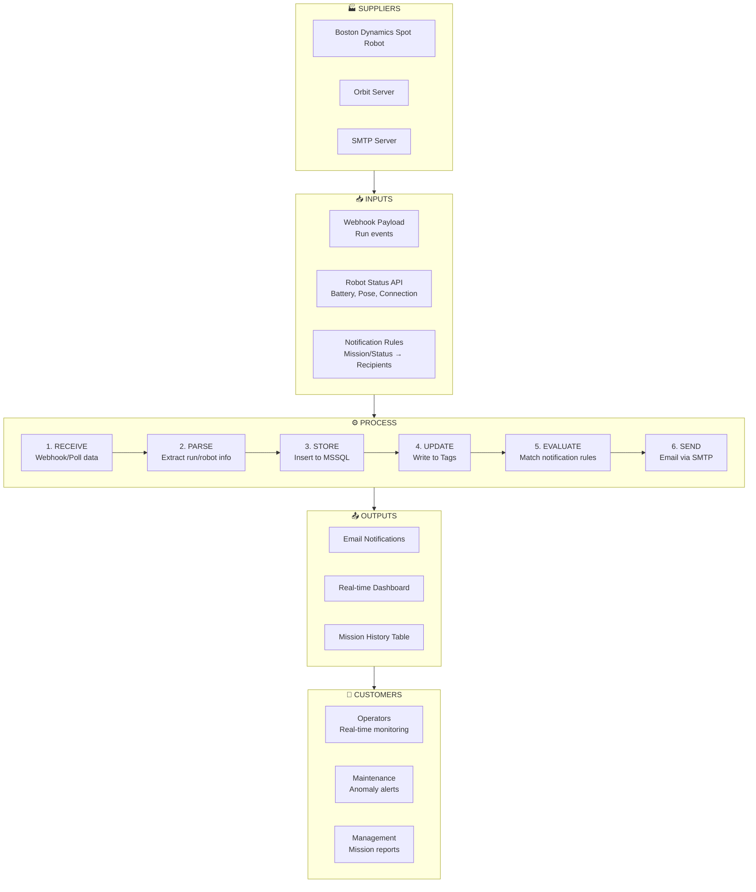
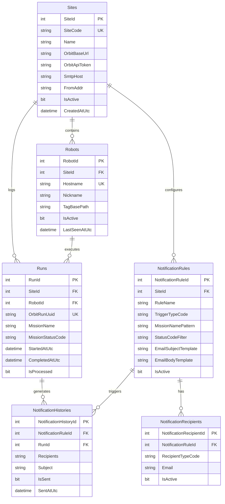

# Spot Mission → Orbit → Ignition Perspective Integration (Demo MVP)

**Project:** Spot Robot Mission Notification System (Simplified)  
**Version:** 1.8 (Demo) - Hostname-based tag naming for production consistency  
**Last Updated:** 2026-02-02

> **Key Documentation References:**
> - [Project Library](https://docs.inductiveautomation.com/docs/8.1/platform/scripting/scripting-in-ignition/project-library)
> - [Gateway Event Scripts](https://docs.inductiveautomation.com/docs/8.1/platform/scripting/scripting-in-ignition/gateway-event-scripts)
> - [Web Dev Module](https://docs.inductiveautomation.com/docs/8.1/ignition-modules/web-dev)
> - [Named Queries](https://docs.inductiveautomation.com/docs/8.1/platform/sql-in-ignition/named-queries)
> - [system.net.httpClient](https://docs.inductiveautomation.com/docs/8.1/appendix/scripting-functions/system-net/system-net-httpClient)
> - [Deployment Best Practices](https://docs.inductiveautomation.com/docs/8.1/tutorials/ignition-8-deployment-best-practices)

## Version History

| Version | Date       | Changes |
|---------|------------|---------|
| **1.8** | 2026-02-02 | **Hostname-Based Tag Naming (Production Best Practice)**<br>• Updated all examples to use actual hostname (e.g., `spot-BD-12345678`) instead of friendly names<br>• Modified `get_robot_tag_base()` to append hostname directly (no formatting) in demo mode<br>• Updated tag hierarchy examples, seed data, and UDT instances<br>• Supports both database lookup (production) and hostname concatenation (demo)<br>• Better traceability and consistency with Orbit API |
| **1.7** | 2026-02-02 | **Tag Path Configuration Update**<br>• Centralized tag base path in `helpers` module<br>• Added `get_robot_tag_base()` function with demo/production modes<br>• Added `Robotics/GetRobotTagPath` Named Query for multi-site support<br>• Updated `robot_polling` and `webhook` to use helper function<br>• Added section 4.3: Tag Path Configuration Strategy<br>• **Migration Path:** Demo (hardcoded) → Production (database lookup)<br>• **Bug Fix:** Corrected syntax error in `_update_robot_tags()` error checking logic |
| **1.6** | 2026-02-02 | Added robot validation filter for invalid/empty robots from Orbit API |
| **1.5** | 2026-02-01 | Initial simplified demo plan |

---

## 1. Objectives

| Objective | Description |
|-----------|-------------|
| **Core Integration** | Integrate Spot mission → Orbit → Ignition Perspective |
| **Conditional Notifications** | Automatically send emails to different recipients based on mission, tag, or status |
| **Scalable Naming** | Maintain consistent naming and rules even as sites/projects scale up |
| **Process Clarity** | Summarize the overall flow using a **SIPOC** diagram |

### 1.1 Demo Scope (MVP)

| In Scope | Out of Scope (Future) |
|----------|----------------------|
| Single site, 1-2 robots | Multi-site federation |
| Basic polling (15s) | Store & Forward historian |
| Webhook for run events | Complex alarm pipelines |
| Simple email notifications | SMS/Push notifications |
| Basic Perspective dashboard | Role-based multi-dashboards |
| Core database tables | Advanced partitioning |

---

## 2. SIPOC Diagram

### 2.1 SIPOC Flow



### 2.2 SIPOC Summary Table

| Element | Description |
|---------|-------------|
| **S**uppliers | Spot Robot, Orbit Server, SMTP Server |
| **I**nputs | Webhook payloads, Robot API data, Notification rules |
| **P**rocess | Receive → Parse → Store → Update Tags → Evaluate Rules → Send Email |
| **O**utputs | Emails, Dashboard, Mission History |
| **C**ustomers | Operators, Maintenance, Management |

---

## 3. System Architecture

### 3.1 Simple Architecture Diagram


### 3.2 Two Data Flows

| Flow | Trigger | Purpose | Update Rate |
|------|---------|---------|-------------|
| **Flow A: Polling** | Gateway Timer | Robot status (battery, pose, connection) | Every 15000ms |
| **Flow B: Webhook** | Orbit event | Mission events (start, complete, fail) | Event-driven |

---

## 4. Naming Convention Summary

> **Reference:** `naming_convention.md` for full details

### 4.1 Quick Reference

| Layer | Convention | Example |
|-------|------------|---------|
| **SQL Tables** | PascalCase, Plural | `RoboticsRuns`, `RoboticsRobots` *(schema-less prefix variant)* |
| **SQL Columns** | PascalCase | `MissionStatusCode`, `StartedAtUtc` |
| **Tag Paths** | ISA-95 Hierarchy + Hostname-based Device | `Enterprise/Site001/Assembly/Line001/spot-BD-12345678/BatteryLevel` |
| **Tag Names** | PascalCase | `BatteryLevel`, `IsConnected`, `MissionStatusCode` |
| **Robot Device Names** | **Use Orbit hostname as-is** | `spot-BD-12345678` *(not formatted - use actual hostname)* |
| **Display Names** | Use Nickname field from DB | "Assembly Line Spot" *(stored in `RoboticsRobots.Nickname`)* |
| **Python** | snake_case | `battery_level`, `mission_status_code` |
| **Named Queries** | PascalCase | `GetMissionHistory`, `UpsertRun` |

### 4.2 Tag Hierarchy (Demo)

**Note:** This project uses **hostname-based naming** (e.g., `spot-BD-12345678`) for better traceability and consistency with Orbit API.

```
[default]
└── Enterprise/
    └── Site001/
        └── Assembly/
            └── Line001/
                └── spot-BD-12345678/  ← SpotRobot UDT Instance (uses Orbit hostname)
                    ├── BatteryLevel
                    ├── IsConnected
                    ├── IsCharging
                    ├── RobotStateCode
                    ├── MissionId
                    ├── MissionName
                    ├── MissionStatusCode
                    ├── LastRunAtUtc
                    └── Pose/
                        ├── X
                        ├── Y
                        └── Theta
```

### 4.3 Tag Path Configuration Strategy

This project uses a **hostname-based naming approach** with two operational modes for tag base paths:

#### Naming Convention: Hostname-Based (Production Best Practice)

**Why hostname-based naming?**

| Benefit | Description |
|---------|-------------|
| **API Consistency** | Tag names match Orbit hostname exactly (no translation needed) |
| **Traceability** | Direct correlation between tags and physical robot serial numbers |
| **Robot Swaps** | No confusion when hardware is replaced or moved |
| **Debugging** | Logs, tags, and API responses use identical identifiers |
| **Multi-Site** | BD serial numbers guarantee uniqueness across all sites |

**Example:** Robot hostname `spot-BD-12345678` creates tag path:
```
[default]Enterprise/Site001/Assembly/Line001/spot-BD-12345678
```

**Human-Readable Names:** Use the `Nickname` database field for displays:
- **Tags/Data:** `spot-BD-12345678` (hostname)
- **UI Display:** "Assembly Line Spot" (nickname)

#### Stage 1: Demo Mode (Hardcoded Concatenation)

**When to use:** Single site with 1-2 robots, quick testing

**Configuration:** Set in `helpers` module
```python
TAG_BASE_PATH = "[default]Enterprise/Site001/Assembly/Line001"
USE_DATABASE_FOR_TAG_PATHS = False
```

**How it works:**
- Tag paths are constructed as: `TAG_BASE_PATH + "/" + robot_hostname`
- Example: `[default]Enterprise/Site001/Assembly/Line001/spot-BD-12345678`
- **No name formatting/conversion** - uses hostname exactly as-is
- Fast and simple for demo environments
- **To customize:** Change `TAG_BASE_PATH` to match your tag hierarchy

#### Stage 2: Production Mode (Database Lookup)

**When to use:** Multiple sites, different tag hierarchies, or 3+ robots

**Configuration:** Set in `helpers` module
```python
USE_DATABASE_FOR_TAG_PATHS = True
```

**How it works:**
- Tag paths are retrieved from `RoboticsRobots.TagBasePath` column
- Queries database using `Robotics/GetRobotTagPath` Named Query
- Supports different tag structures per site/robot
- Centralized configuration in database

**Migration Example:**

| Robot Hostname | Demo Mode Path (Concatenated) | Production Mode Path (From DB) |
|----------------|-------------------------------|--------------------------------|
| spot-BD-12345678 | `[default]Enterprise/Site001/Assembly/Line001/spot-BD-12345678` | `[default]Enterprise/Site001/Assembly/Line001/spot-BD-12345678` |
| spot-BD-87654321 | `[default]Enterprise/Site001/Assembly/Line001/spot-BD-87654321` | `[default]Enterprise/Site002/Warehouse/Area03/spot-BD-87654321` |

**Advantages of This Approach:**

| Benefit | Description |
|---------|-------------|
| **Easy Start** | Demo mode requires no database setup for tag paths |
| **Clean Migration** | Change one flag (`USE_DATABASE_FOR_TAG_PATHS`) to switch modes |
| **No Code Rewrite** | Both modes use the same `helpers.get_robot_tag_base()` function |
| **Flexible Scaling** | Production mode supports multi-site with different hierarchies |
| **Backwards Compatible** | Can test database mode before full cutover |

**Implementation Locations:**

The `helpers.get_robot_tag_base()` function is called in:
1. `robot_polling._update_robot_tags()` - For polling tag updates
2. `orbit_webhook._update_mission_tags()` - For webhook tag updates

---

## 5. Database Schema (Simplified)

**Logical vs Physical Names (important):**

- The ERD below uses **logical entity names** (`Sites`, `Robots`, `Runs`, etc.) for readability.
- The physical database tables in this project use the **schema-less prefix variant** because `Robotics.<TableName>` cannot be used in the target environment.
  - Physical table examples: `RoboticsSites`, `RoboticsRobots`, `RoboticsRuns`

**Logical → Physical mapping (Demo MVP):**

| Logical Entity | Physical Table |
|---------------|----------------|
| `Sites` | `RoboticsSites` |
| `Robots` | `RoboticsRobots` |
| `Runs` | `RoboticsRuns` |
| `NotificationRules` | `RoboticsNotificationRules` |
| `NotificationRecipients` | `RoboticsNotificationRecipients` |
| `NotificationHistories` | `RoboticsNotificationHistories` |
| `MissionStatusCodes` | `RoboticsMissionStatusCodes` |
| `TriggerTypeCodes` | `RoboticsTriggerTypeCodes` |

### 5.1 Entity Relationship Diagram



### 5.2 SQL DDL (Core Tables Only)

```sql
-- ============================================================
-- ROBOTICS SCHEMA - Demo MVP
-- ============================================================

-- NOTE:
-- This plan uses the schema-less naming variant where tables are created in dbo
-- and prefixed with "Robotics" (e.g., RoboticsRuns) because Robotics.<Table> is
-- not available in the target environment.

-- Lookup: Mission Status Codes
CREATE TABLE RoboticsMissionStatusCodes (
    MissionStatusCode NVARCHAR(10) NOT NULL,
    Description NVARCHAR(100) NOT NULL,
    DisplayOrder INT NOT NULL DEFAULT 0,
    CONSTRAINT PK_RoboticsMissionStatusCodes PRIMARY KEY (MissionStatusCode)
);

INSERT INTO RoboticsMissionStatusCodes VALUES
('PEND', 'Pending', 1),
('RUN', 'Running', 2),
('COMP', 'Completed', 3),
('FAIL', 'Failed', 4);

-- Lookup: Trigger Types
CREATE TABLE RoboticsTriggerTypeCodes (
    TriggerTypeCode NVARCHAR(20) NOT NULL,
    Description NVARCHAR(100) NOT NULL,
    CONSTRAINT PK_RoboticsTriggerTypeCodes PRIMARY KEY (TriggerTypeCode)
);

INSERT INTO RoboticsTriggerTypeCodes VALUES
('RUN_START', 'Run Started'),
('RUN_COMP', 'Run Completed'),
('RUN_FAIL', 'Run Failed');

-- Core: Sites
CREATE TABLE RoboticsSites (
    SiteId INT IDENTITY(1,1) NOT NULL,
    SiteCode NVARCHAR(20) NOT NULL,
    Name NVARCHAR(200) NOT NULL,
    OrbitBaseUrl NVARCHAR(500) NOT NULL,
    OrbitApiToken NVARCHAR(500) NULL,
    SmtpHost NVARCHAR(200) NULL,        -- SMTP server for notifications (NULL = use fallback)
    FromAddr NVARCHAR(200) NULL,        -- Email "from" address (NULL = use fallback)
    IsActive BIT NOT NULL DEFAULT 1,
    CreatedAtUtc DATETIME2(3) NOT NULL DEFAULT SYSUTCDATETIME(),
    CONSTRAINT PK_RoboticsSites PRIMARY KEY (SiteId),
    CONSTRAINT UQ_RoboticsSites_SiteCode UNIQUE (SiteCode)
);

-- Core: Robots
CREATE TABLE RoboticsRobots (
    RobotId INT IDENTITY(1,1) NOT NULL,
    SiteId INT NOT NULL,
    Hostname NVARCHAR(100) NOT NULL,
    Nickname NVARCHAR(100) NULL,
    TagBasePath NVARCHAR(500) NULL,
    IsActive BIT NOT NULL DEFAULT 1,
    LastSeenAtUtc DATETIME2(3) NULL,
    CreatedAtUtc DATETIME2(3) NOT NULL DEFAULT SYSUTCDATETIME(),
    CONSTRAINT PK_RoboticsRobots PRIMARY KEY (RobotId),
    CONSTRAINT FK_RoboticsRobots_RoboticsSites FOREIGN KEY (SiteId) REFERENCES RoboticsSites(SiteId),
    CONSTRAINT UQ_RoboticsRobots_SiteId_Hostname UNIQUE (SiteId, Hostname)
);

-- Core: Runs (Mission Executions)
CREATE TABLE RoboticsRuns (
    RunId INT IDENTITY(1,1) NOT NULL,
    SiteId INT NOT NULL,
    RobotId INT NULL,
    OrbitRunUuid NVARCHAR(100) NOT NULL,
    MissionName NVARCHAR(200) NULL,
    MissionStatusCode NVARCHAR(10) NULL,
    StartedAtUtc DATETIME2(3) NULL,
    CompletedAtUtc DATETIME2(3) NULL,
    DurationMinutes AS DATEDIFF(MINUTE, StartedAtUtc, CompletedAtUtc),
    IsProcessed BIT NOT NULL DEFAULT 0,
    CreatedAtUtc DATETIME2(3) NOT NULL DEFAULT SYSUTCDATETIME(),
    CONSTRAINT PK_RoboticsRuns PRIMARY KEY (RunId),
    CONSTRAINT FK_RoboticsRuns_RoboticsSites FOREIGN KEY (SiteId) REFERENCES RoboticsSites(SiteId),
    CONSTRAINT FK_RoboticsRuns_RoboticsRobots FOREIGN KEY (RobotId) REFERENCES RoboticsRobots(RobotId),
    CONSTRAINT FK_RoboticsRuns_RoboticsMissionStatusCodes FOREIGN KEY (MissionStatusCode) REFERENCES RoboticsMissionStatusCodes(MissionStatusCode),
    CONSTRAINT UQ_RoboticsRuns_OrbitRunUuid UNIQUE (OrbitRunUuid)
);

-- Notification: Rules
CREATE TABLE RoboticsNotificationRules (
    NotificationRuleId INT IDENTITY(1,1) NOT NULL,
    SiteId INT NULL,
    RuleName NVARCHAR(200) NOT NULL,
    TriggerTypeCode NVARCHAR(20) NOT NULL,
    MissionNamePattern NVARCHAR(200) NULL,  -- NULL = all missions
    StatusCodeFilter NVARCHAR(100) NULL,    -- NULL = all statuses
    EmailSubjectTemplate NVARCHAR(500) NULL,
    EmailBodyTemplate NVARCHAR(MAX) NULL,
    IsActive BIT NOT NULL DEFAULT 1,
    Priority INT NOT NULL DEFAULT 100,
    CreatedAtUtc DATETIME2(3) NOT NULL DEFAULT SYSUTCDATETIME(),
    CONSTRAINT PK_RoboticsNotificationRules PRIMARY KEY (NotificationRuleId),
    CONSTRAINT FK_RoboticsNotificationRules_RoboticsSites FOREIGN KEY (SiteId) REFERENCES RoboticsSites(SiteId),
    CONSTRAINT FK_RoboticsNotificationRules_RoboticsTriggerTypeCodes FOREIGN KEY (TriggerTypeCode) REFERENCES RoboticsTriggerTypeCodes(TriggerTypeCode)
);

-- Notification: Recipients
CREATE TABLE RoboticsNotificationRecipients (
    NotificationRecipientId INT IDENTITY(1,1) NOT NULL,
    NotificationRuleId INT NOT NULL,
    RecipientTypeCode NVARCHAR(10) NOT NULL DEFAULT 'to',  -- to, cc, bcc
    Email NVARCHAR(200) NOT NULL,
    DisplayName NVARCHAR(200) NULL,
    IsActive BIT NOT NULL DEFAULT 1,
    CreatedAtUtc DATETIME2(3) NOT NULL DEFAULT SYSUTCDATETIME(),
    CONSTRAINT PK_RoboticsNotificationRecipients PRIMARY KEY (NotificationRecipientId),
    CONSTRAINT FK_RoboticsNotificationRecipients_RoboticsNotificationRules FOREIGN KEY (NotificationRuleId) REFERENCES RoboticsNotificationRules(NotificationRuleId)
);

-- Notification: History (Audit Trail)
CREATE TABLE RoboticsNotificationHistories (
    NotificationHistoryId INT IDENTITY(1,1) NOT NULL,
    NotificationRuleId INT NULL,
    RunId INT NULL,
    TriggerTypeCode NVARCHAR(20) NOT NULL,
    Recipients NVARCHAR(MAX) NULL,
    Subject NVARCHAR(500) NOT NULL,
    Body NVARCHAR(MAX) NULL,
    IsSent BIT NOT NULL DEFAULT 0,
    SentAtUtc DATETIME2(3) NULL,
    ErrorMessage NVARCHAR(MAX) NULL,
    CreatedAtUtc DATETIME2(3) NOT NULL DEFAULT SYSUTCDATETIME(),
    CONSTRAINT PK_RoboticsNotificationHistories PRIMARY KEY (NotificationHistoryId),
    CONSTRAINT FK_RoboticsNotificationHistories_RoboticsNotificationRules FOREIGN KEY (NotificationRuleId) REFERENCES RoboticsNotificationRules(NotificationRuleId),
    CONSTRAINT FK_RoboticsNotificationHistories_RoboticsRuns FOREIGN KEY (RunId) REFERENCES RoboticsRuns(RunId),
    CONSTRAINT FK_RoboticsNotificationHistories_RoboticsTriggerTypeCodes FOREIGN KEY (TriggerTypeCode) REFERENCES RoboticsTriggerTypeCodes(TriggerTypeCode)
);

-- Indexes
CREATE INDEX IX_RoboticsRuns_SiteId ON RoboticsRuns(SiteId);
CREATE INDEX IX_RoboticsRuns_StartedAtUtc ON RoboticsRuns(StartedAtUtc DESC);
CREATE INDEX IX_RoboticsRuns_IsProcessed ON RoboticsRuns(IsProcessed) WHERE IsProcessed = 0;
CREATE INDEX IX_RoboticsNotificationHistories_CreatedAtUtc ON RoboticsNotificationHistories(CreatedAtUtc DESC);
GO
```

### 5.3 Seed Data (Demo)

```sql
-- ============================================================
-- DEMO SEED DATA - Complete test dataset
-- ============================================================

-- Demo Site
-- SmtpHost/FromAddr are optional; if NULL, Python code falls back to hardcoded defaults.
INSERT INTO RoboticsSites (SiteCode, Name, OrbitBaseUrl, OrbitApiToken, SmtpHost, FromAddr)
VALUES (
    'SITE001', 
    'Demo Factory', 
    'https://orbit.demo.local', 
    'your-api-token-here',
    'smtp.company.com',              -- Replace with your SMTP server (or NULL to use fallback)
    'factory-alerts@company.com'     -- Replace with your from address (or NULL to use fallback)
);

-- Demo Robot
-- Note: 
--   - Hostname must match exactly what's registered in Orbit (typically BD serial-based)
--   - TagBasePath uses the hostname for consistency and traceability
--   - Nickname is human-friendly name for UI display
INSERT INTO RoboticsRobots (SiteId, Hostname, Nickname, TagBasePath)
VALUES (1, 'spot-BD-12345678', 'Assembly Line Spot', '[default]Enterprise/Site001/Assembly/Line001/spot-BD-12345678');

-- Add Missing Trigger Types
INSERT INTO RoboticsTriggerTypeCodes VALUES
('BATTERY_LOW', 'Battery Level Below Threshold'),
('CONNECTIVITY', 'Robot Connection Lost');

-- Sample Notification Rules (All 5 Trigger Types)
INSERT INTO RoboticsNotificationRules (SiteId, RuleName, TriggerTypeCode, MissionNamePattern, EmailSubjectTemplate, EmailBodyTemplate)
VALUES 
-- Rule 1: Mission Started (any mission)
(1, 'Mission Started Alert', 'RUN_START', NULL, 
 '[INFO] Mission Started: {{MissionName}}', 
 'Robot {{RobotNickname}} has started mission {{MissionName}} at {{StartedAtUtc}}. Monitor progress in dashboard.'),

-- Rule 2: Mission Completed (any mission)
(1, 'Mission Completed', 'RUN_COMP', NULL, 
 '[SUCCESS] Mission Completed: {{MissionName}}', 
 'Robot {{RobotNickname}} completed mission {{MissionName}} at {{CompletedAtUtc}}. Duration: {{Duration}} minutes.'),

-- Rule 3: Mission Failed (any mission)
(1, 'Mission Failed Alert', 'RUN_FAIL', NULL, 
 '[ALERT] Mission Failed: {{MissionName}}', 
 'Robot {{RobotNickname}} failed mission {{MissionName}} at {{CompletedAtUtc}}. Please investigate immediately.'),

-- Rule 4: Inspection Complete (specific mission pattern)
(1, 'Inspection Complete', 'RUN_COMP', '%Inspection%', 
 '[INFO] Inspection Complete: {{MissionName}}', 
 'Inspection mission {{MissionName}} completed successfully on {{CompletedAtUtc}}. Duration: {{Duration}} minutes. Review results in Orbit.'),

-- Rule 5: Battery Low Warning
(1, 'Battery Low Warning', 'BATTERY_LOW', NULL,
 '[WARNING] Low Battery: {{RobotNickname}}',
 'Robot {{RobotNickname}} battery is below 20%. Current level: {{BatteryLevel}}%. Please recharge soon.'),

-- Rule 6: Robot Connectivity Issue
(1, 'Robot Connectivity Issue', 'CONNECTIVITY', NULL,
 '[CRITICAL] Robot Connection Lost: {{RobotNickname}}',
 'Robot {{RobotNickname}} has lost connection to Orbit. Last seen: {{LastSeenUtc}}. Check network and robot status.');

-- Recipients for rules (using same email with different display names for testing)
INSERT INTO RoboticsNotificationRecipients (NotificationRuleId, RecipientTypeCode, Email, DisplayName)
VALUES 
-- Rule 1: Mission Started
(1, 'to', 'your.email@example.com', 'Operations Team'),

-- Rule 2: Mission Completed
(2, 'to', 'your.email@example.com', 'Operations Team'),
(2, 'cc', 'your.email@example.com', 'Management'),

-- Rule 3: Mission Failed
(3, 'to', 'your.email@example.com', 'Operations Team'),
(3, 'cc', 'your.email@example.com', 'Robotics Manager'),

-- Rule 4: Inspection Complete
(4, 'to', 'your.email@example.com', 'Quality Team'),
(4, 'cc', 'your.email@example.com', 'Operations Team'),

-- Rule 5: Battery Low
(5, 'to', 'your.email@example.com', 'Maintenance Team'),
(5, 'cc', 'your.email@example.com', 'Operations Team'),

-- Rule 6: Connectivity Issues
(6, 'to', 'your.email@example.com', 'IT Support'),
(6, 'cc', 'your.email@example.com', 'Maintenance Team');

-- Sample Run Data (for testing dashboard and notifications)
INSERT INTO RoboticsRuns (SiteId, RobotId, OrbitRunUuid, MissionName, MissionStatusCode, StartedAtUtc, CompletedAtUtc, IsProcessed)
VALUES 
-- Completed missions
(1, 1, '550e8400-e29b-41d4-a716-446655440001', 'Inspection-Zone-A', 'COMP', DATEADD(HOUR, -2, SYSUTCDATETIME()), DATEADD(MINUTE, -105, SYSUTCDATETIME()), 1),
(1, 1, '550e8400-e29b-41d4-a716-446655440002', 'Patrol-North', 'COMP', DATEADD(HOUR, -4, SYSUTCDATETIME()), DATEADD(HOUR, -3, SYSUTCDATETIME()), 1),
(1, 1, '550e8400-e29b-41d4-a716-446655440003', 'Inspection-Zone-B', 'COMP', DATEADD(HOUR, -6, SYSUTCDATETIME()), DATEADD(MINUTE, -330, SYSUTCDATETIME()), 1),

-- Failed missions
(1, 1, '550e8400-e29b-41d4-a716-446655440004', 'Patrol-South', 'FAIL', DATEADD(HOUR, -8, SYSUTCDATETIME()), DATEADD(HOUR, -7, SYSUTCDATETIME()), 1),
(1, 1, '550e8400-e29b-41d4-a716-446655440005', 'Inspection-Zone-C', 'FAIL', DATEADD(HOUR, -10, SYSUTCDATETIME()), DATEADD(MINUTE, -590, SYSUTCDATETIME()), 1),

-- Currently running mission
(1, 1, '550e8400-e29b-41d4-a716-446655440006', 'Patrol-East', 'RUN', DATEADD(MINUTE, -15, SYSUTCDATETIME()), NULL, 0),

-- Pending mission
(1, 1, '550e8400-e29b-41d4-a716-446655440007', 'Inspection-Zone-D', 'PEND', SYSUTCDATETIME(), NULL, 0);

-- Sample Notification History (for audit trail testing)
INSERT INTO RoboticsNotificationHistories (NotificationRuleId, RunId, TriggerTypeCode, Recipients, Subject, Body, IsSent, SentAtUtc)
VALUES 
-- Successfully sent notifications
(2, 1, 'RUN_COMP', '["your.email@example.com"]', '[SUCCESS] Mission Completed: Inspection-Zone-A', 
 'Robot Spot 001 completed mission Inspection-Zone-A. Duration: 15 minutes.', 1, DATEADD(MINUTE, -105, SYSUTCDATETIME())),
 
(3, 4, 'RUN_FAIL', '["your.email@example.com"]', '[ALERT] Mission Failed: Patrol-South', 
 'Robot Spot 001 failed mission Patrol-South. Please investigate immediately.', 1, DATEADD(HOUR, -7, SYSUTCDATETIME())),

(4, 3, 'RUN_COMP', '["your.email@example.com"]', '[INFO] Inspection Complete: Inspection-Zone-B', 
 'Inspection mission Inspection-Zone-B completed successfully. Duration: 30 minutes.', 1, DATEADD(MINUTE, -330, SYSUTCDATETIME())),

-- Failed to send (for error testing)
(5, NULL, 'BATTERY_LOW', '["your.email@example.com"]', '[WARNING] Low Battery: Spot 001', 
 'Robot Spot 001 battery is below 20%. Current level: 18%. Please recharge soon.', 0, NULL);

GO
```

**Note:** Replace `your.email@example.com` with your actual email address for testing. The different `DisplayName` values help you identify which rule triggered each email.

---

## 6. Ignition Implementation

### 6.1 Script Organization Overview

> **Reference:** [Project Library](https://docs.inductiveautomation.com/docs/8.1/platform/scripting/scripting-in-ignition/project-library), [Gateway Event Scripts](https://docs.inductiveautomation.com/docs/8.1/platform/scripting/scripting-in-ignition/gateway-event-scripts), [Deployment Best Practices](https://docs.inductiveautomation.com/docs/8.1/tutorials/ignition-8-deployment-best-practices)

#### How Ignition Stores Scripts

**Important:** Ignition uses **internal project resources** for scripts, NOT file paths. Scripts are stored in Ignition's internal SQLite database as project resources. There are no `.py` files like `project/orbit/poll_robots.py`.

| Resource Type | Location | Storage | Access Scope |
|---------------|----------|---------|--------------|
| **Project Library** | Designer > Project Browser > Scripting > Project Library | Internal database (project resource) | Accessible from all scripts within the same project |
| **Gateway Event Scripts** | Designer > Project Browser > Scripting > Gateway Events | Internal database (project resource) | Gateway scope (runs regardless of clients); can access Project Library |
| **Web Dev Resources** | Designer > Project Browser > Web Dev | `.py` and `.json` files in `data/projects/` | HTTP endpoints; can access Project Library |

#### Recommended Architecture: Project Library + Gateway Timer Script

**Best Practice:** Store reusable logic in **Project Library modules**, then call those modules from **Gateway Timer Scripts**. This provides:

- ✅ **Reusability** - Call functions from multiple places (polling, webhooks, UI buttons)
- ✅ **Testability** - Test functions in Script Console: `orbit_api.get_robots()`
- ✅ **Maintainability** - Edit Project Library without restarting gateway events
- ✅ **Separation of concerns** - Timer = "when", Library = "what"

#### Project Library Structure for This Project

```
Project: SpotOrbitIntegration
│
├── Project Library (Designer > Scripting > Project Library)
│   │
│   ├── orbit_api                   ← Orbit API client (reusable HTTP client)
│   │   ├── _client                 # Cached httpClient instance (heavyweight, reuse!)
│   │   ├── get_robots()            # GET /api/v0/robots
│   │   ├── get_runs()              # GET /api/v0/runs
│   │   └── _make_request()         # Internal helper
│   │
│   ├── robot_polling               ← Robot polling logic
│   │   ├── poll_all_robots()       # Main polling function
│   │   └── update_robot_tags()     # Write to UDT tags
│   │
│   ├── webhook_handlers            ← Webhook processing logic
│   │   ├── handle_run_event()      # Process run events
│   │   ├── upsert_run()            # Database upsert
│   │   └── update_mission_tags()   # Write mission tags
│   │
│   ├── notification_engine         ← Notification logic
│   │   ├── evaluate_rules()        # Match rules to events
│   │   ├── send_notification()     # Send via SMTP
│   │   └── render_template()       # {{variable}} replacement
│   │
│   └── helpers                     ← Shared utilities
│       ├── get_robot_tag_base()    # Get tag path (demo: concat, prod: DB lookup)
│       ├── hostname_to_tag_path()  # DEPRECATED - kept for compatibility
│       └── get_site_config()       # Read site configuration
│
├── Gateway Events (Designer > Scripting > Gateway Events)
│   │
│   └── Timer Scripts
│       └── RobotPolling            ← Simple 1-line executor
│           Code: robot_polling.poll_all_robots()
│           Delay: 15000ms, Fixed Rate
│
└── Web Dev (Designer > Web Dev)
    └── orbit/
        └── webhook                 ← Python Resource (doPost)
            Code: webhook_handlers.handle_run_event(request)
```

#### Gateway Scripting Project Setup (Optional for This Project)

> **Important Clarification:** Gateway Event Scripts (Timer Scripts, Startup/Shutdown Scripts, etc.) defined within a project in the Designer **automatically have access to that project's script library**. You do NOT need to configure the Gateway Scripting Project setting for these scripts.

**When is this setting needed?**

| Script Type | Needs Gateway Scripting Project Setting? |
|-------------|------------------------------------------|
| Gateway Timer Scripts (in project) | ❌ No - runs in project context |
| Gateway Startup/Shutdown Scripts (in project) | ❌ No - runs in project context |
| Web Dev endpoints (in project) | ❌ No - runs in project context |
| Tag Event Scripts (on individual tags) | ✅ Yes - not project-specific |
| Expression tags with scripting | ✅ Yes - not project-specific |
| Scripts in Tag Change events | ✅ Yes - not project-specific |

**If you DO need it** (e.g., using Tag Event Scripts that call your Project Library):

1. Open Gateway webpage: `http://localhost:8088`
2. Navigate to **Config > Gateway Settings**
3. Find **Gateway Scripting Project** setting
4. Enter your project name: `SpotOrbitIntegration`
5. Click **Save Changes**

> **Reference:** [Gateway Scripting Project documentation](https://docs.inductiveautomation.com/docs/8.1/platform/scripting/scripting-in-ignition/project-library#gateway-scripting-project)

#### Important Best Practices from Documentation

1. **Wrap all code in functions or classes** - Code outside functions executes when the Designer loads or project saves
2. **httpClient instances are heavyweight** - Create once in Project Library and reuse
3. **Save project after creating scripts** - Project Library scripts aren't accessible until saved
4. **Use hierarchical logger names** - e.g., `orbit.polling`, `orbit.webhook.notify`

### 6.2 SpotRobot UDT Definition

> **Reference:** [User Defined Types - UDTs](https://docs.inductiveautomation.com/docs/8.1/platform/tags/user-defined-types-udts), [UDT Parameters](https://docs.inductiveautomation.com/docs/8.1/platform/tags/user-defined-types-udts/udt-parameters)

**Location:** Designer > Tag Browser > Tag Provider > _types_ > SpotRobot

```
SpotRobot (UDT Definition)
│
├── [Parameters] ← Configure per instance, referenced in member tags
│   ├── RobotHostname       : String   -- e.g., "spot-BD-12345678" (must match Orbit exactly)
│   ├── SiteId              : Int      -- FK to Sites table
│   └── PollEnabled         : Boolean  -- Enable/disable polling for this robot
│
├── [Pre-defined Parameters Available] ← Built-in, no configuration needed
│   ├── {InstanceName}      -- Name of this UDT instance (e.g., "spot-BD-12345678")
│   ├── {PathToParentFolder}-- Full path to containing folder
│   └── {TagName}           -- Name of the specific tag using this parameter
│
├── [Polled Tags] ← Updated by Gateway Timer Script
│   ├── BatteryLevel        : Float    -- 0-100%
│   ├── IsConnected         : Boolean
│   ├── IsCharging          : Boolean
│   ├── RobotStateCode      : String   -- e.g., "idle", "running"
│   └── Pose/
│       ├── X               : Float    -- meters
│       ├── Y               : Float    -- meters
│       └── Theta           : Float    -- radians
│
├── [Webhook Tags] ← Updated by Web Dev endpoint
│   ├── MissionId           : String
│   ├── MissionName         : String
│   ├── MissionStatusCode   : String   -- PEND, RUN, COMP, FAIL
│   └── LastRunAtUtc        : DateTime
│
└── [System Tags]
    ├── LastPollAtUtc       : DateTime
    └── PollErrorCount      : Int
```

**UDT Instance Example (Hostname-Based Naming):**
```
[default]Enterprise/Site001/Assembly/Line001/spot-BD-12345678  ← Instance of SpotRobot UDT
    Parameters:
        RobotHostname = "spot-BD-12345678"   ← Must match Orbit hostname exactly
        SiteId = 1
        PollEnabled = true

Note: Instance name uses the hostname for consistency with Orbit API.
      Display "Assembly Line Spot" nickname in UI using the Nickname database field.
```

### 6.3 Project Library: orbit_api Module

> **Reference:** [system.net.httpClient](https://docs.inductiveautomation.com/docs/8.1/appendix/scripting-functions/system-net/system-net-httpClient)

**Location:** Designer > Project Browser > Scripting > Project Library > orbit_api

**Important:** `httpClient` instances are **heavyweight** objects. Per Ignition documentation: *"httpClient instances are heavyweight, so they should be created sparingly and reused as much as possible. For ease of reuse, consider instantiating a new httpClient as a top-level variable in a project library script."*

**Robot Validation Strategy:** The Orbit API may return robots with empty or invalid data (e.g., empty hostname, null values). This module implements a **defense-in-depth approach**:

1. **Primary Filtering** (`_is_valid_robot()`): Validates and filters robots at the API level before returning them
2. **Secondary Validation** (in `robot_polling.poll_all_robots()`): Additional checks when processing robots
3. **Logging**: Invalid robots are logged with warnings for debugging and audit purposes

This ensures that only valid robots with required fields (hostname, robotIndex) are processed by the polling logic.

```python
"""
Project Library: orbit_api
Location: Designer > Project Browser > Scripting > Project Library
Purpose: Orbit API client with reusable httpClient instance
"""

# ==============================================================================
# HEAVYWEIGHT CLIENT - Created once, reused for all API calls
# Per Ignition docs: "httpClient instances are heavyweight, so they should be 
# created sparingly and reused as much as possible"
# ==============================================================================
_client = None

def _get_client():
    """Get or create the shared httpClient instance."""
    global _client
    if _client is None:
        _client = system.net.httpClient(
            timeout=30000,  # 30 second timeout
            bypass_cert_validation=False  # Set True only for dev/testing
        )
    return _client

def _get_config():
    """Get Orbit configuration from database or tags."""
    # In production, read from database or secure tag
    return {
        "base_url": "https://orbit.demo.local",
        "api_token": "your-api-token-here"  # Move to encrypted storage in production
    }

def get_robots():
    """
    GET /api/v0/robots - Fetch all robots from Orbit API.
    Filters out invalid robots with empty/null required fields.
    
    Returns:
        list: List of valid robot dictionaries, or empty list on error
    """
    logger = system.util.getLogger("orbit.api.robots")
    config = _get_config()
    client = _get_client()
    
    try:
        response = client.get(
            url=config["base_url"] + "/api/v0/robots",
            headers={"Authorization": "Bearer " + config["api_token"]}
        )
        
        if response.good:
            raw_robots = response.json
            
            # Filter out invalid robots (empty hostname, null values, etc.)
            valid_robots = []
            for robot in raw_robots:
                if _is_valid_robot(robot):
                    valid_robots.append(robot)
                else:
                    logger.warn("Skipping invalid robot: {}".format(robot))
            
            logger.debug("Fetched {} valid robots (filtered from {} total)".format(
                len(valid_robots), len(raw_robots)))
            return valid_robots
        else:
            logger.error("API error: {} - {}".format(response.statusCode, response.text))
            return []
            
    except Exception as e:
        logger.error("Request failed: {}".format(str(e)))
        return []

def _is_valid_robot(robot):
    """
    Validate that a robot has required fields.
    Filters out robots with empty/null hostname or invalid robotIndex.
    
    Args:
        robot: Robot dictionary from API
        
    Returns:
        bool: True if robot is valid, False otherwise
    """
    if not robot:
        return False
    
    # Check required field: hostname (must be non-empty string)
    hostname = robot.get("hostname")
    if not hostname or hostname == "" or hostname is None:
        return False
    
    # Check robotIndex is valid (must be >= 0)
    robot_index = robot.get("robotIndex")
    if robot_index is None or robot_index < 0:
        return False
    
    return True

def get_runs(limit=100, status=None):
    """
    GET /api/v0/runs - Fetch mission runs from Orbit API.
    
    Args:
        limit: Maximum number of runs to fetch
        status: Optional status filter (started, completed, failed)
    
    Returns:
        list: List of run dictionaries, or empty list on error
    """
    logger = system.util.getLogger("orbit.api.runs")
    config = _get_config()
    client = _get_client()
    
    params = {"limit": limit}
    if status:
        params["status"] = status
    
    try:
        response = client.get(
            url=config["base_url"] + "/api/v0/runs",
            headers={"Authorization": "Bearer " + config["api_token"]},
            params=params
        )
        
        if response.good:
            return response.json
        else:
            logger.error("API error: {} - {}".format(response.statusCode, response.text))
            return []
            
    except Exception as e:
        logger.error("Request failed: {}".format(str(e)))
        return []
```

### 6.4 Project Library: robot_polling Module

**Location:** Designer > Project Browser > Scripting > Project Library > robot_polling

```python
"""
Project Library: robot_polling
Location: Designer > Project Browser > Scripting > Project Library
Purpose: Robot polling logic - called by Gateway Timer Script
"""

def poll_all_robots():
    """
    Main polling function - called by Gateway Timer Script.
    Fetches all robots from Orbit API and updates UDT tags.
    Includes validation to skip robots with empty/invalid data.
    """
    logger = system.util.getLogger("orbit.polling")
    
    try:
        # Use the shared orbit_api module (already filters invalid robots)
        robots = orbit_api.get_robots()
        
        if not robots:
            logger.warn("No robots returned from API")
            return
        
        # Process each robot with additional validation (defense in depth)
        processed_count = 0
        for robot in robots:
            # Secondary validation: skip robots with empty hostname
            hostname = robot.get("hostname", "")
            if not hostname:
                logger.warn("Skipping robot with empty hostname: {}".format(robot))
                continue
            
            _update_robot_tags(robot)
            processed_count += 1
        
        logger.info("Polled {} valid robots successfully (out of {} total)".format(
            processed_count, len(robots)))
        
    except Exception as e:
        logger.error("Polling failed: {}".format(str(e)))

def _update_robot_tags(robot_data):
    """
    Update tags for a single robot.
    
    Args:
        robot_data: Dictionary from Orbit API /robots endpoint
    """
    logger = system.util.getLogger("orbit.polling.tags")
    
    hostname = robot_data.get("hostname", "")
    nickname = robot_data.get("nickname", hostname)
    
    # Get tag base path using helper (supports both demo and production modes)
    tag_base = helpers.get_robot_tag_base(hostname, nickname)
    if not tag_base:
        logger.error("Cannot update tags: tag path not found for robot {}".format(hostname))
        return
    
    # Prepare tag paths and values
    tags_to_write = [
        "{}/BatteryLevel".format(tag_base),
        "{}/IsConnected".format(tag_base),
        "{}/IsCharging".format(tag_base),
        "{}/RobotStateCode".format(tag_base),
        "{}/Pose/X".format(tag_base),
        "{}/Pose/Y".format(tag_base),
        "{}/Pose/Theta".format(tag_base),
        "{}/LastPollAtUtc".format(tag_base),
    ]
    
    pose = robot_data.get("pose", {})
    values = [
        robot_data.get("batteryLevel", 0.0),
        robot_data.get("isConnected", False),
        robot_data.get("isCharging", False),
        robot_data.get("state", "unknown"),
        pose.get("x", 0.0),
        pose.get("y", 0.0),
        pose.get("theta", 0.0),
        system.date.now(),
    ]
    
    # Write all tags in single blocking call
    results = system.tag.writeBlocking(tags_to_write, values)
    
    # Check for write errors
    for i, result in enumerate(results):
        if not result.isGood():
            logger.error("Failed to write {}: {}".format(tags_to_write[i], result.getName()))
```

### 6.5 Project Library: helpers Module

**Location:** Designer > Project Browser > Scripting > Project Library > helpers

```python
"""
Project Library: helpers
Location: Designer > Project Browser > Scripting > Project Library
Purpose: Shared utility functions
"""

# ============================================================
# CONFIGURATION - Tag Base Path
# ============================================================
# Hostname-Based Naming: Tag paths use Orbit hostname (e.g., spot-BD-12345678) for consistency
# 
# For Demo: Set USE_DATABASE_FOR_TAG_PATHS = False
#   - Tag path constructed as: TAG_BASE_PATH + "/" + robot_hostname
#   - Example: "[default]Enterprise/Site001/Assembly/Line001/spot-BD-12345678"
#   - Change TAG_BASE_PATH below to match your tag provider and hierarchy
#
# For Production: Set USE_DATABASE_FOR_TAG_PATHS = True
#   - Tag paths queried from RoboticsRobots.TagBasePath column
#   - Supports multiple sites with different tag hierarchies
#
TAG_BASE_PATH = "[default]Enterprise/Site001/Assembly/Line001"
USE_DATABASE_FOR_TAG_PATHS = False  # Set True when scaling to multiple sites

def hostname_to_tag_path(name):
    """
    Convert robot nickname to tag path format.
    
    DEPRECATED: This function is kept for backwards compatibility but is no longer
    recommended. The current best practice is to use the hostname directly.
    
    Note: For hostname-based naming (recommended), use the hostname as-is instead
    of formatting it. This function was designed for friendly names like "Assembly Line Spot".
    
    Examples (legacy approach):
        "Assembly Line Spot" → "AssemblyLineSpot"
        "Spot 001" → "Spot001"
    
    Args:
        name: Robot nickname string (for legacy friendly-name approach)
    
    Returns:
        str: Formatted tag path component
    """
    return name.replace("-", "").replace(" ", "").title()

def get_robot_tag_base(robot_hostname, robot_nickname=None):
    """
    Get the full tag base path for a robot using hostname-based naming.
    
    Hostname-Based Approach (v1.8+):
        Uses Orbit hostname directly (e.g., "spot-BD-12345678") for better
        traceability, API consistency, and multi-site scalability.
    
    Migration Strategy:
        Demo (USE_DATABASE_FOR_TAG_PATHS=False):
            Returns: TAG_BASE_PATH + "/" + robot_hostname
            Example: "[default]Enterprise/Site001/Assembly/Line001/spot-BD-12345678"
            Note: Hostname is used directly without formatting
        
        Production (USE_DATABASE_FOR_TAG_PATHS=True):
            Queries RoboticsRobots table for TagBasePath by hostname
            Example: "[default]Enterprise/Site001/Assembly/Line001/spot-BD-12345678" (from DB)
            Supports multiple sites with different tag hierarchies
    
    Args:
        robot_hostname: Robot hostname from Orbit (e.g., 'spot-BD-12345678')
        robot_nickname: Optional robot nickname (not used in hostname-based approach)
    
    Returns:
        str: Full tag base path, or None if robot not found (database mode)
    
    Examples:
        Demo mode: get_robot_tag_base("spot-BD-12345678")
            → "[default]Enterprise/Site001/Assembly/Line001/spot-BD-12345678"
        
        Production mode: get_robot_tag_base("spot-BD-12345678")
            → "[default]Enterprise/Site001/Assembly/Line001/spot-BD-12345678" (from database)
    """
    logger = system.util.getLogger("helpers")
    
    if USE_DATABASE_FOR_TAG_PATHS:
        # Production: Query database for TagBasePath
        try:
            result = system.db.runNamedQuery(
                "Robotics/GetRobotTagPath",
                {"hostname": robot_hostname}
            )
            
            if result.getRowCount() > 0:
                tag_path = result.getValueAt(0, "TagBasePath")
                logger.debug("Retrieved tag path from database for {}: {}".format(
                    robot_hostname, tag_path))
                return tag_path
            else:
                logger.error("Robot not found in database: {}".format(robot_hostname))
                return None
        except Exception as e:
            logger.error("Failed to query robot tag path: {}".format(str(e)))
            return None
    else:
        # Demo: Use hardcoded TAG_BASE_PATH + hostname (no formatting)
        tag_path = "{}/{}".format(TAG_BASE_PATH, robot_hostname)
        logger.debug("Using hardcoded tag path for {}: {}".format(
            robot_hostname, tag_path))
        return tag_path

def get_site_config(site_id=1):
    """
    Get site configuration from database.
    
    Args:
        site_id: Site ID to fetch configuration for
    
    Returns:
        dict: Site configuration or None if not found
    """
    result = system.db.runNamedQuery(
        "GetSiteConfig", 
        {"site_id": site_id}
    )
    
    if result and len(result) > 0:
        return dict(result[0])
    return None
```

### 6.6 Gateway Timer Script: RobotPolling

> **Reference:** [Gateway Event Scripts - Timer Script](https://docs.inductiveautomation.com/docs/8.1/platform/scripting/scripting-in-ignition/gateway-event-scripts#timer-script)

**Location:** Designer > Project Browser > Scripting > Gateway Events > Timer Scripts  
**Script Name:** `RobotPolling`  
**Settings:**
- **Delay:** 15000 (milliseconds)
- **Delay Type:** Fixed Rate
- **Enabled:** ✓
- **Threading:** Shared (or Dedicated if polling takes >1 second)

```python
"""
Gateway Timer Script: RobotPolling
Location: Designer > Scripting > Gateway Events > Timer Scripts
Schedule: Fixed Rate, 15000ms

This script simply calls the Project Library module.
All logic is in robot_polling module for reusability and testability.
"""

# One-line executor - all logic in Project Library
robot_polling.poll_all_robots()
```

**Testing:** Before enabling the timer, test in Script Console:
```python
# Open: Designer > Tools > Script Console
robot_polling.poll_all_robots()
```

### 6.7 Gateway Timer Script: Robot Polling (Alternative - All-in-One)

**Alternative approach:** If you prefer simpler structure without Project Library modules, you can put all logic directly in the Gateway Timer Script. This is acceptable for smaller projects but reduces reusability and testability.

```python
"""
Gateway Timer Script: RobotPolling (All-in-One Alternative)
Location: Designer > Scripting > Gateway Events > Timer Scripts
Schedule: Fixed Rate, 15000ms

Note: The recommended approach is to use Project Library modules (see section 6.3-6.6).
This all-in-one version is provided as a simpler alternative for quick demos.
"""

# Configuration - In production, read from database or secure tags
ORBIT_BASE_URL = "https://orbit.demo.local"
ORBIT_API_TOKEN = "your-api-token-here"

# IMPORTANT: Change this to match your actual tag provider and path
# Example: "[default]YourProvider/YourSite/YourArea/YourLine"
SITE_TAG_BASE = "[default]Enterprise/Site001/Assembly/Line001"

def poll_robots():
    """Poll all robots from Orbit API and update tags."""
    logger = system.util.getLogger("orbit.polling")
    
    try:
        # Create httpClient (note: ideally reuse via Project Library)
        client = system.net.httpClient(timeout=30000)
        
        # Call Orbit API: GET /api/v0/robots
        response = client.get(
            url=ORBIT_BASE_URL + "/api/v0/robots",
            headers={"Authorization": "Bearer " + ORBIT_API_TOKEN}
        )
        
        if not response.good:
            logger.error("API error: {}".format(response.statusCode))
            return
        
        robots = response.json
        
        for robot in robots:
            hostname = robot.get("hostname", "")
            
            # Build tag path using hostname directly (hostname-based naming)
            # Example: "[default]Enterprise/Site001/Assembly/Line001/spot-BD-12345678"
            tag_base = "{}/{}".format(SITE_TAG_BASE, hostname)
            
            # Prepare tag writes
            tags_to_write = [
                "{}/BatteryLevel".format(tag_base),
                "{}/IsConnected".format(tag_base),
                "{}/IsCharging".format(tag_base),
                "{}/RobotStateCode".format(tag_base),
                "{}/Pose/X".format(tag_base),
                "{}/Pose/Y".format(tag_base),
                "{}/Pose/Theta".format(tag_base),
                "{}/LastPollAtUtc".format(tag_base),
            ]
            
            pose = robot.get("pose", {})
            values = [
                robot.get("batteryLevel", 0.0),
                robot.get("isConnected", False),
                robot.get("isCharging", False),
                robot.get("state", "unknown"),
                pose.get("x", 0.0),
                pose.get("y", 0.0),
                pose.get("theta", 0.0),
                system.date.now(),
            ]
            
            # Write to tags
            system.tag.writeBlocking(tags_to_write, values)
            
        logger.info("Polled {} robots successfully".format(len(robots)))
        
    except Exception as e:
        logger.error("Robot polling failed: {}".format(str(e)))

# Execute the polling function
poll_robots()
```

### 6.8 Web Dev Webhook Endpoint

> **Reference:** [Web Dev Module](https://docs.inductiveautomation.com/docs/8.1/ignition-modules/web-dev)

**Location:** Designer > Project Browser > Web Dev  
**Resource Type:** Python Resource  
**Resource Name:** `orbit/webhook`  
**Endpoint URL:** `http://<gateway>:8088/system/webdev/<project>/orbit/webhook`  
**Method:** POST (enable doPost)

#### Web Dev Resource Configuration

1. Right-click **Web Dev** in Project Browser → **New Python Resource**
2. Name it `webhook` inside an `orbit` folder (creates `orbit/webhook`)
3. Check **Enabled** for **doPost** method
4. Optionally enable **Require HTTPS** for production
5. Optionally enable **Require Authentication** with appropriate User Source

#### Request Object Properties

Per Ignition documentation, the `request` parameter contains:

| Key | Description |
|-----|-------------|
| `request["data"]` | POST body - automatically parsed as dict if Content-Type is `application/json` |
| `request["headers"]` | Dictionary of HTTP headers |
| `request["params"]` | URL query parameters |
| `request["remoteAddr"]` | Client IP address |

#### Return Value Format

Return a dictionary with one of these keys:
- `{"json": data}` - Returns JSON response (recommended for webhooks)
- `{"html": string}` - Returns HTML response
- `{"response": string}` - Returns plain text

```python
"""
Web Dev Endpoint: Receive Orbit webhook events
Location: Designer > Project Browser > Web Dev > orbit/webhook
Endpoint: POST /system/webdev/<project>/orbit/webhook

Return Value Reference:
- {"json": data} → application/json response
- {"status": "ok"} → Will be converted to JSON automatically
"""

def doPost(request, session):
    """
    Handle incoming webhook from Orbit.
    
    Args:
        request: Dictionary with keys: data, headers, params, remoteAddr, etc.
        session: Dictionary for session state (cookies must be enabled)
    
    Returns:
        dict: Response dictionary with 'json', 'html', or 'response' key
    """
    logger = system.util.getLogger("orbit.webhook")
    
    try:
        # request["data"] is automatically parsed as dict when Content-Type is application/json
        payload = request["data"]
        
        # If payload is string (non-JSON content type), parse it
        # NOTE: Ignition 8.1 uses Jython 2.7 where `basestring` exists (Python 3 uses `str`).
        if isinstance(payload, basestring):
            import json
            payload = json.loads(payload)
        
        event_type = payload.get("type", "")
        logger.info("Received webhook: {} from {}".format(event_type, request["remoteAddr"]))
        
        # Route by event type - delegate to Project Library modules
        # Orbit webhook implementations may send values like "run", "run.started", etc.
        if event_type.startswith("run"):
            webhook_handlers.handle_run_event(payload)
        else:
            logger.warn("Unknown event type: {}".format(event_type))
        
        # Return JSON response
        return {"json": {"status": "ok", "received": event_type}}
        
    except Exception as e:
        logger.error("Webhook error: {}".format(str(e)))
        # Return error response (still 200 OK, but with error in body)
        return {"json": {"status": "error", "message": str(e)}}

```

### 6.9 Project Library: webhook_handlers Module

**Location:** Designer > Project Browser > Scripting > Project Library > webhook_handlers

```python
"""
Project Library: webhook_handlers
Location: Designer > Project Browser > Scripting > Project Library
Purpose: Webhook event processing logic
"""

def handle_run_event(payload):
    """
    Process run (mission) events from Orbit webhook.
    
    Args:
        payload: Parsed webhook payload dictionary
    """
    logger = system.util.getLogger("orbit.webhook.run")
    
    run_data = payload.get("data", {})
    run_uuid = run_data.get("uuid", "")
    mission_name = run_data.get("missionName", "")
    status = run_data.get("status", "")  # started, completed, failed
    robot_hostname = run_data.get("robot", {}).get("hostname", "")
    
    # Map Orbit status to our codes
    status_map = {
        "started": "RUN",
        "completed": "COMP",
        "failed": "FAIL",
        "pending": "PEND"
    }
    mission_status_code = status_map.get(status, "PEND")
    
    # 1. Upsert to database using Named Query
    _upsert_run(run_uuid, mission_name, mission_status_code, robot_hostname)
    
    # 2. Update mission tags
    _update_mission_tags(robot_hostname, run_uuid, mission_name, mission_status_code)
    
    # 3. Evaluate notification rules
    trigger_type_map = {
        "started": "RUN_START",
        "completed": "RUN_COMP",
        "failed": "RUN_FAIL",
    }
    trigger_type = trigger_type_map.get(status, None)
    if trigger_type is None:
        logger.warn("Unhandled run status for trigger mapping: {}".format(status))
        return
    notification_engine.evaluate_and_send(trigger_type, run_uuid, mission_name, mission_status_code, robot_hostname)
    
    logger.info("Processed run event: {} - {}".format(mission_name, mission_status_code))


def _upsert_run(run_uuid, mission_name, status_code, robot_hostname):
    """
    Insert or update run in database using Named Query.
    Uses atomic MERGE operation for thread safety.
    """
    logger = system.util.getLogger("orbit.webhook.db")
    
    try:
        # Use Named Query for secure, maintainable database access
        rows_affected = system.db.runNamedQuery(
            "UpsertRun",
            {
                "run_uuid": run_uuid,
                "mission_name": mission_name,
                "status_code": status_code,
                "robot_hostname": robot_hostname
            }
        )
        logger.debug("Upserted run {}: {} rows affected".format(run_uuid, rows_affected))
    except Exception as e:
        logger.error("Failed to upsert run: {}".format(str(e)))


def _update_mission_tags(robot_hostname, run_uuid, mission_name, status_code):
    """Update mission-related tags for the robot."""
    logger = system.util.getLogger("orbit.webhook.tags")
    
    # Get tag base path using helper (supports both demo and production modes)
    tag_base = helpers.get_robot_tag_base(robot_hostname)
    if not tag_base:
        logger.error("Cannot update tags: tag path not found for robot {}".format(robot_hostname))
        return
    
    tags = [
        "{}/MissionId".format(tag_base),
        "{}/MissionName".format(tag_base),
        "{}/MissionStatusCode".format(tag_base),
        "{}/LastRunAtUtc".format(tag_base),
    ]
    
    values = [run_uuid, mission_name, status_code, system.date.now()]
    
    results = system.tag.writeBlocking(tags, values)
    
    # Check for write errors
    for i, result in enumerate(results):
        if not result.isGood():
            logger.error("Failed to write {}: {}".format(tags[i], result.getName()))
```

### 6.10 Project Library: notification_engine Module

**Location:** Designer > Project Browser > Scripting > Project Library > notification_engine

```python
"""
Project Library: notification_engine
Location: Designer > Project Browser > Scripting > Project Library
Purpose: Notification rule evaluation and email sending
"""

def evaluate_and_send(trigger_type, run_uuid, mission_name, status_code, robot_hostname):
    """
    Evaluate notification rules and send matching emails.
    
    Args:
        trigger_type: Event type (RUN_START, RUN_COMP, RUN_FAIL)
        run_uuid: Orbit run UUID
        mission_name: Mission name
        status_code: Mission status code
        robot_hostname: Robot hostname
    """
    logger = system.util.getLogger("orbit.notification")
    
    # Optional but recommended: enrich templates with DB-backed context (times, duration, nickname, tag path).
    # This avoids relying on placeholders that aren't available in the webhook payload.
    ctx = None
    try:
        ctx_ds = system.db.runNamedQuery("GetRunNotificationContext", {"run_uuid": run_uuid})
        if ctx_ds and len(ctx_ds) > 0:
            ctx = dict(ctx_ds[0])
    except Exception as e:
        logger.warn("GetRunNotificationContext failed for {}: {}".format(run_uuid, str(e)))
    
    battery_level = None
    try:
        tag_base_path = (ctx or {}).get("TagBasePath")
        if tag_base_path:
            battery_level = system.tag.readBlocking(["{}/BatteryLevel".format(tag_base_path)])[0].value
    except Exception as e:
        logger.warn("BatteryLevel read failed for {}: {}".format(run_uuid, str(e)))
    
    # Get matching rules using Named Query
    rules = system.db.runNamedQuery(
        "GetNotificationRules",
        {"trigger_type_code": trigger_type, "status_code": status_code}
    )
    
    for rule in rules:
        rule_id = rule["NotificationRuleId"]
        pattern = rule["MissionNamePattern"]
        
        # Check mission name pattern match
        if pattern and pattern.replace("%", "") not in mission_name:
            continue
        
        # Get recipients
        recipients = system.db.runNamedQuery(
            "GetNotificationRecipients",
            {"rule_id": rule_id}
        )
        
        if not recipients or len(recipients) == 0:
            continue
        
        # Build recipient lists
        to_list = [r["Email"] for r in recipients if r["RecipientTypeCode"] == "to"]
        cc_list = [r["Email"] for r in recipients if r["RecipientTypeCode"] == "cc"]
        
        if not to_list:
            continue
        
        # Render templates
        template_vars = {
            "TriggerTypeCode": trigger_type,
            "RunUuid": run_uuid,
            "MissionName": mission_name,
            "StatusCode": status_code,
            "RobotHostname": robot_hostname,
            "RobotNickname": (ctx or {}).get("RobotNickname") or robot_hostname.replace("-", " ").title(),
            "StartedAtUtc": (ctx or {}).get("StartedAtUtc"),
            "CompletedAtUtc": (ctx or {}).get("CompletedAtUtc"),
            "DurationMinutes": (ctx or {}).get("DurationMinutes"),
            # Backwards-compatible aliases for common templates
            "Duration": (ctx or {}).get("DurationMinutes"),
            "BatteryLevel": battery_level,
            "LastSeenAtUtc": (ctx or {}).get("LastSeenAtUtc"),
            "LastSeenUtc": (ctx or {}).get("LastSeenAtUtc")
        }
        
        subject = _render_template(rule["EmailSubjectTemplate"], template_vars)
        body = _render_template(rule["EmailBodyTemplate"], template_vars)
        
        # Send email
        _send_and_log(rule_id, run_uuid, trigger_type, to_list, cc_list, subject, body)


def _render_template(template, variables):
    """Simple template rendering with {{variable}} syntax."""
    if not template:
        return ""
    result = template
    for key, value in variables.items():
        result = result.replace("{{" + key + "}}", str(value) if value else "")
    return result


def _send_and_log(rule_id, run_uuid, trigger_type, to_list, cc_list, subject, body):
    """Send email and log the notification attempt."""
    logger = system.util.getLogger("orbit.notification.send")
    
    try:
        # Prefer config-driven SMTP and fromAddr (database, project properties, etc.).
        # For the demo, fallback to placeholders if not configured.
        site_config = None
        try:
            site_config = helpers.get_site_config(site_id=1)
        except:
            site_config = None
        
        smtp_host = (site_config or {}).get("SmtpHost") or "smtp.company.com"
        from_addr = (site_config or {}).get("FromAddr") or "ignition@company.com"
        
        system.net.sendEmail(
            smtp=smtp_host,
            fromAddr=from_addr,
            to=to_list,
            cc=cc_list if cc_list else None,
            subject=subject,
            body=body
        )
        
        _log_notification(rule_id, run_uuid, trigger_type, to_list + cc_list, subject, body, True, None)
        logger.info("Sent notification: {}".format(subject))
        
    except Exception as e:
        _log_notification(rule_id, run_uuid, trigger_type, to_list + cc_list, subject, body, False, str(e))
        logger.error("Failed to send notification: {}".format(str(e)))


def _log_notification(rule_id, run_uuid, trigger_type, recipients, subject, body, is_sent, error_msg):
    """Log notification to history table using Named Query."""
    try:
        system.db.runNamedQuery(
            "InsertNotificationHistory",
            {
                "rule_id": rule_id,
                "run_uuid": run_uuid,
                "trigger_type_code": trigger_type,
                "recipients": str(recipients),
                "subject": subject,
                "body": body,
                "is_sent": is_sent,
                "error_message": error_msg
            }
        )
    except Exception as e:
        system.util.getLogger("orbit.notification.log").error(
            "Failed to log notification: {}".format(str(e))
        )
```

### 6.11 Named Queries

> **Reference:** [Named Queries](https://docs.inductiveautomation.com/docs/8.1/platform/sql-in-ignition/named-queries), [Named Query Parameters](https://docs.inductiveautomation.com/docs/8.1/platform/sql-in-ignition/named-queries/named-query-parameters)

**Location:** Designer > Project Browser > Named Queries

#### Parameter Best Practices

| Parameter Type | When to Use | Security |
|---------------|-------------|----------|
| **Value Parameter** (`:paramName`) | WHERE clause values, INSERT/UPDATE values | ✅ Safe - Prevents SQL injection |
| **QueryString Parameter** (`{paramName}`) | Column names, table names (rare) | ⚠️ Unsafe - Never use with user input |
| **Database Parameter** | Multi-database connections | ✅ Safe |

**Important:** Always use **Value Parameters** (`:paramName`) for user-provided values. They act like prepared statements and prevent SQL injection.

#### Named Query List

| Query Name | Type | Description | Parameters |
|------------|------|-------------|------------|
| `GetAllRobots` | Query | Get all active robots | `:site_id` (Int) |
| `GetMissionHistory` | Query | Get mission history with filters | `:site_id`, `:start_date`, `:end_date` |
| `GetNotificationRules` | Query | Get active notification rules | `:trigger_type_code`, `:status_code` |
| `GetNotificationRecipients` | Query | Get recipients for a rule | `:rule_id` (Int) |
| `GetRunNotificationContext` | Query | Data used for notification templates | `:run_uuid` (String) |
| `UpsertRun` | Update | Insert or update run record | `:run_uuid`, `:mission_name`, `:status_code`, etc. |
| `GetRobotByHostname` | Query | Find robot by hostname | `:hostname` |
| `GetRobotTagPath` | Query | Get robot's tag base path (for production/multi-site) | `:hostname` |
| `GetSiteConfig` | Query | Get site configuration | `:site_id` |
| `InsertNotificationHistory` | Update | Log sent notification | Multiple parameters |

#### GetAllRobots

**Type:** Query  
**Database:** MSSQL_Robotics  
**Caching:** None

**Parameters:**
| Name | Type | Default |
|------|------|---------|
| site_id | Int4 | 1 |

```sql
-- Named Query: GetAllRobots
SELECT
    r.RobotId,
    r.SiteId,
    r.Hostname,
    r.Nickname,
    r.TagBasePath,
    r.IsActive,
    r.LastSeenAtUtc
FROM RoboticsRobots r
WHERE r.SiteId = :site_id
  AND r.IsActive = 1
ORDER BY COALESCE(r.Nickname, r.Hostname) ASC;
```

#### GetRobotByHostname

**Type:** Query  
**Database:** MSSQL_Robotics  
**Caching:** None

**Parameters:**
| Name | Type | Default |
|------|------|---------|
| hostname | String | (required) |

```sql
-- Named Query: GetRobotByHostname
SELECT TOP 1
    r.RobotId,
    r.SiteId,
    r.Hostname,
    r.Nickname,
    r.TagBasePath,
    r.LastSeenAtUtc
FROM RoboticsRobots r
WHERE r.Hostname = :hostname
  AND r.IsActive = 1
ORDER BY r.RobotId DESC;
```

#### GetRobotTagPath

**Type:** Query  
**Database:** MSSQL_Robotics  
**Caching:** None  
**Purpose:** Used in production/multi-site mode to retrieve robot's tag base path from database

**Parameters:**
| Name | Type | Default |
|------|------|---------|
| hostname | String | (required) |

**Usage:** Called by `helpers.get_robot_tag_base()` when `USE_DATABASE_FOR_TAG_PATHS = True`

```sql
-- Named Query: Robotics/GetRobotTagPath
-- Returns the full tag base path for a robot
-- Used when scaling to multiple sites with different tag hierarchies
SELECT TOP 1
    r.TagBasePath
FROM RoboticsRobots r
WHERE r.Hostname = :hostname
  AND r.IsActive = 1
ORDER BY r.RobotId DESC;
```

**Example Return (Hostname-Based Naming):**
| TagBasePath |
|-------------|
| `[default]Enterprise/Site001/Assembly/Line001/spot-BD-12345678` |

#### GetSiteConfig

**Type:** Query  
**Database:** MSSQL_Robotics  
**Caching:** None

**Parameters:**
| Name | Type | Default |
|------|------|---------|
| site_id | Int4 | 1 |

```sql
-- Named Query: GetSiteConfig
-- SmtpHost/FromAddr are nullable; Python code falls back to defaults if NULL.
SELECT TOP 1
    s.SiteId,
    s.SiteCode,
    s.Name,
    s.OrbitBaseUrl,
    s.OrbitApiToken,
    s.SmtpHost,
    s.FromAddr
FROM RoboticsSites s
WHERE s.SiteId = :site_id
  AND s.IsActive = 1
ORDER BY s.SiteId DESC;
```

#### GetNotificationRules

**Type:** Query  
**Database:** MSSQL_Robotics  
**Caching:** None

**Parameters:**
| Name | Type | Default |
|------|------|---------|
| trigger_type_code | String | (required) |
| status_code | String | null |

```sql
-- Named Query: GetNotificationRules
SELECT
    nr.NotificationRuleId,
    nr.SiteId,
    nr.RuleName,
    nr.TriggerTypeCode,
    nr.MissionNamePattern,
    nr.StatusCodeFilter,
    nr.EmailSubjectTemplate,
    nr.EmailBodyTemplate,
    nr.Priority
FROM RoboticsNotificationRules nr
WHERE nr.IsActive = 1
  AND nr.TriggerTypeCode = :trigger_type_code
  AND (nr.StatusCodeFilter IS NULL OR nr.StatusCodeFilter = :status_code)
ORDER BY nr.Priority ASC, nr.NotificationRuleId ASC;
```

#### GetRunNotificationContext

**Type:** Query  
**Database:** MSSQL_Robotics  
**Caching:** None

**Parameters:**
| Name | Type | Default |
|------|------|---------|
| run_uuid | String | (required) |

```sql
-- Named Query: GetRunNotificationContext
-- Returns data needed to render email templates consistently.
SELECT TOP 1
    r.OrbitRunUuid AS RunUuid,
    r.MissionName,
    r.MissionStatusCode AS StatusCode,
    r.StartedAtUtc,
    r.CompletedAtUtc,
    r.DurationMinutes,
    rob.Hostname AS RobotHostname,
    rob.Nickname AS RobotNickname,
    rob.TagBasePath,
    rob.LastSeenAtUtc
FROM RoboticsRuns r
LEFT JOIN RoboticsRobots rob ON r.RobotId = rob.RobotId
WHERE r.OrbitRunUuid = :run_uuid
ORDER BY r.RunId DESC;
```

#### InsertNotificationHistory

**Type:** Update Query  
**Database:** MSSQL_Robotics

**Parameters (recommended):**
| Name | Type | Default |
|------|------|---------|
| rule_id | Int4 | null |
| run_uuid | String | null |
| trigger_type_code | String | (required) |
| recipients | String | null |
| subject | String | (required) |
| body | String | null |
| is_sent | Int1 | 0 |
| error_message | String | null |

```sql
-- Named Query: InsertNotificationHistory
INSERT INTO RoboticsNotificationHistories
(
    NotificationRuleId,
    RunId,
    TriggerTypeCode,
    Recipients,
    Subject,
    Body,
    IsSent,
    SentAtUtc,
    ErrorMessage
)
VALUES
(
    :rule_id,
    (SELECT TOP 1 RunId FROM RoboticsRuns WHERE OrbitRunUuid = :run_uuid ORDER BY RunId DESC),
    :trigger_type_code,
    :recipients,
    :subject,
    :body,
    :is_sent,
    CASE WHEN :is_sent = 1 THEN SYSUTCDATETIME() ELSE NULL END,
    :error_message
);
```

#### GetMissionHistory

**Type:** Query  
**Database:** MSSQL_Robotics  
**Caching:** None (real-time data)

**Parameters:**
| Name | Type | Default |
|------|------|---------|
| site_id | Int4 | 1 |
| start_date | DateTime | null |
| end_date | DateTime | null |
| limit | Int4 | 100 |

```sql
-- Named Query: GetMissionHistory
-- All parameters use Value Parameter syntax (:param) for SQL injection protection
SELECT 
    r.RunId,
    r.MissionName,
    r.MissionStatusCode,
    msc.Description AS StatusDescription,
    r.StartedAtUtc,
    r.CompletedAtUtc,
    r.DurationMinutes,
    rob.Nickname AS RobotName
FROM RoboticsRuns r
LEFT JOIN RoboticsRobots rob ON r.RobotId = rob.RobotId
LEFT JOIN RoboticsMissionStatusCodes msc ON r.MissionStatusCode = msc.MissionStatusCode
WHERE r.SiteId = :site_id
    AND (:start_date IS NULL OR r.StartedAtUtc >= :start_date)
    AND (:end_date IS NULL OR r.StartedAtUtc < :end_date)
ORDER BY r.StartedAtUtc DESC
OFFSET 0 ROWS FETCH NEXT :limit ROWS ONLY
```

#### UpsertRun

**Type:** Update Query  
**Database:** MSSQL_Robotics

**Parameters:**
| Name | Type | Default |
|------|------|---------|
| run_uuid | String | (required) |
| mission_name | String | null |
| status_code | String | (required) |
| robot_hostname | String | (required) |

```sql
-- Named Query: UpsertRun
-- Uses MERGE for atomic upsert operation
MERGE INTO RoboticsRuns AS target
USING (
    SELECT 
        :run_uuid AS OrbitRunUuid,
        :mission_name AS MissionName,
        :status_code AS MissionStatusCode,
        r.RobotId,
        r.SiteId
    FROM RoboticsRobots r
    WHERE r.Hostname = :robot_hostname AND r.IsActive = 1
) AS source
ON target.OrbitRunUuid = source.OrbitRunUuid
WHEN MATCHED THEN
    UPDATE SET 
        MissionStatusCode = source.MissionStatusCode,
        CompletedAtUtc = CASE 
            WHEN source.MissionStatusCode IN ('COMP', 'FAIL') THEN SYSUTCDATETIME() 
            ELSE target.CompletedAtUtc 
        END
WHEN NOT MATCHED THEN
    INSERT (SiteId, RobotId, OrbitRunUuid, MissionName, MissionStatusCode, StartedAtUtc)
    VALUES (source.SiteId, source.RobotId, source.OrbitRunUuid, source.MissionName, 
            source.MissionStatusCode, SYSUTCDATETIME());
```

#### GetNotificationRecipients

**Type:** Query  
**Database:** MSSQL_Robotics  
**Caching:** None

**Parameters:**
| Name | Type | Default |
|------|------|---------|
| rule_id | Int4 | (required) |

```sql
-- Named Query: GetNotificationRecipients
-- Returns a normalized list of recipients for a rule.
SELECT
    nr.NotificationRecipientId,
    nr.NotificationRuleId,
    nr.RecipientTypeCode,
    nr.Email,
    nr.DisplayName
FROM RoboticsNotificationRecipients nr
WHERE nr.NotificationRuleId = :rule_id
  AND nr.IsActive = 1
ORDER BY nr.NotificationRecipientId ASC;
```

#### Calling Named Queries from Scripts

```python
# From Project Library or any script
# Reference: system.db.runNamedQuery()

# Query example - returns dataset
result = system.db.runNamedQuery(
    "GetMissionHistory",
    {"site_id": 1, "start_date": start_date, "end_date": end_date, "limit": 50}
)

# Update example - returns affected row count
rows_affected = system.db.runNamedQuery(
    "UpsertRun",
    {
        "run_uuid": run_uuid,
        "mission_name": mission_name,
        "status_code": status_code,
        "robot_hostname": robot_hostname
    }
)
```

---

## 7. Perspective UI (Basic Dashboard)

### 7.1 View Structure

```
📁 Views/
├── 📁 Pages/
│   ├── Home                    -- Main dashboard
│   └── MissionHistory          -- Historical table
│
├── 📁 Templates/
│   ├── RobotCard               -- Robot status card
│   └── StatusBadge             -- Status indicator
│
└── 📁 Popups/
    └── MissionDetail           -- Mission popup details
```

### 7.2 Home Dashboard Layout

```mermaid
flowchart TB
    subgraph HOME_PAGE["📺 Home Dashboard"]
        subgraph HEADER["Header Row"]
            TITLE[Site: Demo Factory]
            REFRESH[🔄 Last Update: 14:32:05]
        end
        
        subgraph ROBOT_SECTION["Robot Status"]
            subgraph CARD1["Assembly Line Spot"]
                C1_BAT[🔋 78%]
                C1_CONN[● Connected]
                C1_MISSION[Running: Inspection-A]
            end
            NOTE1["(Display: Nickname | Tags: spot-BD-12345678)"]
        end
        
        subgraph MISSION_TABLE["Recent Missions"]
            TABLE[Mission Name | Status | Robot | Started | Duration]
            ROW1[Inspection-A | ✅ Complete | Assembly Line Spot | 14:00 | 15 min]
            ROW2[Patrol-B | 🔄 Running | Assembly Line Spot | 14:20 | -- ]
            NOTE2["(UI shows Nickname, data uses hostname)"]
        end
    end
```

### 7.3 RobotCard Template

**View Parameters:**
- `tagBasePath` : String (e.g., `[default]Enterprise/Site001/Assembly/Line001/spot-BD-12345678`)
- `robotName` : String (e.g., `Assembly Line Spot` - from Nickname field for display)

**Bindings:**

| Property | Binding Type | Path |
|----------|--------------|------|
| Battery Level | Tag | `{view.params.tagBasePath}/BatteryLevel` |
| Is Connected | Tag | `{view.params.tagBasePath}/IsConnected` |
| Mission Name | Tag | `{view.params.tagBasePath}/MissionName` |
| Mission Status | Tag | `{view.params.tagBasePath}/MissionStatusCode` |

### 7.4 Mission History Page

**Components:**
1. **Filter Bar**: Date range picker, Status dropdown
2. **Table**: Named Query binding to `GetMissionHistory`
3. **Row Click**: Opens `MissionDetail` popup

---

## 8. Notification Rules Examples

### 8.1 Rule: All Mission Failures → Operators + Maintenance

| Field | Value |
|-------|-------|
| Rule Name | Mission Failed Alert |
| Trigger Type | `RUN_FAIL` |
| Mission Pattern | `NULL` (all missions) |
| Status Filter | `NULL` |
| Subject | `[ALERT] Mission Failed: {{MissionName}}` |
| Recipients | operator@company.com (to), maintenance@company.com (cc) |

### 8.2 Rule: Inspection Complete → Quality Team

| Field | Value |
|-------|-------|
| Rule Name | Inspection Complete |
| Trigger Type | `RUN_COMP` |
| Mission Pattern | `%Inspection%` |
| Status Filter | `COMP` |
| Subject | `[INFO] Inspection Complete: {{MissionName}}` |
| Recipients | quality@company.com (to) |

### 8.3 Rule: Patrol Started → Security

| Field | Value |
|-------|-------|
| Rule Name | Patrol Started |
| Trigger Type | `RUN_START` |
| Mission Pattern | `%Patrol%` |
| Subject | `[INFO] Patrol Started: {{MissionName}}` |
| Recipients | security@company.com (to) |

---

## 9. Implementation Checklist

> **Reference:** [Ignition 8 Deployment Best Practices](https://docs.inductiveautomation.com/docs/8.1/tutorials/ignition-8-deployment-best-practices)

### Phase 1: Foundation (Day 1-2)

- [x] Create MSSQL database and Robotics schema
- [x] Execute DDL scripts (Section 5.2)
- [x] Insert seed data - site, robot, sample rules (Section 5.3)
- [x] Configure Ignition MSSQL connection (`MSSQL_Robotics`)
- [x] Test database connection in Designer

### Phase 2: Project Setup (Day 2)

- [x] Create project: `SpotOrbitIntegration`
- [x] ~~**Configure Gateway Scripting Project**~~ *(Not needed for this project)*
  - Gateway Timer Scripts and Web Dev endpoints created within the project already have access to the Project Library
  - Only required if using Tag Event Scripts or expression tags that call Project Library functions (see Section 6.1)
- [ ] Create Project Library structure:
  - [x] `orbit_api` - Orbit API client with reusable httpClient
  - [ ] `robot_polling` - Polling logic
  - [ ] `webhook_handlers` - Webhook processing
  - [ ] `notification_engine` - Notification logic
  - [ ] `helpers` - Utility functions (⚠️ **Configure `TAG_BASE_PATH` to match your environment!**)
- [ ] **Save project** (Project Library not accessible until saved!)
- [ ] Test modules in Script Console: `orbit_api.get_robots()`

### Phase 3: Tags & UDT (Day 2-3)

- [ ] Create SpotRobot UDT definition in Tag Browser > _types_
- [ ] Configure UDT parameters: RobotHostname (must match Orbit hostname), SiteId, PollEnabled
- [ ] Create tag instance using **hostname-based naming**: `[default]Enterprise/Site001/Assembly/Line001/spot-BD-12345678`
  - ⚠️ **Important:** Use actual Orbit hostname for tag instance name (e.g., `spot-BD-12345678`)
  - This ensures consistency with Orbit API and database configuration
- [ ] Set instance parameter values:
  - RobotHostname: `spot-BD-12345678` (match your robot's actual hostname)
  - SiteId: `1`
  - PollEnabled: `true`

### Phase 4: Polling Flow (Day 3)

- [ ] Create Gateway Timer Script:
  - Designer > Scripting > Gateway Events > Timer Scripts
  - Name: `RobotPolling`
  - Delay: 15000ms, Fixed Rate
  - Code: `robot_polling.poll_all_robots()`
- [ ] Enable the timer script
- [ ] Verify tag updates in Tag Browser
- [ ] Check Gateway logs for polling messages

### Phase 5: Webhook Flow (Day 3-4)

- [ ] Verify Web Dev Module is installed (Gateway > Config > Modules)
- [ ] Create Web Dev Python Resource:
  - Designer > Project Browser > Web Dev
  - Create folder `orbit`, then resource `webhook`
  - Enable `doPost` method
- [ ] Test endpoint with curl or Postman:
  ```bash
  curl -X POST http://localhost:8088/system/webdev/SpotOrbitIntegration/orbit/webhook \
    -H "Content-Type: application/json" \
    -d '{"type": "run", "data": {"uuid": "test-123", "missionName": "Test", "status": "completed"}}'
  ```
- [ ] Configure Orbit webhook URL in Orbit server
- [ ] Test webhook → database → tag flow

### Phase 6: Named Queries (Day 4)

- [ ] Create Named Queries:
  - [ ] `GetMissionHistory` - Query with Value Parameters
  - [ ] `UpsertRun` - Update Query with MERGE
  - [ ] `GetNotificationRules` - Query
  - [ ] `GetRobotByHostname` - Query
  - [ ] `InsertNotificationHistory` - Update Query
- [ ] Test each query using Named Query test interface
- [ ] Update Project Library to use Named Queries

### Phase 7: Notifications (Day 4-5)

- [ ] Configure SMTP profile in Gateway Config > Alarming > Notification
- [ ] Test `system.net.sendEmail()` in Script Console
- [ ] Implement `notification_engine` module
- [ ] Verify notification rules trigger correctly
- [ ] Check notification history in database

### Phase 8: Perspective UI (Day 5-7)

- [ ] Create view structure (Section 7.1)
- [ ] Build RobotCard template with tag bindings
- [ ] Build Home dashboard with Named Query bindings
- [ ] Build MissionHistory page with filters
- [ ] Test end-to-end flow

### Phase 9: Testing & Validation

- [ ] Test complete polling → tag update flow
- [ ] Test complete webhook → database → tag → notification flow
- [ ] Verify logging in Gateway logs
- [ ] Document any configuration differences for production

---

## 10. Future Expansion Points

| Area | Current (Demo) | Future Enhancement |
|------|----------------|-------------------|
| **Sites** | 1 site | Multi-site with site selector |
| **Robots** | 1-2 robots | N robots per site |
| **History** | Memory tags only | Tag Historian + Store & Forward |
| **Alarms** | None | Alarm pipeline (battery low, comm lost) |
| **Notifications** | Email only | SMS, Push, Teams/Slack webhooks |
| **UI** | Single dashboard | Role-based views (Operator/Manager/Admin) |
| **Anomalies** | Not tracked | Anomaly table + webhook handling |
| **Security** | None | Role-based access control |
| **Reports** | None | Scheduled PDF/Excel reports |

---

## 11. Orbit API Reference (Used Endpoints)

| Endpoint | Method | Purpose |
|----------|--------|---------|
| `/api/v0/robots` | GET | Poll robot status (battery, pose, connection) |
| `/api/v0/runs` | GET | Query run history (optional backup polling) |
| `/api/v0/webhooks` | POST | Register Ignition webhook endpoint |

**Webhook Events Used:**
- `run.started` - Mission started
- `run.completed` - Mission completed successfully
- `run.failed` - Mission failed

---

---

## 12. Documentation References Summary

| Topic | Official Documentation |
|-------|----------------------|
| **Script Organization** | [Project Library](https://docs.inductiveautomation.com/docs/8.1/platform/scripting/scripting-in-ignition/project-library) |
| **Gateway Timer Scripts** | [Gateway Event Scripts](https://docs.inductiveautomation.com/docs/8.1/platform/scripting/scripting-in-ignition/gateway-event-scripts#timer-script) |
| **Web Dev Module** | [Web Dev](https://docs.inductiveautomation.com/docs/8.1/ignition-modules/web-dev) |
| **HTTP Client** | [system.net.httpClient](https://docs.inductiveautomation.com/docs/8.1/appendix/scripting-functions/system-net/system-net-httpClient) |
| **Named Queries** | [Named Queries](https://docs.inductiveautomation.com/docs/8.1/platform/sql-in-ignition/named-queries) |
| **UDT Best Practices** | [User Defined Types](https://docs.inductiveautomation.com/docs/8.1/platform/tags/user-defined-types-udts) |
| **Logging** | [system.util.getLogger](https://docs.inductiveautomation.com/docs/8.1/appendix/scripting-functions/system-util/system-util-getLogger) |
| **Deployment** | [Deployment Best Practices](https://docs.inductiveautomation.com/docs/8.1/tutorials/ignition-8-deployment-best-practices) |

---

*Document maintained by: AME-Junsu Lee*  
*Version: 1.8 (Demo MVP) - Hostname-based tag naming for production consistency*
*Based on: ignition-spot-long-plan.md (Enterprise Version)*
